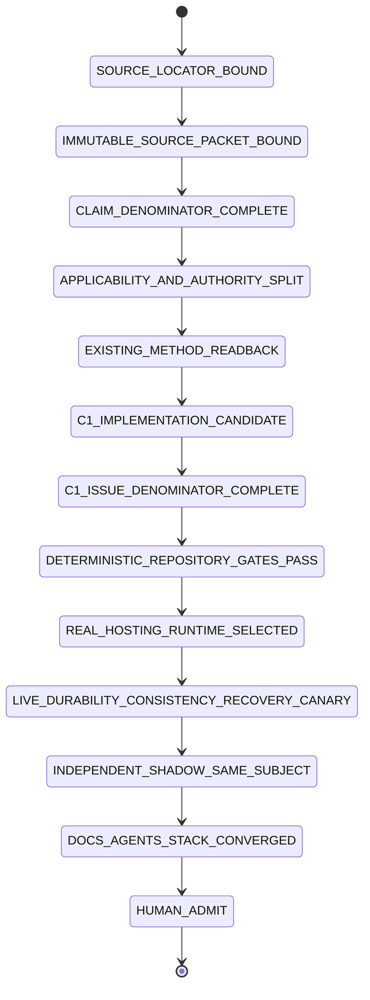
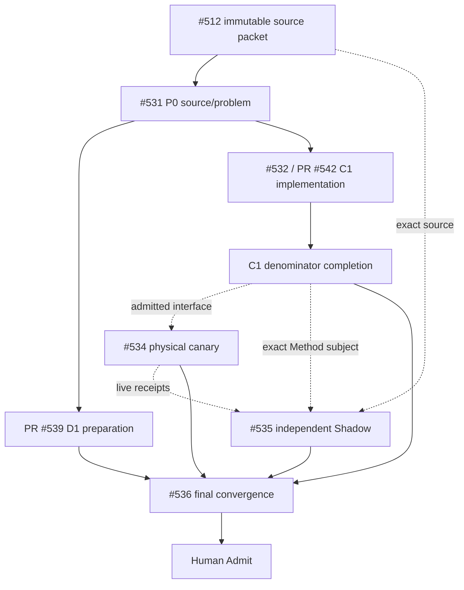

# Git at any scale — Tech Lead + Shadow closure trace

Source article: Cursor, **Git at any scale**, published 2026-08-18. The article remains `SOURCE_PROPOSAL` until the immutable source-packet lane is completed. This repository owns Method-Plane assurance and delivery traceability, not Cursor's proprietary hosting runtime.

## Current admission verdict — 2026-08-21

```text
main                                      988a4e790af6a8bee31fd14e00e52a6e944b9f17
P0 source/problem                         OPEN / #531
D1 preparation                            PR #539 OPEN DRAFT mergeable-clean
C1 aggregate assurance candidate          PR #542 OPEN DRAFT mergeable-clean
C1 exact head                             196a75ac04f6ad2c9a6e50b0645d71fea9bf43e3
C1 hosted workflow                        Shared Skills Infra = SKIPPED
C1 issue-contract denominator             INCOMPLETE
L1 physical hosting runtime               NOT_EXERCISED / #534
S1 terminal independent Shadow            NOT_EXERCISED / #535
final shared convergence                  BLOCKED/PARTIAL / #536
article performance/arbitrary scale       SOURCE_PROPOSAL
merge/release/infrastructure adoption     HUMAN_ADMIT_REQUIRED
```

**Merge audit:** neither #539 nor #542 is admitted for `main` in this epoch. `mergeable-clean` is transport state, not completion evidence. #542 still misses required #532 contract families and fixtures; #539 is a preparation projection whose owning workflows have not produced required exact-head PASS and whose final shared paths remain blocked by active writers.

## Directory → owner → State Machine responsibility

| Path | Owner | Responsibility | Current ceiling |
|---|---|---|---|
| `docs/traceability/git-at-any-scale/` | #531/#536 | source/problem denominator, current closure state, routing | trace only |
| `skills/git-hosting-scale-assurance/**` | #532 / PR #542 | portable assurance schemas/checker/tests | implementation candidate |
| selected disposable consumer/runtime | #534 | durability/linearizability/cache/gossip/compaction/recovery/benchmark experiments | not exercised |
| independent read-only Shadow | #535 | same-subject falsification/admission | design/readback only |
| `skills/git-town-stacked-pr-worker/molecular-indexes/git-at-any-scale/` | #536 | actual issue/PR/evidence topology | delivery projection |
| `skills/agentic-tech-lead-orchestration/runtime-handoff/git-at-any-scale-local-handoff-queue.json` | #531/#536 | exactly-one-active local/external handoff | queue state |

## Real-problem denominator

| ID | Problem | Current state | Closure owner |
|---|---|---|---|
| `GS-01` | Agent repo/branch/PR volume breaks coordination/traceability | `PARTIALLY_CLOSED` | existing Tech Lead/Git Town/Shadow + #536 |
| `GS-02` | local Git/pack semantics resist distributed storage | `NOT_IMPLEMENTED_IN_THIS_REPOSITORY` | #534 |
| `GS-03` | synchronous multi-replica ref transactions impose tail/replica limits | `NOT_EXERCISED` | #534 |
| `GS-04` | durable persistence must precede acknowledgement | `AGGREGATE_CONTRACT_CANDIDATE / PHYSICAL_OPEN` | #532/#534 |
| `GS-05` | ref publication needs CAS/transaction-bound visibility and linearizable history | `AGGREGATE_CONTRACT_CANDIDATE / HISTORY_FIXTURES_MISSING` | #532/#534 |
| `GS-06` | local repos are disposable caches with authoritative freshness/rebuild | `AGGREGATE_CONTRACT_CANDIDATE / PHYSICAL_OPEN` | #532/#534 |
| `GS-07` | gossip may accelerate but cannot own correctness | `LAW_CANDIDATE / LIVE_FALSIFIER_OPEN` | #532/#534 |
| `GS-08` | compaction must preserve reachability and account per-replica cost | `AGGREGATE_CONTRACT_CANDIDATE / NOT_EXERCISED` | #532/#534 |
| `GS-09` | corruption/race recovery needs inspectable replay history | `PARTIAL_GENERIC_METHOD / RECEIPT_FAMILY_MISSING` | #532/#534 |
| `GS-10` | scale/throughput claims need matched immutable benchmark subjects | `SOURCE_PROPOSAL / FIXTURE_FAMILY_MISSING` | #532/#534/#535 |

## #532 first-red denominator gap

PR #542 correctly adds a host-neutral Skill, aggregate `hosting-assurance/v1` schema, semantic checker and `GS-C01..GS-C20` named mutation controls. That does **not** satisfy the whole #532 issue contract. Remaining deterministic work includes at minimum:

```text
hosting-subject schema
operation-history schema + concurrent valid linearization fixture
separate durability receipt + hollow durable-readback fixture
separate ref-transaction receipt
read-freshness receipt + stale-cache catch-up fixture
cache-rebuild receipt + destroy/rebuild fixture
gossip observation receipt + drop/delay/reorder/duplicate fixtures
compaction receipt + reachable-object fixture
corruption-recovery receipt + partial-record/restart fixture
benchmark-run schema + full denominator fixture
hosting-closure-record schema
repository-wide skill/eval/core/entry-route/commit-role gates
exact-head hosted PASS
```

Until these exist and pass, #532 remains `OPEN`; #542 remains `DRAFT`.

## Closure State Machine



Current earned state is `C1_IMPLEMENTATION_CANDIDATE`; source-packet and C1-denominator lanes are both incomplete completion dependencies.

## Issue / execution DAG



PR #539 and PR #542 are path-disjoint **SIBLING** candidates from current `main`; issue chronology does not create Git ancestry. #534/#535 are process/external-evidence dependencies unless concrete branches consume exact unmerged bytes.

## Data flow

```text
Cursor locator
→ immutable source packet (#512)
→ #531 claim/applicability denominator
→ PR #542 Method-Plane schema/checker/fixture family
→ repository deterministic + exact-head hosted gates
→ #534 selected disposable runtime + operation/fault/benchmark receipts
→ #535 independent same-subject falsification
→ #536 current-main README/AGENTS/Molecular/Local-Handoff convergence
→ Human merge/admit
```

## Writer reconciliation

Current active shared-path writers observed for this program remain:

```text
PR #412 -> skills/git-town-stacked-pr-worker/README.md
PR #419 -> skills/git-town-stacked-pr-worker/README.md + docs/INDEX.md
```

Therefore PR #539 owns only its dedicated trace/index/queue surfaces. The canonical Git Town README and shared index remain #536 final-convergence paths after writer disposition. PR #542 owns only `skills/git-hosting-scale-assurance/**`.

## Shadow Architect ruling

The independent role must reject these promotions:

```text
mergeable PR -> admitted implementation
skipped workflow -> PASS
aggregate schema -> complete #532 receipt family
20 semantic mutations -> complete #532 fixture denominator
Method contract -> physical durability/linearizability
fixture -> live canary
Builder self-review -> independent Shadow
bounded benchmark -> arbitrary scale/Cursor production
```

## Evidence ceiling

This program currently proves only that a traceable Method-Plane implementation candidate exists. It does not yet prove a complete #532 portable contract, any physical Git-hosting property, Cursor production behavior, arbitrary scale, production readiness, merge, release or infrastructure adoption.