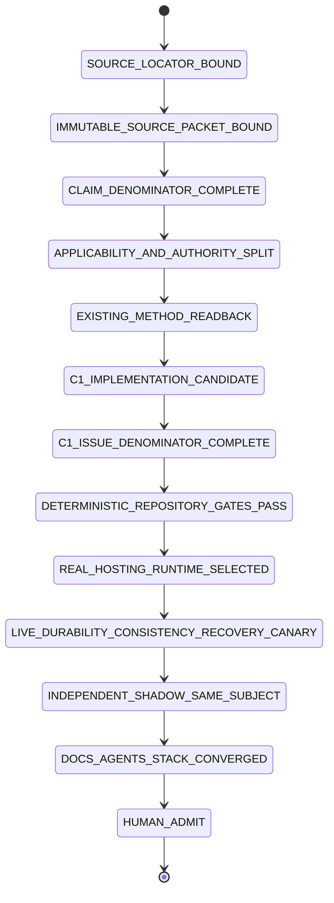
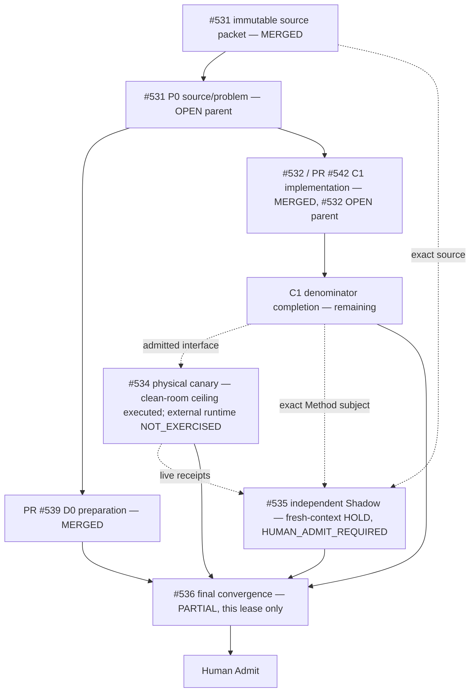

# Git at any scale — Tech Lead + Shadow closure trace

Source article: Cursor, **Git at any scale**, published 2026-08-18. The article remains `SOURCE_PROPOSAL` — a dated observation of a mutable web page, not a durability/consistency proof — until independently re-verified. This repository owns Method-Plane assurance and delivery traceability, not Cursor's proprietary hosting runtime.

## Current admission verdict — restamped 2026-08-22

```text
main                                      5341885f26b5e8e7baf5087a4d661e324f878242
tree                                      a18e12507f9e621efd5354f58384eded1f1e2a9a
rollback                                  9fe3c6daf53dcdd61123d5d7a4eeedbdf37b5d7c
compile subject (2026-08-21, HISTORICAL)  main 174009203a3ff9bd6ebc4010bc6cab7232dd44a4
                                          tree 311052ecf5780f8d91c4d2429e8ce1a50a0361d8
P0 source/problem                         MERGED / #531 OPEN (parent stays open until close gate)
  immutable source packet                 bound: 864322 bytes, sha256 25f59fc6…f00447cab9
  claim denominator                       28 claims, 26 APPLICABLE/OPEN, 2 NOT_APPLICABLE (narrative)
D0 preparation                            PR #539 MERGED — traceability skeleton + Local Handoff queue landed
C1 assurance contract                     PR #542 MERGED — skills/git-hosting-scale-assurance/** / #532 OPEN
  C1 test denominator                     positive=1, mutations=20/20 PASS (tests/run-all.sh)
  C1 evidence ceiling                     GIT_HOSTING_ASSURANCE_CONTRACT_READY_FOR_LIVE_CANARY (not full #532 close)
L1 physical hosting runtime               EXECUTED_AT_CLEAN_ROOM_CEILING / #534 OPEN — clean-room single-node canary bundle landed in this convergence (data/handoff/git-at-any-scale/, check_hosting_assurance.py PASS/CONTRACT_READY); the 19 REQUIRES_EXTERNAL_RUNTIME claims incl. all performance numbers stay NOT_EXERCISED
S1 terminal independent Shadow            FRESH_CONTEXT_HOLD / #535 OPEN — data/handoff/git-at-any-scale/issue-535-shadow-receipt.json (verdict HOLD, HUMAN_ADMIT_REQUIRED; reviewer is Tech-Lead-dispatched fresh context, not a truly independent identity)
final shared convergence                  EXECUTED_IN_THIS_CONVERGENCE / #536 — root README/AGENTS/docs/INDEX.md routing landed by the single convergence writer; hosted exact-head readback still pending
article performance/arbitrary scale       SOURCE_PROPOSAL
merge/release/infrastructure adoption     HUMAN_ADMIT_REQUIRED
```

**Merge audit:** #539 and #542 are merged into `main`; #531 and #532 stay `OPEN` as parent issues — a merged implementation PR closes its own path lease, not the issue's full contract denominator. `mergeable-clean` was transport state on the old Draft epoch and no longer applies; the current PASS is a real exact-head test run, not a claim about physical hosting behavior. #542 supplies a complete, tested Method-Plane contract (schema + checker + 20 named mutation refusals) but does not carry operation-history/durability/ref/cache/gossip/compaction/recovery live receipts — those remain #534's job.

## Directory → owner → State Machine responsibility

| Path | Owner | Responsibility | Current ceiling |
|---|---|---|---|
| `docs/traceability/git-at-any-scale/` | #531/#536 | source/problem denominator, current closure state, routing | trace only |
| `skills/git-hosting-scale-assurance/**` | #532 (PR #542 merged) | portable assurance schema/checker/tests | MERGED, contract-only ceiling |
| selected disposable consumer/runtime | #534 | durability/linearizability/cache/gossip/compaction/recovery/benchmark experiments | CLEAN_ROOM single-node canary executed (kill-injection durability, CAS linearizability, stale-cache fail-closed, cache rebuild, compaction reachability, corruption replay); gossip/replicas/matched-scale/power-loss NOT_EXERCISED; subject refcore.py deliberately uncommitted (replay ceiling) |
| independent read-only Shadow | #535 | same-subject falsification/admission | FRESH_CONTEXT_HOLD, HUMAN_ADMIT_REQUIRED (issue-535-shadow-receipt.json; independence gap declared) |
| `skills/git-town-stacked-pr-worker/molecular-indexes/git-at-any-scale/` | #536 | actual issue/PR/evidence topology | delivery projection |
| `skills/agentic-tech-lead-orchestration/runtime-handoff/git-at-any-scale-local-handoff-queue.json` | #531/#536 | exactly-one-active local/external handoff | recompiled onto the epoch subject `5341885f` in this convergence by the queue writer; read `current.active_item` there rather than restating it here. Its earlier committed form declared `agentic-tech-lead/local-handoff-queue/v1` while using `schema`/`bound_main`/`law` keys, so `assert_local_handoff_queue.py` exited 2 on it — a declared schema identity is not a passed gate. This lease does not edit that file |

## Claim denominator and per-claim triage

The authoritative 28-claim ledger lives at [`data/handoff/source-evidence/git-at-any-scale-closure-ledger.json`](../../../data/handoff/source-evidence/git-at-any-scale-closure-ledger.json) (claims at [`git-at-any-scale-claims.json`](../../../data/handoff/source-evidence/git-at-any-scale-claims.json), source bytes at [`sources/cursor-git-at-any-scale.html`](../../../data/handoff/source-evidence/sources/cursor-git-at-any-scale.html)). This document does not duplicate the 28 rows; it states only the exact-head triage and points at the SSOT.

```text
python3 skills/agentic-tech-lead-orchestration/scripts/check_problem_closure.py \
  data/handoff/source-evidence/git-at-any-scale-closure-ledger.json
```
exits 0 and reports `problem_count: 28`, `counts: {OPEN: 26, NOT_APPLICABLE: 2}`, `evidence_ceiling: LEDGER_DETERMINISTIC_CHECKED`, `source_manifest_sha256: 4a66a725c2113fb988b19e0738fbba7519f5ce5a13035cf51b37f1cdd111aba5` (re-run at the 2026-08-22 epoch).

That exit code is the exact boundary the ledger's own `evidence_ceiling` names, and no more. The checker's digest chain closes **inside** the ledger file: it has no `--source-dir` flag (`grep -c 'source_dir\|source-dir'` on `check_problem_closure.py` → 0), so nothing opens the persisted bytes under `data/handoff/source-evidence/sources/` and re-derives `claim_sha256` from them. A ledger whose `source_manifest` identity strings were rewritten to a different set of bytes would still exit 0. The close-gate phrase "compiler PASS is not promoted to source truth" therefore has no deterministic checker at this epoch; making it checkable — a `--source-dir` readback plus a planted-defect control that mutates one digest and asserts red — is owned by #512, not by this lease.

| Triage bucket | Count | issue_nodes | Meaning |
|---|---:|---|---|
| Narrative / not independently checkable | 2 | (none — `applicability: NOT_APPLICABLE`) | scene-setting + packfile-transport background; no independent verification lifecycle |
| Addressed by existing mechanism | 1 | `[531]` | Agent-driven coordination-pressure framing; already the subject of the existing Tech Lead/Git Town/Shadow mechanism, not a new build |
| Owned by C1 (`skills/git-hosting-scale-assurance`) | 6 | `[531, 532]` | Stateless routing, no-consensus CAS ref update, linearizable push visibility, gossip non-authority/ETag validation, WAL source-of-truth, WAL forensic replay — these are exactly the shape of contract the merged checker's `GS-C01..GS-C20` controls target |
| `REQUIRES_EXTERNAL_RUNTIME` | 19 | `[531, 534]` | Historical (Spokes/DHT/NFS/GFS/DRBD), continuation architecture, and every performance number (100-replica synthetic test, linear read-only scaling, S3 Standard/Express push throughput) — none of these close without a real selected runtime and #534's receipts |

1 + 6 + 19 + 2 = 28. No claim is promoted past what the ledger's own `closure` field states; the merged C1 contract closes zero of the 19 `#534`-owned claims regardless of how well its own test suite passes.

## #532 evidence ceiling after the C1 merge

PR #542 correctly added a host-neutral Skill, aggregate `hosting-assurance/v1` schema, semantic checker and `GS-C01..GS-C20` named mutation controls, and it is merged and green (`tests/run-all.sh` → `PASS positive=1 mutations=20/20`). That is a real, tested Method-Plane contract — not a claim that #532 is closed. The issue's own denominator (per the Local Handoff queue's `GIT-SCALE-H1` record) still lists the per-receipt schema FILES (operation-history/durability/ref/cache/gossip/compaction/recovery, benchmark-run, hosting-closure-record) as unshipped: the clean-room canary in this convergence produced the corresponding receipt ARTIFACTS under `data/handoff/git-at-any-scale/` and they pass the aggregate `hosting-assurance/v1` checker, but only the aggregate schema exists as a contract file — the receipt-family `receipt.schema` labels remain machine-unbound (a self-declared identity, not a passed per-family gate). Until the contract files exist and pass, #532 remains `OPEN` and the highest honest terminal for this directory is:

```text
GIT_HOSTING_ASSURANCE_CONTRACT_READY_FOR_LIVE_CANARY
```

## Closure State Machine



Current earned state is `C1_IMPLEMENTATION_CANDIDATE`, one step past the prior epoch (immutable source packet and claim denominator are now both bound and merged). `C1_ISSUE_DENOMINATOR_COMPLETE`, the live canary and the independent Shadow are all still ahead.

## Issue / execution DAG



PR #539 and PR #542 were path-disjoint **SIBLING** candidates and both merged from the same admitted `main`; issue chronology did not create Git ancestry between them, and merging both did not create ancestry after the fact either. #534/#535 remain process/external-evidence dependencies: no branch for either has consumed exact bytes, but both now carry same-tree receipts — #534's clean-room single-node canary bundle and #535's fresh-context `HOLD` receipt under `data/handoff/git-at-any-scale/` — while their external-runtime and identity-independent halves stay `NOT_EXERCISED`.

## Data flow

```text
Cursor locator
→ immutable source packet (#531, bound and merged)
→ 28-claim applicability/closure denominator (#531, bound and merged)
→ PR #542 Method-Plane schema/checker/fixture family (#532, merged; issue still OPEN)
→ repository deterministic gates (check_document_routes, git-hosting-scale-assurance/tests/run-all.sh — both GREEN on this head)
→ #534 disposable runtime + operation/fault/benchmark receipts (clean-room single-node bundle EXECUTED, data/handoff/git-at-any-scale/; hosting-grade external runtime NOT_EXERCISED)
→ #535 independent same-subject falsification (fresh-context receipt HOLD / HUMAN_ADMIT_REQUIRED; identity-independent review NOT_EXERCISED)
→ #536 current-main README/AGENTS/Molecular/Local-Handoff convergence (root README.md/AGENTS.md/docs/INDEX.md routing landed in this convergence; hosted exact-head readback pending)
→ Human merge/admit
```

## Writer reconciliation

At the 2026-08-22 readback, PR #412 and PR #419 are both CLOSED unmerged (#412 `SUPERSEDED_BY_#419`, #419 `CONSUMED`, landed via PR #573 commit `9fe3c6d`); the earlier reading that they remained open Drafts contending for `skills/git-town-stacked-pr-worker/README.md` was a dated 2026-08-21 observation and is no longer current. The path-writer conflict is cleared and #536's root-path convergence is unblocked but **unowned** — it needs a named writer. This lease (docs/traceability/git-at-any-scale/**, the molecular index, and the C1 skill's own README/AGENTS if inaccurate) stays disjoint from root `README.md`/`AGENTS.md`/`docs/INDEX.md` and from the canonical Git Town README; lifting the block does not widen the lease.

## Shadow Architect ruling

The independent role must reject these promotions:

```text
merged PR -> admitted issue closure (#532/#531 stay OPEN as parents regardless of PR merge)
mergeable/merged PR -> physical hosting proof
C1 test-suite green -> #534 durability/linearizability PASS
aggregate schema -> complete #532 receipt family
20 semantic mutations -> complete #532 fixture denominator
Method contract -> physical durability/linearizability
Builder self-review -> independent Shadow
bounded benchmark -> arbitrary scale/Cursor production
```

## Evidence ceiling

This program currently proves: an immutable, hashed source packet exists; a 28-claim applicability/closure denominator is bound and passes its own deterministic checker; a portable, tested Method-Plane assurance contract (`skills/git-hosting-scale-assurance`) is merged and green; and one clean-room, single-node, single-host canary (SIGKILL-only faults, pipes-only IPC, subject deliberately uncommitted) produced a receipt bundle that passes the aggregate checker with a proven red-when-red control. It does not prove any distributed or production Git-hosting property, Cursor production behavior, arbitrary scale, gossip/replica/power-loss behavior, a complete #532 portable contract, production readiness, merge of #531/#532/#536 themselves, release, or infrastructure adoption. The 19 `#534`-owned `REQUIRES_EXTERNAL_RUNTIME` claims — which include every performance number in the source article — remain unaddressed by this repository's bytes; the clean-room canary bounds the method, not those claims.
