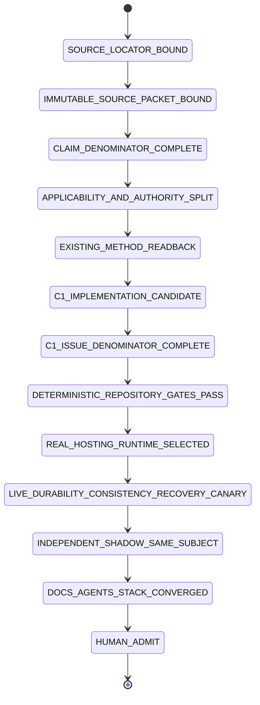
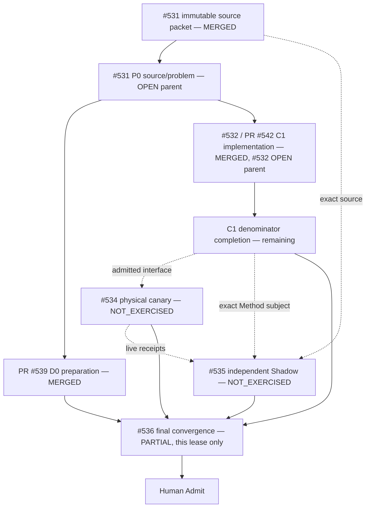

# Git at any scale — Tech Lead + Shadow closure trace

Source article: Cursor, **Git at any scale**, published 2026-08-18. The article remains `SOURCE_PROPOSAL` — a dated observation of a mutable web page, not a durability/consistency proof — until independently re-verified. This repository owns Method-Plane assurance and delivery traceability, not Cursor's proprietary hosting runtime.

## Current admission verdict — 2026-08-21

```text
main                                      174009203a3ff9bd6ebc4010bc6cab7232dd44a4
tree                                      311052ecf5780f8d91c4d2429e8ce1a50a0361d8
P0 source/problem                         MERGED / #531 OPEN (parent stays open until close gate)
  immutable source packet                 bound: 864322 bytes, sha256 25f59fc6…f00447cab9
  claim denominator                       28 claims, 26 APPLICABLE/OPEN, 2 NOT_APPLICABLE (narrative)
D0 preparation                            PR #539 MERGED — traceability skeleton + Local Handoff queue landed
C1 assurance contract                     PR #542 MERGED — skills/git-hosting-scale-assurance/** / #532 OPEN
  C1 test denominator                     positive=1, mutations=20/20 PASS (tests/run-all.sh)
  C1 evidence ceiling                     GIT_HOSTING_ASSURANCE_CONTRACT_READY_FOR_LIVE_CANARY (not full #532 close)
L1 physical hosting runtime               NOT_EXERCISED / #534 OPEN — owns 19 REQUIRES_EXTERNAL_RUNTIME claims incl. all performance numbers
S1 terminal independent Shadow            NOT_EXERCISED / #535 OPEN — blocked on #534's missing runtime subjects
final shared convergence                  PARTIAL / #536 (this doc lease only; root README/AGENTS/docs/INDEX.md convergence not yet done by any writer)
article performance/arbitrary scale       SOURCE_PROPOSAL
merge/release/infrastructure adoption     HUMAN_ADMIT_REQUIRED
```

**Merge audit:** #539 and #542 are merged into `main`; #531 and #532 stay `OPEN` as parent issues — a merged implementation PR closes its own path lease, not the issue's full contract denominator. `mergeable-clean` was transport state on the old Draft epoch and no longer applies; the current PASS is a real exact-head test run, not a claim about physical hosting behavior. #542 supplies a complete, tested Method-Plane contract (schema + checker + 20 named mutation refusals) but does not carry operation-history/durability/ref/cache/gossip/compaction/recovery live receipts — those remain #534's job.

## Directory → owner → State Machine responsibility

| Path | Owner | Responsibility | Current ceiling |
|---|---|---|---|
| `docs/traceability/git-at-any-scale/` | #531/#536 | source/problem denominator, current closure state, routing | trace only |
| `skills/git-hosting-scale-assurance/**` | #532 (PR #542 merged) | portable assurance schema/checker/tests | MERGED, contract-only ceiling |
| selected disposable consumer/runtime | #534 | durability/linearizability/cache/gossip/compaction/recovery/benchmark experiments | NOT_EXERCISED |
| independent read-only Shadow | #535 | same-subject falsification/admission | NOT_EXERCISED (blocked on #534) |
| `skills/git-town-stacked-pr-worker/molecular-indexes/git-at-any-scale/` | #536 | actual issue/PR/evidence topology | delivery projection |
| `skills/agentic-tech-lead-orchestration/runtime-handoff/git-at-any-scale-local-handoff-queue.json` | #531/#536 | exactly-one-active local/external handoff | **stale**: `GIT-SCALE-H0` still reads `ACTIVE`, but the source packet it asks for is already bound (see above); the queue's own recompile against the merged packet is pending and is not this lease's file to edit |

## Claim denominator and per-claim triage

The authoritative 28-claim ledger lives at [`data/handoff/source-evidence/git-at-any-scale-closure-ledger.json`](../../../data/handoff/source-evidence/git-at-any-scale-closure-ledger.json) (claims at [`git-at-any-scale-claims.json`](../../../data/handoff/source-evidence/git-at-any-scale-claims.json), source bytes at [`sources/cursor-git-at-any-scale.html`](../../../data/handoff/source-evidence/sources/cursor-git-at-any-scale.html)). This document does not duplicate the 28 rows; it states only the exact-head triage and points at the SSOT.

```text
python3 skills/agentic-tech-lead-orchestration/scripts/check_problem_closure.py \
  data/handoff/source-evidence/git-at-any-scale-closure-ledger.json
```
exits 0 and reports `problem_count: 28`, `counts: {OPEN: 26, NOT_APPLICABLE: 2}`.

| Triage bucket | Count | issue_nodes | Meaning |
|---|---:|---|---|
| Narrative / not independently checkable | 2 | (none — `applicability: NOT_APPLICABLE`) | scene-setting + packfile-transport background; no independent verification lifecycle |
| Addressed by existing mechanism | 1 | `[531]` | Agent-driven coordination-pressure framing; already the subject of the existing Tech Lead/Git Town/Shadow mechanism, not a new build |
| Owned by C1 (`skills/git-hosting-scale-assurance`) | 6 | `[531, 532]` | Stateless routing, no-consensus CAS ref update, linearizable push visibility, gossip non-authority/ETag validation, WAL source-of-truth, WAL forensic replay — these are exactly the shape of contract the merged checker's `GS-C01..GS-C20` controls target |
| `REQUIRES_EXTERNAL_RUNTIME` | 19 | `[531, 534]` | Historical (Spokes/DHT/NFS/GFS/DRBD), continuation architecture, and every performance number (100-replica synthetic test, linear read-only scaling, S3 Standard/Express push throughput) — none of these close without a real selected runtime and #534's receipts |

1 + 6 + 19 + 2 = 28. No claim is promoted past what the ledger's own `closure` field states; the merged C1 contract closes zero of the 19 `#534`-owned claims regardless of how well its own test suite passes.

## #532 evidence ceiling after the C1 merge

PR #542 correctly added a host-neutral Skill, aggregate `hosting-assurance/v1` schema, semantic checker and `GS-C01..GS-C20` named mutation controls, and it is merged and green (`tests/run-all.sh` → `PASS positive=1 mutations=20/20`). That is a real, tested Method-Plane contract — not a claim that #532 is closed. The issue's own denominator (per the Local Handoff queue's `GIT-SCALE-H1` record) still lists operation-history/durability/ref/cache/gossip/compaction/recovery receipt schemas, matching fixtures, a benchmark-run schema and a hosting-closure-record as missing. Until those exist and pass, #532 remains `OPEN` and the highest honest terminal for this directory is:

```text
GIT_HOSTING_ASSURANCE_CONTRACT_READY_FOR_LIVE_CANARY
```

## Closure State Machine



Current earned state is `C1_IMPLEMENTATION_CANDIDATE`, one step past the prior epoch (immutable source packet and claim denominator are now both bound and merged). `C1_ISSUE_DENOMINATOR_COMPLETE`, the live canary and the independent Shadow are all still ahead.

## Issue / execution DAG



PR #539 and PR #542 were path-disjoint **SIBLING** candidates and both merged from the same admitted `main`; issue chronology did not create Git ancestry between them, and merging both did not create ancestry after the fact either. #534/#535 remain process/external-evidence dependencies: no branch for either has consumed exact bytes yet, so both stay `NOT_EXERCISED`.

## Data flow

```text
Cursor locator
→ immutable source packet (#531, bound and merged)
→ 28-claim applicability/closure denominator (#531, bound and merged)
→ PR #542 Method-Plane schema/checker/fixture family (#532, merged; issue still OPEN)
→ repository deterministic gates (check_document_routes, git-hosting-scale-assurance/tests/run-all.sh — both GREEN on this head)
→ #534 selected disposable runtime + operation/fault/benchmark receipts (NOT_EXERCISED)
→ #535 independent same-subject falsification (NOT_EXERCISED, blocked on #534)
→ #536 current-main README/AGENTS/Molecular/Local-Handoff convergence (this doc lease only — root README.md/AGENTS.md/docs/INDEX.md convergence is a separate, not-yet-done writer's work)
→ Human merge/admit
```

## Writer reconciliation

At this epoch's readback, PR #412 and PR #419 remain `OPEN`/`DRAFT` and both still write `skills/git-town-stacked-pr-worker/README.md`; PR #419 also writes `docs/INDEX.md`. This lease (docs/traceability/git-at-any-scale/**, the molecular index, and the C1 skill's own README/AGENTS if inaccurate) is disjoint from those paths and from root `README.md`/`AGENTS.md`/`docs/INDEX.md`. The canonical Git Town README, root README/AGENTS and shared `docs/INDEX.md` remain unconverged and are not touched by this lease.

## Shadow Architect ruling

The independent role must reject these promotions:

```text
merged PR -> admitted issue closure (#532/#531 stay OPEN as parents regardless of PR merge)
mergeable/merged PR -> physical hosting proof
C1 test-suite green -> #534 durability/linearizability PASS
aggregate schema -> complete #532 receipt family
20 semantic mutations -> complete #532 fixture denominator
Method contract -> physical durability/linearizability
Builder self-review -> independent Shadow
bounded benchmark -> arbitrary scale/Cursor production
```

## Evidence ceiling

This program currently proves: an immutable, hashed source packet exists; a 28-claim applicability/closure denominator is bound and passes its own deterministic checker; and a portable, tested Method-Plane assurance contract (`skills/git-hosting-scale-assurance`) is merged and green. It does not yet prove a complete #532 portable contract, any physical Git-hosting property, Cursor production behavior, arbitrary scale, production readiness, merge of #531/#532/#536 themselves, release, or infrastructure adoption. None of the 19 `#534`-owned claims — which include every performance number in the source article — are addressed by this repository's current state.
