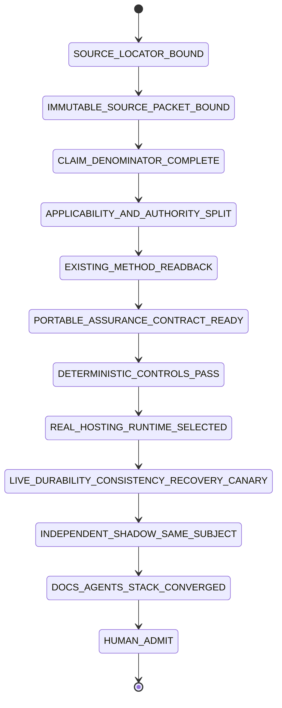
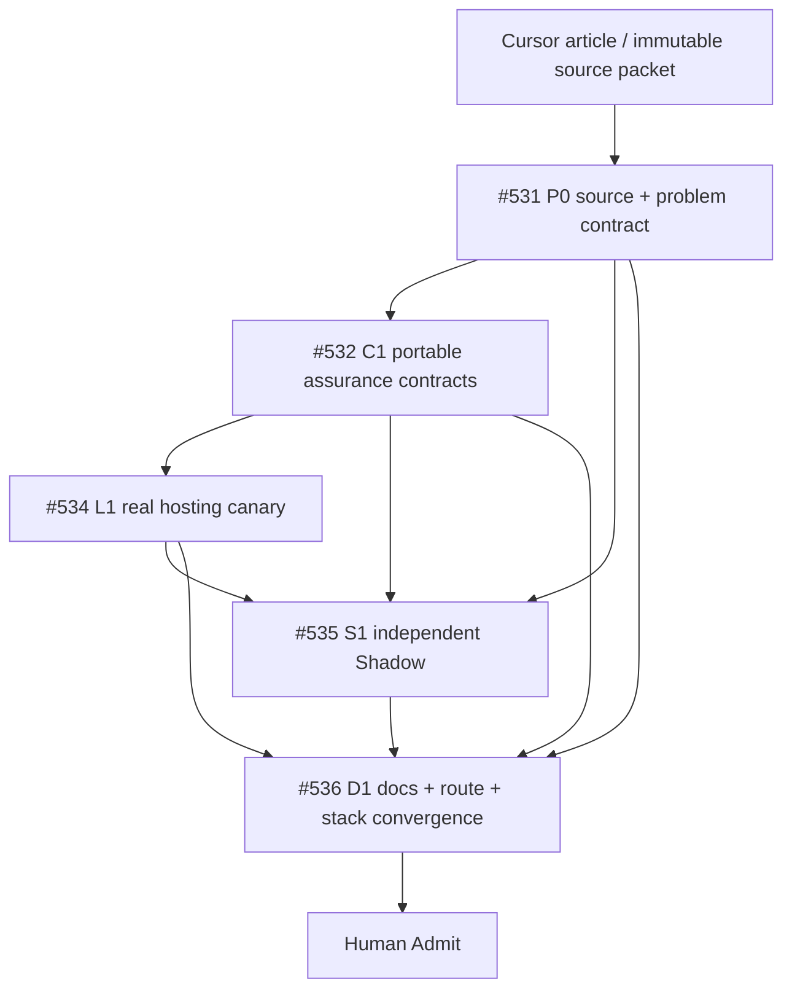

# Git at any scale — Tech Lead + Shadow closure trace

Source article: Cursor, **Git at any scale**, published 2026-08-18. The public article is an architectural source proposal. This repository records applicability, contracts, delivery topology, and evidence ceilings; it does not claim to reproduce Cursor's proprietary Continuity implementation.

## Current verdict

```text
skills-shared Method / Control Plane                 PARTIAL_CLOSURE
portable Git-hosting assurance profile               OPEN / #532
physical Git-hosting runtime                         OUT_OF_SCOPE_HERE / #534
live durability / linearizability / recovery proof  NOT_EXERCISED / #534
independent exact-subject Shadow                     OPEN / #535
root/shared convergence                              OPEN / #536
article performance and arbitrary-scale claims       SOURCE_PROPOSAL
merge / release / infrastructure adoption            HUMAN_ADMIT_REQUIRED
```

The repository already provides useful coordination machinery for Agent-driven Git pressure: immutable subject binding, task/issue DAG separation from Git ancestry, sibling/true-child/convergence vocabulary, one-writer leases, exact-head receipts, Local Handoff, evidence ceilings, and independent Shadow review. Those mechanisms do not implement object storage, WAL durability, linearizable ref publication, cache rebuild, gossip transport, pack/MIDX compaction, corruption replay, or measured hosting-scale behavior.

## Directory → owner → responsibility

| Path | Owner | Responsibility | Evidence ceiling |
|---|---|---|---|
| `docs/traceability/git-at-any-scale/` | #531 / #536 | source/problem closure ledger, navigation, current state | method/document trace only |
| `skills/git-hosting-scale-assurance/` | #532 | portable host-neutral contracts/checkers/tests | deterministic contract evidence |
| selected consumer/runtime | #534 | WAL/storage/ref/cache/gossip/compaction/recovery experiments | bounded physical/live evidence |
| read-only Shadow session/receipt | #535 | independent exact-subject falsification | advisory admission evidence |
| `skills/git-town-stacked-pr-worker/molecular-indexes/git-at-any-scale/` | #536 | actual issue/PR/branch/evidence delivery index | delivery projection only |
| `skills/agentic-tech-lead-orchestration/runtime-handoff/` | #531/#534/#536 | unavailable local/provider/runtime/Human work | handoff state only |

## Real-problem denominator

| ID | Problem | Current state | Closure owner |
|---|---|---|---|
| `GS-01` | Agent-created repo/branch/PR volume breaks coordination and traceability | `PARTIALLY_CLOSED` | existing Tech Lead + Git Town + Shadow mechanisms; #536 convergence |
| `GS-02` | Git local-filesystem and packfile semantics resist remote/distributed storage | `NOT_IMPLEMENTED_IN_THIS_REPOSITORY` | #534 selected hosting runtime |
| `GS-03` | synchronous multi-replica ref transactions hit tail latency and replica-floor limits | `NOT_EXERCISED` | #534 matched runtime experiment |
| `GS-04` | push acknowledgement requires durable authoritative persistence | `CONTRACT_OPEN / PHYSICAL_OPEN` | #532 + #534 |
| `GS-05` | ref publication requires atomic/CAS transaction and linearizable history | `CONTRACT_OPEN / PHYSICAL_OPEN` | #532 + #534 |
| `GS-06` | local Git repos should be disposable caches with authoritative freshness/catch-up | `CONTRACT_OPEN / PHYSICAL_OPEN` | #532 + #534 |
| `GS-07` | gossip may accelerate convergence but cannot own correctness | `CONTRACT_OPEN` | #532; live falsifier #534 |
| `GS-08` | compaction/repack cost should not be multiplied blindly across replicas | `NOT_EXERCISED` | #534 |
| `GS-09` | corruption/race recovery needs inspectable, replayable operation history | `PARTIAL_GENERIC_METHOD / HOSTING_PROFILE_OPEN` | #532 + #534 |
| `GS-10` | scale/throughput claims require exact benchmark subjects and denominators | `SOURCE_PROPOSAL` | #534 + #535 |

## Closure State Machine



Current execution is before `PORTABLE_ASSURANCE_CONTRACT_READY`; #532/#534/#535/#536 remain open. A source URL, contract draft, open PR, green static test, or Shadow design review cannot skip a state.

## Issue / execution DAG



Dependency meaning is typed:

```text
#531 → #532  contract dependency after exact source/problem binding
#532 → #534  process/interface dependency; physical runtime remains external
#532/#534 → #535  exact-subject read-only evidence dependency
#531/#532/#534/#535 → #536  convergence dependency
```

Issue order alone does not manufacture Git ancestry. A `TRUE_CHILD` branch exists only when its bytes consume an unmerged parent artifact.

## Data flow

```text
article / source packet
→ source-claims.json
→ problem-closure-ledger.json
→ #531 applicability + authority split
→ #532 portable contracts/checkers/fixtures
→ #534 exact runtime/storage/workload/fault subjects
→ durability/ref/read/cache/gossip/compaction/recovery receipts
→ #535 independent same-subject falsification
→ #536 route + Molecular Stack + Local Handoff convergence
→ Human Admit
```

## Shadow Architect monitor

The Shadow role is read-only and adversarial. It independently checks at least:

```text
source immutability and claim denominator
Method Plane vs physical storage-plane separation
durable acknowledgement boundary
ref visibility and object reachability
operation-history completeness and linearizability oracle
stale-cache authority validation
gossip non-authority
cache destroy/rebuild
compaction reachability and cost accounting
corruption/truncation/restart replay
benchmark matching and scale ceiling
current PR/path-writer state
cleanup/rollback/Human gates
```

A Builder conclusion is not Shadow evidence. Until #535 receives an exact-subject independent receipt, its state remains `OPEN`.

## Molecular delivery plan

```text
P0-SOURCE   #531  source/problem contract and closure denominator
C1-CONTRACT #532  portable Git-hosting assurance Skill
L1-LIVE     #534  real runtime/storage canary; external evidence
S1-SHADOW   #535  independent read-only audit; external evidence
D1-CONVERGE #536  README/AGENTS/trace/Molecular/Local-Handoff convergence
```

The dedicated actual-state index is `skills/git-town-stacked-pr-worker/molecular-indexes/git-at-any-scale/README.md`. Do not invent PR numbers: `PR_ABSENT` is the required value until a real PR exists.

## Current writer reconciliation

Observed on 2026-08-21 against `main@988a4e790af6a8bee31fd14e00e52a6e944b9f17`:

```text
PR #412 writes skills/git-town-stacked-pr-worker/README.md
PR #419 writes skills/git-town-stacked-pr-worker/README.md and docs/INDEX.md
```

Therefore this preparation branch writes only dedicated Git-at-any-scale paths plus root routing. Canonical shared-index/Git-Town-README convergence remains #536 and must consume, supersede, or wait for those writers explicitly.

## Evidence ceiling

Even after all deterministic work passes, `skills-shared` can prove only the portable assurance method and the exact consumer/runtime experiments supplied to it. It cannot prove Cursor's private production implementation, S3/provider guarantees in general, arbitrary replica counts, universal linear scaling, production safety, or infrastructure adoption without separately admitted evidence.