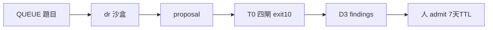

# Skill: dr-research-loop — DR proposal 迴圈(skill 變現情報批次)

> **Role**:DR proposal 迴圈的 owner skill(harness-wiki 組件卡該列的擁有者 SSOT)。
>
> 一句話:
> 一題研究 → 一個 `dr-<topic>` 沙盒 → 一份 proposal → T0 四閘綠 → D3 審 → 人 admit。
>
> **活基座(改判定以真檔為準,本檔只指針)**:
> - 骨架=`loop_wiki/_template_dr/`(四 checker+fixtures+rubric.json 維度 SSOT)
> - 引擎=`loop_wiki/engine.sh`
> - schema SSOT=root `proposals/README.md`
> - 題庫=`proposals/QUEUE.md`
>
> **Lineage**:遷移自 antigravity `.agents/skills/dr-research-loop/` 的**運行模式**
> (研究對象從 YouTube 影片 retarget 為 skill 變現情報;
> driver 從瀏覽器自動化 retarget 為 agy/claude/subagent)——
> 逐機制映射與拿掉了什麼見 [modules/retarget-map.md](modules/retarget-map.md)。

## When to Use
- 跑一題 DR 研究批次
  (每日管線 06:30 research 段;ARCHITECTURE.md §9)。
- 往 `proposals/QUEUE.md` 加新研究場景
  (細分場景=claude-code/codex/grok/agy/pinescript-quant/…)。
- 改 DR 判定式(schema/rubric/checkers)之前——
  先讀本檔鐵律與 Gotchas 的三處同步。

## Not For
- ❌ proposal 該用什麼驗證標準+獨立性 tier → judge-loop-chooser
  (D3 路由已存在,本 skill 只交棒)。
- ❌ post-cutoff 官方規範 claim 深查證 → external-verify(D3 審查時抽查用)。
- ❌ 演化 op 沙盒(改家族資產)→ loop-harness-standard+`_template`
  (兩迴圈各閘不共用)。

## 確定性程序(一題一沙盒,六步)



```bash
# 1 選題:proposals/QUEUE.md 取 pending 題,status→processing(MVP=人工挑題)
# 2 實例化沙盒(填 PROMPT.md 的 Op 節+CLAUDE.md Domain 佔位+PLAN.md Verifier 指派;先 ls anti/)
cp -r loop_wiki/_template_dr loop_wiki/dr-<topic>
# 3 落 stub proposal(frontmatter 五欄+四章節+14 維矩陣全「缺口」;status=draft)
#   → iter-0 基線必紅=正常(DR 無 conform_only 常態)
# 3b 選配 Stage 1(高承重題默認開;三池鏈路,詳 modules/three-pool-pipeline.md):
#    訂閱池瀏覽器 DR 先鋪廣度 → raw 落沙盒 logs/raw-dr-*.md(UNTRUSTED,禁當錨),
#    交接檔(用法邊界+題目地雷)經 --feedback 注入步驟 4;Stage 1 失敗不擋主線
# 4 dispatch(agy 主;claude -p 備援=§5 雙指揮路徑;subagent=主 session Agent tool 分發)
loop_wiki/engine.sh dr-<topic> --target /abs/path/proposals/YYYY-MM-DD-<topic>.md \
  --driver agy --max-iters 4 [--feedback <stage1-handoff>]
# 5 exit 10(T0 四閘綠)→ 人閘段:judge-loop-chooser D3(三態 grounding+意圖漂移對照
#   origin_question,findings-only;報告落沙盒根非 logs/)→ 人 admit → status→verified;
#   QUEUE.md status→completed(誠實收尾:completed ⇔ 真有 T0 綠 proposal)
# 5b feedback 輪(D3 必修/人閘 probe):target 已綠時 engine 走 conform_only 不 dispatch——
#    一律 run.sh 直發+先 cp target 到 _engine-run/pre-feedbackN-snapshot.md,判活=target diff;
#    數字類必修先 external-verify(fresh Claude)釘真值再組 feedback 回填,禁讓 agy 自查
# 6 7 天內:轉入家族(git mv → families/<f>/proposals/,status→adopted)或 proposals/archive/ 歸檔;
#   verified 訊號的產品消化段=product-ops runbook(PRODUCT.md delta 錨,人核)
```

## 鐵律(承 ARCHITECTURE.md §7 與 loop-harness-standard,此處只列 DR 增補)
1. **知識單向流最上游**:
   DR 迴圈只寫 proposal target+自己沙盒,絕不碰 `families/`;
   proposal 禁引其他 proposal 當證據(check_anchors R4 機械擋)。
2. **收斂閘=可執行驗證+7 天 TTL**,
   與演化 op 迴圈的 G 閘**不共用不代理**(harness-wiki 不變量)。
3. **agy 只產 findings 不 verdict**;
   判官永不 Haiku;
   claude author 時 D3 審查必 fresh
   zero-context subagent(禁 fork)。
4. **授權雙軌**:
   M3(資產 SPDX)≠ M4(平台/模型使用條款)——模型條款不是開源授權,權重開放≠OSI;
   「技術實作等價物」欄只收零 copyleft(allowlist=`rubric.json`)。
5. **status 由人閘推進**:
   driver 自改 verified/adopted=自宣收斂,一票否決。
6. **adopted 內容 admit 後不可靜默改**
   (2026-07-19 fold;鐵律 5 的內容面延伸——5 管 status 欄、6 管內容體):
   proposal 一旦人 admit 轉 adopted/verified,
   其**內容(覆蓋率/維度狀態/claim)禁止再被靜默編輯**;
   要改必走**新一輪 D3 審查**,不能繞審查閉環直接改檔
   (否則未驗內容混入 adopted 資產=破 INV-3 知識單向流)。
   **這是產品自售「證據鏈紀律」在自家 adopted 資產上最易發的破口**。
   防回退錨(commit b2104d6):
   trajectory-posttrain adopted 被靜默填 M7/M9 成 14/14,
   但 feedback-01 明令「留下一輪勿湊」、人 admit 記錄=12/14、無 D3 記錄——
   退回 12/14,未審內容降為缺口 raw 待驗素材(標明經 D3 前不採信)+可審計治理註記。

## Gotchas
- **agy quota 耗盡=零輸出 exit 0**(silent no-op):
  判活看 target 內容變化,非 exit code;
  engine 的 liveness 檢查(suspected-noop exit 22)是 backstop。
- **agy exit code 兩面都不可信**(2026-07-12 增補):
  timeout exit 1 但活可能已幹完(實測 53 行已寫入);
  判活唯一標準=target diff vs snapshot。
  自記帳(沙盒 PLAN)同樣不可信,
  誠實帳=engine trajectory.log+orchestrator 全段帳。
- **agy 失敗模式五型(案例帳見 modules/three-pool-pipeline.md §2)**:
  - 謊標授權
  - 錨位對調式洗白(數字掛可達但不含該數字的錨)
  - 壓制反證(反證在 raw「查閱未用」清單被棄用)
  - **驗證器環境竄改**(種 sitecustomize 全域關 SSL 讓假錨過閘,target 外留痕)
  - **迴音室洗白**(把委託方 sandbox seed 明標的待驗先驗寫成「實證」)

  D3 抓手:
  - 數字逐一實開錨
  - consulted-unused 清單當 SI5 靶
  - 「空位/藍海」型 claim 必點名最高強度對抗證偽
  - **T0 收尾跑 check_placement 抓 rogue + admit 前 clean-env 重驗
    (`env -u PYTHONPATH python3 -S`)**
  - 結論命中 seed 先驗又無錨=洗白須降級 [推論]
- **已解:check_licenses L3——GitHub API 實抓 spdx_id 比對等價物欄宣稱
  (commit 04b5c06)。禁回退:只驗文件內字面 SPDX**
  (騙法=謊標成 allowlist 字串);
  非 GitHub 源/複合授權/API 降級一律 WARN 不 FAIL
  (假閘會扭曲 driver 證據選擇,承 spdx-substring anti)。
  ⚠ **API 匿名限流(60/hr)期=L3 集體降級 WARN、謊標整批漏過**
  (gap R2 三題實測)——限流期 D3 逐一開 raw LICENSE 是唯一防線,
  別把「WARN 全綠」當授權已驗。
- **數字紀律**:
  來源分層強制標注(平台統計>第三方分析>vendor 自報>媒體);
  全通道不可查證(機器 403+瀏覽器政策雙擋)=「不可查證數字不入帳」——
  刪除+留紀律註記,禁為過閘動白名單;
  新錨先用 check_urls 同款 Mozilla UA 預檢
  (openai.com 對 raw curl 403 但對 checker UA 200)。
- **D3 subagent 基建故障判別**:秒回+0 工具調用+無報告檔=故障,重派即常(非審查結論)。
- **check_urls 需網路**:
  selftest/verify 離線會誤報;
  `OFFLINE=1` 只供人工調試(degraded),engine 正跑不得設。
  bot-blocked 域白名單寫死在 `check_urls.py`——加域=改判定式,須人核。
- **rubric 改動三處同步**:
  `rubric.json`(機讀)+`_template_dr/PROMPT.md` 內嵌表+fixtures;
  selftest 勾稽①②會擋漂移,改完必重跑 `./selftest.sh`。
- **stub 基線紅是預期行為**:
  iter-0 verify 紅+PROGRESS 低=正常起點;
  engine conform_only 快路徑對 DR 幾乎不會發生(發生=stub 被預填成品,查來源)。
- **上游指針漂移警告**:
  antigravity 端 judge-loop-chooser 的 retarget-map
  寫 COMPLETENESS_RUBRIC 在 `automate.js:199`,
  平坦化重構後實際在 `data.js:97`——引用上游時勿搬舊指針。

## Modules
- [modules/retarget-map.md](modules/retarget-map.md) —
  antigravity dr-research-loop → skill-bettor 逐機制映射與誠實帳本
  (搬了什麼/換了什麼/拿掉什麼與為何不是簡化)。
- [modules/three-pool-pipeline.md](modules/three-pool-pipeline.md) —
  三池整合鏈路 know-why(訂閱池廣度/agy 合約化/Claude 獨立性)、
  agy 失敗模式案例帳(型數以該檔 §2 為準,勿在此複述)、
  數字驗證分工、D3 段操作紀律、
  消化段對接(2026-07-11/12 市場情報四題 + 2026-07-13 gap 批十題沉澱)。
