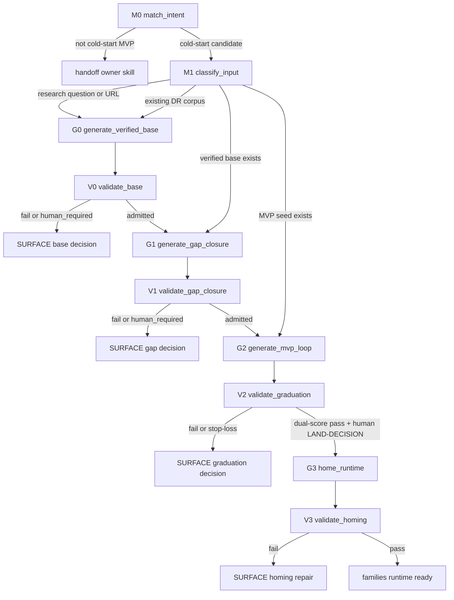

# Skill: dr-to-mvp — 冷啟動新家族 MVP 的 Stateful Workflow 脊椎

> **Role**：把一個研究題、一批 DR 語料、或一份已驗可信基底，路由成一個全新
> `families/<f>/` 畢業 MVP。
>
> 本 skill 是 **recipe-not-engine**：只負責 state graph、交接契約、SURFACE 人閘、
> 兩種 prototype 消歧與產物語意真相；不重寫各 Phase owner 的內部程序。
>
> **語意真相契約**：本文與本文產出的 plan/report/dispatch packet 必須讓 fresh LLM
> 在沒有原對話上下文時仍知道：目標、證據、grounding、actor、validator、human admit、
> failure edge。不得留下 `Opus or Codex or agy`、`按需驗證`、`處理相關問題` 這類未裁決
> 指令。需要選 actor 時，寫語意角色與不可替代理由。
>
> **Owner 指針**：Phase R 交給 [dr-research-loop](../dr-research-loop/SKILL.md)
> + [judge-loop-chooser](../judge-loop-chooser/SKILL.md)；Phase G 交給
> [unknown-discovery-composer](../unknown-discovery-composer/SKILL.md)、
> `~/.claude/skills/prototype`、必要時 [repo-agent-native](../repo-agent-native/SKILL.md)；
> Phase M 交給 [loop-harness-standard](../loop-harness-standard/SKILL.md)
> + `loop_wiki/engine.sh`。
>
> **Layer B**：可貼 playbook 在 [reference/guiding-prompt.md](reference/guiding-prompt.md)；
> 移植誠實帳在 [modules/retarget-map.md](modules/retarget-map.md)；Domain 詞與語料 intake
> 紀律在 [modules/domain-terms-and-intake.md](modules/domain-terms-and-intake.md)；資訊保全帳在
> [modules/semantic-loss-ledger.md](modules/semantic-loss-ledger.md)；重構前原文快照在
> [modules/legacy-skill-2026-07-22.md](modules/legacy-skill-2026-07-22.md)。它們按需讀，不是冷啟動
> 主路由；遇到疑似 domain 詞遺失或舊語意漂移時，先回 legacy snapshot 對照，不靠摘要猜。

## When to Use
- 要把研究題、URL、DR 語料、或已驗基底冷啟動成**全新**耐久家族資產。
- 要產出研究到 MVP 的 agent-ready 計劃、報告、或 dispatch packet。
- 要判斷目前材料該走 Phase R、Phase G、Phase M，還是應轉交其他 owner skill。

## Not For
- 既有家族的每日演化、publish、輪替 → [product-ops](../product-ops/SKILL.md)。
- 只跑一題 proposal 或 DR 迴圈 → [dr-research-loop](../dr-research-loop/SKILL.md)。
- 只建或修改小迴圈八大基座 → [loop-harness-standard](../loop-harness-standard/SKILL.md)。
- 只選驗證標準與獨立性 tier → [judge-loop-chooser](../judge-loop-chooser/SKILL.md)。
- 只把已完成經驗沉澱回 skill → [fold-in](../fold-in/SKILL.md)。

## State Graph



## Grounding Labels

Use these labels in every route ledger, plan, report, dispatch packet, and final gate.

| Label | Meaning | Allowed Use |
|---|---|---|
| `technical_equivalent` | Read and, when load-bearing, ran or compared the real component. It actually does the needed job. | Can be a plan premise or delegation target. |
| `candidate` | A real source, component, fixture, or rubric exists, but equivalence or coverage is not proven. | Can justify investigation, not final adoption. |
| `[推論]` | No direct source or fixture proves the claim. It is inference, LLM judgment, or pattern guess. | Must be surfaced as assumption, risk, or human question. |
| `human_required` | Scope, architecture, admit, or product intent cannot be decided from repo facts. | Stop and ask or record as SURFACE decision. |

## Output Contract

Any artifact produced by this skill must include a route ledger row for each Match/Generate/Validate
state:

```md
| state | decision | evidence | grounding | actor | validator | chosen edge | failure edge |
|---|---|---|---|---|---|---|---|
```

Rules:
- Do not compress context into labels like `semantic truth`, `validate later`, or `judge it`.
- State what is being judged, which evidence grounds it, who generates it, who validates it, and what failure means.
- Actor choices are semantic roles:
  - scripts verify deterministic facts and exit codes;
  - Codex implements, reproduces, and edits code or docs;
  - Opus fresh judges semantic verdicts and design graduation;
  - agy/Gemini researches or cross-checks findings, never final verdict;
  - human admits phase transitions, graduation, and homing.
- If the artifact cannot decide an actor or validator without product intent, mark `human_required` and stop.
- Domain terms must be expanded on first use. If a term is missing, add a `Glossary delta` row or mark the route `human_required`; see [modules/domain-terms-and-intake.md](modules/domain-terms-and-intake.md).

## Node Contracts

### M0 match_intent
Purpose：prevent ordinary work from being taxed by the cold-start spine.

Inputs：
- User request.
- Mentioned paths, proposals, families, loop names, or runtime targets.

Decision rule：
- If the task is existing-family daily evolution, hand off to `product-ops`.
- If the task is only DR proposal production, hand off to `dr-research-loop`.
- If the task is only loop harness engineering, hand off to `loop-harness-standard`.
- If the task is only verdict routing, hand off to `judge-loop-chooser`.
- Continue only when the target is a new durable family/runtime asset.

Output：
- Route ledger row with rejected owners and why.

Failure edge：
- If the target family/new-runtime boundary is unclear, mark `human_required`.

### M1 classify_input
Purpose：start from the real material state, not from a fixed Phase R prompt.

Inputs：
- Research question or URL.
- Existing DR corpus.
- Existing proposal or trusted synthesis.
- Existing prototype or MVP seed.

Decision rule：
- `research_question_or_url` → `G0 generate_verified_base`.
- `existing_dr_corpus` → `G0`, Mode B：classify corpus, reuse existing anchors, run only incremental verification.
- `verified_base_exists` → `G1 generate_gap_closure`.
- `mvp_seed_exists` → `G2 generate_mvp_loop`, but record why Phase G is already satisfied or not applicable.

Output：
- Route ledger row naming the input mode and evidence path.

Failure edge：
- If the material has no source path or provenance, mark `[推論]` and stop before treating it as a base.
- For Mode B corpus with transcripts or extracted notes, apply S0/S1 intake discipline from [modules/domain-terms-and-intake.md](modules/domain-terms-and-intake.md).

### G0 generate_verified_base
Purpose：produce a trusted base from research material without letting DR become the product premise.

Allowed actor：
- `dr-research-loop` driver for proposal production.
- agy may produce research findings.
- Codex may assemble source-linked docs.

Validator：
- T0 proposal checkers under `loop_wiki/_template_dr/scripts/check_*.py`.
- `judge-loop-chooser` D3 with Opus fresh verdict for adoptability.
- Human admit at the Phase R SURFACE gate.

Decision rule：
- DR/proposal output is pending narrative until T0 + D3 adopt.
- Every load-bearing claim needs deterministic anchor, primary source, or explicit `[推論]`.
- For Mode B, first search existing proposals/family assets for same-topic anchors; do not rerun DR by default.

Output artifact：
- Trusted base with truth scorecard, equivalence matrix, layered architecture, and weakest three unresolved claims.
- Route ledger rows for proposal status, D3 verdict, and human admit.

Conditional edge：
- Pass + human admit → `G1 generate_gap_closure`.

Failure edge：
- Contradicted claims, Half-Bridge, missing origin question, or unverifiable load-bearing facts → SURFACE with claim list.

### V0 validate_base
Purpose：make the base legible to a fresh judge.

Pass conditions：
- Proposal status is verified/adopted or equivalent evidence is path-backed.
- Claim table marks `technical_equivalent`, `candidate`, `[推論]`, or `human_required`.
- D3 intent drift check cites the origin question.
- Human admit is recorded before Phase G.

Failure edge：
- Return to `G0` for fixable evidence gaps.
- Stop at SURFACE if admit or product intent is missing.

### G1 generate_gap_closure
Purpose：turn base uncertainty into explicit KU/UK/UU routes.

Allowed actor：
- `unknown-discovery-composer` or equivalent reasoning for uncertainty classification.
- `repo-agent-native` for KU that can be answered by repo invariants.
- `~/.claude/skills/prototype` for D4 validation prototypes.
- Codex may build prototype code when the gap requires runnable implementation.

Validator：
- Scripts or prototype commands for deterministic behavior.
- Opus fresh semantic spot-check before absorbing any prototype answer.
- Human admit at Phase G SURFACE.

Decision rule：
- KU means source reading can answer it; cite the source.
- UK means only implementation or experiment can answer it; build a D4 validation prototype unless the MVP seed itself is the experimental artifact.
- D4 validation prototype artifacts are retained as anchors and never promoted into `src/`.
- MVP seed prototype can skip D4 only when the exact seed is about to enter Phase M and the gap can be tested inside the MVP loop.

Output artifact：
- Gap ledger with each gap, route, actor, validator, answer, and grounding label.

Conditional edge：
- All load-bearing UK closed or explicitly accepted as `human_required` → `G2 generate_mvp_loop`.

Failure edge：
- Prototype answer without fresh judge, missing bad case, or absorb-before-judge → stop and rerun validation.

### V1 validate_gap_closure
Purpose：prevent prototype evidence from becoming unsupported narrative.

Pass conditions：
- Each gap has route, evidence, validator, and grounding label.
- D4 answers were judged before absorb.
- D4 artifacts are retained as anchors and not promoted.
- Any D4 skip records why the MVP seed itself is the right test surface.

Failure edge：
- Return to `G1` for missing evidence.
- SURFACE if the remaining UK changes MVP scope.

### G2 generate_mvp_loop
Purpose：turn an admitted base or seed into an eight-base loop that can graduate.

Allowed actor：
- Codex or claude driver implements and edits.
- agy driver may implement or cross-check where configured, but not judge.
- `loop_wiki/engine.sh` dispatches iteration and stop-loss.

Validator：
- `verify.sh` full and fast modes.
- Design score judge using `DESIGN-SCORE.md`.
- Opus fresh semantic judge for graduation claims.
- Human LAND-DECISION.

Decision rule：
- Scaffold from `loop_wiki/_template`.
- Write `DESIGN-SCORE.md` before implementation; it is the design answer key.
- Put only admitted MVP seed code in `<loop>/src/`.
- Dispatch packets must include target path, success criteria, forbidden weakening, validator command, and failure edge.

Output artifact：
- `loop_wiki/<loop>/` with `PROMPT.md`, `PLAN.md`, `DESIGN-SCORE.md`, `src/`, tests, `verify.sh`, and dispatches.

Conditional edge：
- `verify.sh` pass + design score zero MISS + Opus fresh judge pass + human LAND-DECISION → `G3 home_runtime`.

Failure edge：
- Stop-loss three no-progress rounds, deleted tests, weakened source, or missing design score → SURFACE.

### V2 validate_graduation
Purpose：graduate only when design truth and implementation truth both pass.

Pass conditions：
- Mechanical implementation score passes via real `verify.sh` exit 0.
- Design score has zero MISS or explicit designed-cut accepted by judge.
- Judge does not rely only on exit code; it spot-checks the core claim.
- Human LAND-DECISION is recorded.

Failure edge：
- Return to `G2` for fixable implementation/design misses.
- SURFACE if graduation depends on product tradeoff.

### G3 home_runtime
Purpose：move the graduated MVP from loop/prototype space into durable family runtime.

Allowed actor：
- Codex performs file moves and path rewrites.

Validator：
- Family/runtime verification after move.
- Human admit for merge/homing if not already recorded.

Decision rule：
- Destination is `families/<f>/shared/runtime/<mvp>/`.
- Exclude `.git`, `venv`, caches, and transient logs.
- Rewrite prototype absolute paths to `__file__` relative paths.
- Family assets must not cite `proposals/` as runtime evidence.

Output artifact：
- Checked-in runtime under the family.
- Updated family metrics or changelog pointer when applicable.

Failure edge：
- If moved runtime cannot verify, stop at `V3 validate_homing` and repair before declaring ready.

### V3 validate_homing
Purpose：prove the durable runtime works from its final location.

Pass conditions：
- Final-location verify is green.
- Runtime paths are relative to checked-in files.
- Family-facing docs do not back-reference isolated proposals as evidence.
- Homing admit is recorded.

Failure edge：
- Repair pathing, missing files, or illegal proposal references before DONE.

## Invariants
1. **Recipe-not-engine**：every Phase boundary stops at SURFACE for human admit.
2. **DR is a gap-filler, not the product premise**：proposal text becomes trusted only after T0 + D3 + admit.
3. **Two prototype kinds stay separate**：D4 validation prototype is retained as evidence and never promoted; MVP seed enters Phase M only after admit.
4. **Actor and validator are not interchangeable**：scripts, Codex, Opus, agy, and human each have a semantic role.
5. **LLM verdict is evidence, not admit**：Opus or agy findings never auto-chain the next Phase.
6. **Dual-score AND gates graduation**：design score and implementation score must both pass.
7. **Grounding labels are mandatory** for load-bearing claims, route decisions, and produced artifacts.
8. **Owner skills remain SSOT**：this spine routes and records contracts; it does not duplicate owner internals.

## Gotchas
- **Slim does not mean compressed away**：state purpose, input, output, gate, and failure edge are load-bearing and must stay in `SKILL.md`.
- **Mode B can reuse anchors**：existing same-topic proposals or family assets should be checked before rerunning DR.
- **Absorb-before-judge is a known failure mode**：prototype answers are judged first, then absorbed.
- **Homing is families-type only in this repo**：remote/reference-impl homing belongs to other hosts, not skill-bettor.
- **Phase M family assets cannot cite `proposals/`**：knowledge flows through verified/admitted artifacts only.
- **`:9333` browser occupancy belongs to DR owner**：check it only when Phase R actually runs live browser DR.

## References
- [reference/guiding-prompt.md](reference/guiding-prompt.md) — Layer B可貼 playbook與輸出格式。
- [modules/retarget-map.md](modules/retarget-map.md) — antigravity 到 skill-bettor 的移植誠實帳。
- [modules/domain-terms-and-intake.md](modules/domain-terms-and-intake.md) — Domain 詞、Mode B 語料 intake、被降權資訊索引。
- [modules/semantic-loss-ledger.md](modules/semantic-loss-ledger.md) — state graph 重構資訊保全帳。
- [modules/legacy-skill-2026-07-22.md](modules/legacy-skill-2026-07-22.md) — 重構前 `SKILL.md` 原文快照，用於語意流失審計與 domain wording 復原。
- `families/agent-harness/` — 本地 worked instance：兩個已 homed runtime 與 changelog 錨。
