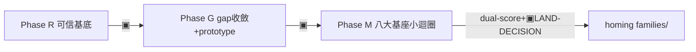

# Module: dr-to-mvp — Legacy SKILL.md Snapshot 2026-07-22

> This is the pre-state-graph `SKILL.md` snapshot preserved for zero-loss refactors.
> Source baseline：`git show 9600c79:.claude/skills/dr-to-mvp/SKILL.md`.
> Use this only for semantic loss audits and domain wording recovery. Active routing lives in [`../SKILL.md`](../SKILL.md).

---

---
name: dr-to-mvp
description: |
  把「一個研究問題／一批 DR 語料」一路編排到「一個畢業的家族資產（families/<f>）」時使用——串起 skill-bettor
  既有管線的**冷啟動脊椎**：Phase R 研究到可信基底（proposals 驗證閘 exit 10 ＋ judge-loop-chooser D3 adopt）→
  Phase G 可行度 gap 收斂＋驗證型 prototype 實測 → Phase M 種子 prototype 進八大基座迭代成畢業 MVP
  （loop_wiki/_template ＋ loop_wiki/engine.sh 小迴圈 iterate-until-pass×stop-loss＋dual-score 畢業）→ homing
  進 families/<f>/shared/runtime/。**recipe-not-engine**：每 Phase 間 SURFACE 停點人 admit,非 auto-chain;DR 是
  gap-filler 非主幹、非 prototype 入口;prototype 有兩種（驗證型 vs MVP 種子）別混。findings／產物給絕對路徑,
  畢業／homing 永遠人核。
  何時用：要把一個研究題／DR 語料**冷啟動**長成一個全新的耐久家族資產、或要一份 研究→prototype→畢業 MVP 的
  完整引導提示詞時。
  觸發詞：研究到 MVP、prototype 做成家族資產、冷啟動新家族、SYNTHESIS 落地成 runtime、八大基座做 MVP、
  MVP-builder 引導提示詞、大小迴圈做終端資產、dr-to-mvp。
  NOT for：既有家族的每日演化 runbook（product-ops）、只建單條迴圈規範（loop-harness-standard）、
  只跑 DR proposal（dr-research-loop）、只 fold 經驗進既有 skill（fold-in）、只選驗證 tier（judge-loop-chooser）。
  可貼 playbook → reference/guiding-prompt.md;antigravity→skill-bettor 移植映射 → modules/retarget-map.md。
---

# Skill: dr-to-mvp — 研究問題 → 可信基底 → prototype → 八大基座畢業 MVP 的冷啟動脊椎

> **Role**：把一個研究問題／一批 DR 語料**冷啟動**長成一個全新畢業家族資產的**大迴圈編排脊椎**。
> 它**不擁有任何 Phase 的內部**（那些在各 owner skill）——只擁有 **R→G→M 的定序、phase 間的 SURFACE handoff gate、兩種 prototype 消歧、誠實接縫帳本**。
> **recipe-not-engine**：每 Phase 間停下等人 admit,不 auto-chain。
> **它不是 turnkey auto-engine,是人核 recipe。**
> **疆界（反重疊）**：dr-to-mvp＝**冷啟動**（研究題／DR 語料 → 全新畢業家族資產）;
> 既有家族的**每日演化**（晨檢→op→畢業→publish→輪替）在 [product-ops](../product-ops/SKILL.md)。
> 兩者在 **Phase M homing→families** 交接:dr-to-mvp 把種子 homing 進 `families/<f>/shared/runtime/` 後,product-ops 接手日常演化。
> **別在本脊椎重述 product-ops 的日常 runbook。**
> **結構**：SKILL.md＝Phase 路由表＋SURFACE gate＋不變量;
> 可貼的逐階段 playbook（prompt 骨架＋閘＋▣停點＋接縫帳本）在 [reference/guiding-prompt.md](reference/guiding-prompt.md);
> 移植命門與誠實帳（哪些 antigravity 機制怎麼 retarget 到 skill-bettor）在 [modules/retarget-map.md](modules/retarget-map.md)。
> **owner skill（脊椎只指針,不複述其內部;漂移以它們為準）**：
>   - Phase R → [proposals/](../../../proposals/README.md)（DR 隔離區＋schema SSOT）＋ [dr-research-loop](../dr-research-loop/SKILL.md)（DR 執行）＋ [judge-loop-chooser](../judge-loop-chooser/SKILL.md)（D3 adopt 閘）
>   - Phase G → 同上 D3-D4 ＋ 全局 prototype skill（`~/.claude/skills/prototype`,user-level 不在本 repo）＋ `cp -r loop_wiki/_template`
>   - Phase M → [loop-harness-standard](../loop-harness-standard/SKILL.md) [`modules/harness-spec.md`](../loop-harness-standard/modules/harness-spec.md)（八大基座卡）＋ `loop_wiki/engine.sh`
> **LOCAL LIVE 錨（反-husk;本地真跑,非 antigravity 史）**：`families/agent-harness/`——本脊椎在 skill-bettor 的 worked instance:
> 一次 op 產兩個已畢業 GRADUATED MVP（`shared/runtime/harness-core` `7481e78`、`shared/runtime/evals-gate` `613da6e`）,
> 經八大基座小迴圈畢業 → 人 LAND-DECISION admit → **families 型 homing** 進 `shared/runtime/`
> （隨家族 checked-in,verify.sh 綠 117/177,跨模組 `__file__` 相對 schema 實測通過,三面向 fresh 對抗驗證全 pass）。
> 帳 → `families/agent-harness/{FAMILY.yaml,changelog/2026-07-12.md}`。

## When to Use
- 有一個研究題／一批 DR 語料要**冷啟動**長成一個**全新**的耐久家族資產（`families/<f>/`）。
- 要一份 **研究→prototype→畢業 MVP 的完整引導提示詞**當大迴圈編排腳本。

## Not For
- ❌ 既有家族的**每日演化** runbook（晨檢／選題／輪替／publish）→ [product-ops](../product-ops/SKILL.md)（疆界見上 Role;交接點＝Phase M homing）。
- ❌ 只建／改一條迴圈的工程規範本體 → [loop-harness-standard](../loop-harness-standard/SKILL.md)（Phase M 委派它,不定義基座）。
- ❌ 只跑一輪 DR proposal（proposals/ 上游迴圈本身）→ [dr-research-loop](../dr-research-loop/SKILL.md)（本脊椎的 Phase R 就是委派它）。
- ❌ 只把一段**已完成**經驗 fold 進既有 skill → [fold-in](../fold-in/SKILL.md)。
- ❌ 只選某 deliverable 的驗證 tier → [judge-loop-chooser](../judge-loop-chooser/SKILL.md)。

## §0 拓撲校正（動手前先破兩個常見誤解）
1. **DR 不是 prototype 入口**：DR／proposal 是「填外部知識缺口」的一步,產物＝待驗敘事非鐵錨（Path B）。
   可信基底＝proposal 過 T0 四閘（exit 10）＋ D3 adopt 的裁決。
   prototype 真入口＝**D4**,種子＝**已驗基底 ＋ 一個 D3 的 UK 可行度缺口**。
2. **prototype 有兩種別混**：① **D4 驗證型**（只為答一個 UK 缺口而建,ANSWER absorb→基底;
   artifact **留錨不刪**——驗證過的技術實作等價物,刪掉＝「UK 已關閉」claim 失去可重驗鐵錨;
   **永不升格 src/**）② **MVP 種子**（已驗證,升格進 `loop_wiki/<loop>/src/` 用八大基座長成畢業資產）。
   **分軸＝升格路徑非壽命;「交給八大基座」＝拿②,不是拿 DR proposal、不是拿①的半成品。**
   （2026-07-20 語義修正,同步自 antigravity 上游）
> 完整圖＋對照表 → [reference/guiding-prompt.md](reference/guiding-prompt.md) §0。

## 確定性程序（三 Phase,每 Phase 間 ▣SURFACE 人 admit）

1. **Phase R — 研究到可信基底**〔LIVE ✓〕：
   判 Mode A（有具體研究題/URL）/Mode B（DR 語料型:既有語料主題分類→cluster 深整合,可無新 DR）
   → 跑 proposals/ 上游迴圈（DR 走 dr-research-loop,禁重造）
   → T0 四閘機械驗（`loop_wiki/_template_dr/scripts/check_*.py`,exit 10=verified）
   → judge-loop-chooser **D3 adopt**（意圖漂移錨＝proposal `origin_question`;Half-Bridge 撤回）。
   判官＝Opus,agy 不當判官。
   **閘**：每 load-bearing claim 有確定性錨或明標 UNVERIFIED（無錨＝Half-Bridge,不宣稱）。
   **▣** 可信基底給人核——哪些 claim CONTRADICTED、哪些留待 prototype 實測。
2. **Phase G — gap 收斂＋驗證型 prototype 實測**〔LIVE ✓〕：
   D3 四象限（KU→讀源可答,repo-agent-native L2 不變量,**真實作常反證論點**;UK→prototype）
   → D4 驗證型 prototype（全局 `~/.claude/skills/prototype`,預設輕量,混壞 case 實測防護真起作用,
   答完 **ANSWER 先過 fresh 判官原始重算 spot-check 再 absorb**→基底→**artifact 留錨不升格**,見 §0.2）。
   **▣** 哪些 UK 已實測關閉、夠不夠開 MVP。
3. **Phase M — 種子→八大基座畢業 MVP**〔LIVE ✓〕：① 基底→`DESIGN-SCORE.md`（設計分 answer-key）
   → ② `cp -r loop_wiki/_template loop_wiki/<loop>`（八大基座骨架:PROMPT.md#7／PLAN.md#8／CLAUDE.md#1／run.sh／verify.sh#6 T0／anti/）
   → ③ 種子進 `<loop>/src/`＋verify.sh 首條回歸（實作分 T0）
   → 小迴圈 `loop_wiki/engine.sh <loop> --driver claude|agy`：每輪寫 `dispatches/round-NN.md`
   → 派 **fresh zero-context driver（禁 fork）**整改 src/
   → **判官(Opus)** 跑 verify.sh full+--fast＋git-diff 零弱化＋**實質 spot-check 核心 claim**
   → exit0 commit／stop-loss 3→SURFACE（engine `exit 10`=awaiting-human-admit）。
   **閘**：dual-score AND（設計分∧實作分）。
   **▣（終點必停）** 畢業＝人 LAND-DECISION → **families 型 homing** 搬進 `families/<f>/shared/runtime/<mvp>/`（隨家族 checked-in,跨模組路徑 `__file__` 相對）。
> 可貼 prompt 骨架逐階段 → [reference/guiding-prompt.md](reference/guiding-prompt.md) §1。

## 不變量（違反即停）
1. **recipe-not-engine,每 Phase 間人 admit**：不 auto-chain R→G→M;畢業／merge／homing 永遠人核（human-exit-gate）。
2. **DR/proposal 是 gap-filler 非主幹非 prototype 入口**;把 DR 報告當事實直接設計＝幻覺入庫（Path B：待驗敘事非鐵錨,錨＞LLM;proposal driver 不得自宣 verified/adopted）。
3. **兩種 prototype 別混,分軸＝升格路徑非壽命**：D4 驗證型答完留錨、永不升格;只有已驗證種子才升格 MVP。
4. **判官＝Opus,永不 Haiku、永不 agy-as-verdict**（agy＝Gemini only,只出 findings）;
   執行者≠判官,同 op author×judge 必 fresh zero-context subagent **禁 fork**;
   **判官別只信 exit 0,實質 spot-check 該輪核心 claim**。
5. **dual-score AND 才畢業**：降維／移除某 SC 仍須過設計分（證明是 designed-cut 非漏做）。
   畢業後 metrics 回填 `families/<f>/FAMILY.yaml`
   （雙軌成長曲線:機械 success_rate ∧ 語意 semantic_pass_rate,見 [product-ops](../product-ops/SKILL.md)）。
6. **脊椎 pointer-only,不複述 owner 內部**：三 Phase 內部 SSOT 在各 owner skill,漂移以它們為準;
   **不搬 antigravity 歷史證成紀錄**（cutplan／autopilot-bridge／D 編號帳／具體 commit）
   ——skill-bettor 累積自己的軌跡在 `families/*/changelog/`。
   反-husk 錨＝上方指針指真檔＋`families/agent-harness/` LOCAL LIVE 錨。

## Gotchas（誠實接縫,Path B——別在未證關節鋪平滑敘事）
- **知識單向流硬約束**：proposals → 驗證 → 沙盒 diff → eval 閘 → 人 admit → merge,沒有旁門（ARCHITECTURE.md §7 鐵律 1）。
  **Phase M 的 `families/<f>/` SKILL.md／references 禁引用 `proposals/`**（家族引用上游隔離區＝CI FAIL）;
  本脊椎（`.claude/skills/`,非家族）編排整條管線故可指 proposals,但**產出的家族資產**不得回指。
- **Phase R 先查既有同主題基底再決定跑不跑 DR**：語料與既有 proposals/家族產物同主題時,複用已驗機械錨、只做增量驗
  （`families/agent-harness/` 那次即 DR 語料型 Phase R:既有語料主題分類→cluster 深整合,無新 DR）
  ——防重跑已驗＝Path B 錨＞重複敘事。
- **保真語料 intake 兩層分工**（Mode B 語料含「逐字保真原文＋知識萃取」雙層時,2026-07-20 泛化自
  trilogy 消化）：**S0 逐字稿＝意圖考古層**——重建提問者原始意圖／D3 `origin_question`／意圖漂移
  辯論的素材,防記憶改寫（實證:辯論曾抓到「記憶中的敘事與逐字原文已有偏差」）,**不直接入計劃前提**;
  **S1 萃取／整合稿＝知識層**——引用其 load-bearing 數字／實體前,必經 external-verify 查證、
  以查得真值**覆蓋**對話原值(覆蓋表格式先例＝trilogy 整合稿查證結果表),標 still-unverified 者
  一律當未證。**post-cutoff 實體雙向警戒**:「訓練記憶想不起來≠假」——疑真（把假當真）與疑假（把真判假）同時會犯,判
  confabulation 前必走 external-verify（翻案先例:trilogy 三 S 級實體 2026-07-17 全 VERIFIED-real,
  推翻前版 confabulation 判定）。大檔未萃取先關鍵詞 triage,命中才萃取（先例:aie-context-pack
  `dr-intake/A6-triage-unmined.md`）。
- **Phase G 某類種子可跳 D4 驗證型**：當 v1 種子本身即要進 `src/` 的②MVP 種子（非①驗證型）,D4 對它不適用,唯一 UK 直接在 Phase M 小迴圈用 mock 純內部層驗。
  know-why → reference §Phase G。
- **Phase G absorb 先於判官＝實錘失真源**（2026-07-20 antigravity skill-evals-governance 跑,上游同步）：
  先 absorb 再補判官,D4 判官原始重算仍抓出 1 處實質數字失真＋1 處歸因缺口
  ——閘序＝ANSWER→判官→absorb（不變量 4「別只信 exit 0」的 Phase G 面）;
  錨＝`/Users/neon/antigravity/docs/plans/2026-07-20-dr-to-mvp-skill-evals/G-D4-judge-verdict.md`。
- **homing 目的地＝families 型**：畢業 MVP 搬離 gitignored `prototype/` → `families/<f>/shared/runtime/<mvp>/`
  （隨家族 checked-in,訂閱者 git pull 即得可跑模組）;
  搬運排除 `.git`/`venv`/快取,跨模組絕對路徑改 `__file__` 相對（實例 `families/agent-harness/` `0e9ea32`）。
  **硬體/真機類 e2e 無設備標 `deferred(needs-hardware)` 不卡 homing**。
  families 型完整帳＋共通不變量（搬完 verify 必綠）→ `families/agent-harness/changelog/2026-07-12.md`
  （本 repo 唯一適用型;antigravity 另有 remote／reference-impl 型,單 repo 家族場景不適用,見 modules/retarget-map.md §2）。
- **單 host,無 2×2 矩陣**：skill-bettor 恆為 Claude Code 單 host;
  driver 選型單軸（`--driver claude|agy`,agy 落 `AGENTS.md` symlink）,不存在 antigravity「開哪個 CLI 換家族」的隔離翻面。
  移植拿掉 host×driver 矩陣＝架構前提不同,非能力縮水（詳 modules/retarget-map.md）。
- **Phase R 跑 live 瀏覽器 DR 前必查 `:9333` 佔用**：DR 執行引擎 SSOT 在 dr-research-loop;跑前完整查進程＋ESTABLISHED＋分頁活躍 DR,非只 pgrep 一次。
- **反-husk**：本脊椎的價值＝定序＋handoff gate＋兩種 prototype 消歧＋接縫帳本＋冷啟動/日常疆界,**不是**重造三 Phase 或複述 product-ops;若哪天開始複述 owner 內部＝漂移,以 owner 為準。

## Reference
- [reference/guiding-prompt.md](reference/guiding-prompt.md) — 泛化可貼引導提示詞 playbook：
  §0 拓撲校正＋兩種 prototype 對照表
  · §1 Phase R/G/M 逐階段（SSOT 指針＋prompt 骨架＋閘＋▣SURFACE）
  · §2 誠實接縫帳本（LIVE ✓ vs 設計 only）
  · §3 一頁速查命令序列。
- [modules/retarget-map.md](modules/retarget-map.md) — antigravity → skill-bettor 移植映射＋誠實帳：哪些機制一對一映、哪些因架構前提不同拿掉/降級、為何不是簡化。
