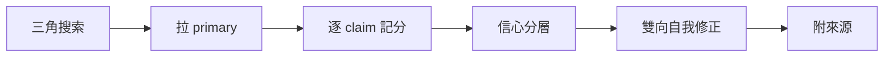

# Skill: external-verify — 官方文件查證真相執行步驟(External-Verify Runbook)

> **Role**: 對 post-cutoff/不可錨 claim,用官方 primary source 查到鐵錨,
> 阻止「拿訓練記憶/WebSearch 摘要當事實」。
> **結構**: SKILL.md = 確定性程序 + pointer;
> 已查證真相快照在 [modules/verified-truth.md](modules/verified-truth.md)。
> **與 path-b-reduction 的關係(已知缺口,誠實標記)**:
> antigravity 原版稱本 skill 是 `path-b-reduction`
> (把每個 claim 約分到它的確定性鐵錨——exit-code／test／
> external-verified primary source——阻止認知卸載的方法論)
> 步驟一「尋找物理鐵錨」的執行化。
> `path-b-reduction` 本身**尚未移植進 skill-bettor**
> (antigravity-external,不在本批次移植項目內),
> 本檔不假裝該 skill 本地存在、也不留死連結。
> 單獨來看本檔仍可成立:上游方法論做的事就是
> 「把每個 claim 拆到最小可查證單位,再逐一查證」,
> 本 skill 就是那個「逐一查證」動作本身的確定性程序,
> 不依賴上游 skill 也讀得懂、用得動。
> **Lineage**: 移植自 antigravity
> `.agents/skills/external-verify/`——
> 6 步 runbook 本身通用於任何平台,幾乎原樣搬;
> `modules/verified-truth.md` 整份重寫
> (antigravity 原版是 Google Antigravity CLI 平台的「已查證真相表」,
> 那是錯平台的事實,不可搬進 Claude-Code-only 的 skill-bettor,
> 已換成本地空白模板+本次移植時順手查證的 Claude Code Skill 規範種子)。
> 逐條映射見 [modules/retarget-map.md](modules/retarget-map.md)。

## When to Use
- claim 涉及「該讀哪個檔／預設哪個模型／哪個版本支援 X／設計規範是什麼」。
- claim 提到「官方規範」「[必備]」卻**沒附可點 URL**。
- 自信 × 具體 × 不可查證 = 幻覺指紋 → 強制查證,別採信、也別反向臆斷。

## Not For
- ❌ 確定性可 grep 的矛盾(如專案內部設定衝突、程式碼與文件互相打架)— 直接驗,不需外部查證。
- ❌ 已 external-verified 且未過期的事實 — 別重複燒查證成本。

## 確定性程序(6 步)

1. **三角搜索** — WebSearch ×3 不同切角,蒐集候選 primary URL;
   優先官方域名(vendor/工具官方文件站、官方工程 blog、
   官方 `github.com/<org>/<repo>`)。
2. **拉 primary** — WebFetch 官方 docs/API/repo,
   要求逐字引用檔名/路徑/欄位。**禁**靠 WebSearch 合成摘要定案(那是二手)。
   若官方文件站是高度 JS 渲染的 app、WebFetch 抓不出內文,
   改抓對應的靜態鏡像(README、release note、codelab——靜態 HTML 通常較可靠)。
3. **逐 claim 記分** — 每條 → {primary 證實 / hard-secondary
   (官方 issue·release note) / 未證}。
   **單一可驗證 claim 撞牆 = 整段降級**。
4. **信心分層** — primary 多源一致 = 可當定局;
   只在二手出現 = frontier-contested,禁當定局。
5. **雙向自我修正** — 推翻原 claim 要記;
   推翻**自己先前的反向臆斷**也要記。
6. **附來源** — 列官方 URL(markdown link),
   標哪條 primary、哪條 secondary。

## Gotchas
- WebSearch 回傳的「答案摘要」是 LLM 合成的二手,**不是鐵錨**
  — 一定走 step 2 拉 primary 才定案。
- **WebFetch 也是二手**:它經小模型改寫——會摘要化(bullet 卡片非原文)、
  正規化標點(彎撇號 ’ U+2019 → 直撇號 ')。
  **逐字引文/string-match 級驗證必須 raw fetch**(curl+HTML tag-strip),
  否則兩類假象:①逐字比對假陰性;②弱模型把 fetch 摘要當頁面原文,
  對「摘要沒提的真內容」發缺席式誤判。
  (antigravity 自己的 truth-verify 迴圈踩過這兩類坑並留有案例帳本,
  但那條迴圈與帳本在 skill-bettor 無本地基座,
  案例細節不隨本次移植搬入——機制風險本身通用,案例是 antigravity 自己的軌跡)
- **數字對 ≠ 機制對**:二手轉述最典型的走樣是百分比全數正確、機制/對象卻漂掉。
  舉例說明這個失敗模式
  (antigravity 外部案例,僅為理解用,未在 skill-bettor 本地重現):
  某次轉述一篇技術部落格時,
  「合併 reviewer」實際上是兩個獨立審查維度(規格符合度×程式碼品質)
  被誤轉述成另外兩個維度(安全性×風格);
  「tiering」實際上是 orchestrator 的 prompt 層引導
  被誤轉述成一個獨立的關鍵字路由器——**數字(百分比)全部正確,機制認錯了**。
  → step 3 逐 claim 記分時,
  把「數字 claim」與「機制 claim」拆開各自對 primary 查證;
  真正要照著落地的,承重的是機制 claim,不是數字。
- 官方文件若架在高度 JS 渲染的網站上(常見於行銷/文件混合站),
  WebFetch 常只回標題或空殼 →
  改抓該文件對應的靜態版本(README、codelab、release note)。
- 本 skill 產出的「已查證真相」是**會過期的快照**,復用前重跑 step 1-2,以官方當下文案為準。

## Modules
- [modules/verified-truth.md](modules/verified-truth.md) —
  skill-bettor 自己的「已查證真相」累積表
  (skill-bettor 尚未累積自己的驗證項,
  故以空白模板+本次移植順手查證的 Claude Code Skill 規範種子起步;
  結構與復用紀律見該檔)。
- [modules/retarget-map.md](modules/retarget-map.md) —
  antigravity → skill-bettor 逐機制映射與誠實帳本。
