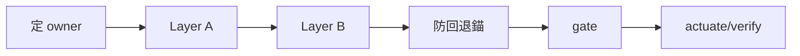

# Skill: fold-in — 把經驗吸收進既有結構(非造新 skill)

> **Role**:把一段**已完成**的工作經驗 fold 進 skill-bettor 的既有結構,
> 而非造新 skill。
> 預設不造新 —— actuator 是 Claude Code 內建 `write-a-skill`
> (經 Skill 工具喚出,位於 `~/.claude/skills/write-a-skill/`,
> **非本 repo 內路徑**;它判「該不該新建」。
> 注意這是 Claude Code 平台自己的 skill 格式規範,不是 Google
> Antigravity `.agents/skills/` 的格式——frontmatter 慣例不同,
> 判「新建 vs fold」的理由本身跨平台通用,只有這個委派指針隨平台換)。
> **結構**:SKILL.md = 確定性程序 + 不變量;
> 為何這樣分層、antigravity lineage、完整 retarget 映射表在
> [modules/fold-in-know-why.md](modules/fold-in-know-why.md) 與
> [modules/retarget-map.md](modules/retarget-map.md)。
> **SSOT**:吸收的 durable home **依範疇+受眾分路
> (2026-07-12 起六路;2026-07-19 增「計劃執行進度」成七路)**
> (見不變量 1、確定性程序 §1 決策樹)——單一家族的
> 行為/eval 教訓進該家族 [`changelog/`](../../../families/pinescript-audit/changelog/);
> 跨家族 harness 工程教訓進 [`loop-harness-standard`](../loop-harness-standard/SKILL.md)
> 自己的 Gotchas/modules;
> 迴圈拓撲(資料流/收斂閘/不變量)事實進 [`harness-wiki`](../harness-wiki/SKILL.md) 組件卡;
> repo 級跨切面決策進 [`ARCHITECTURE.md`](../../../ARCHITECTURE.md) §10/§11。
> **skill-bettor 沒有 antigravity 那種集中式頂層「Resolved」帳本**
> (沒有 root `AGENTS.md`)——確定性邏輯的權威依範疇在該家族
> `evals/runner.py`(或 judge.py／掃描腳本)或 `loop_wiki/engine.sh`。
> 漂移時以程式碼／各自 durable home 為準,不以本 skill 的敘述為準。
> **Lineage**:port 自 antigravity `.agents/skills/fold-in/`
> (本身承 northstar `/fold-in`,DDR-205 Layer A/B)。
> antigravity 的 `antigravity-harness-wiki`／root `AGENTS.md`「Resolved」／
> `antigravity-skill-authoring` 機制已 retarget 成 skill-bettor 對應物
> (映射表在 [modules/retarget-map.md](modules/retarget-map.md)),
> **非原樣搬**(原樣搬 = 引用不存在基座的 husk)。

## When to Use
- 剛修好某家族 `evals/runner.py`(或 judge.py／案例 fixtures)的一個 bug,
  或修好 `loop_wiki/engine.sh` 的一個 Goodhart-checker 漏洞,
  要把「根因＋修法＋禁回退鐵錨」沉澱進 durable 結構。
- 一段操作鐵律／血淚(agy quota 耗盡判別、driver 選型踩坑、eval token 口徑校準…)要吸收,
  而不是散在對話裡蒸發。
- 某迴圈的收斂閘／資料流歸屬／不變量真的變了,要回同步 `harness-wiki` 組件卡。
- 想加能力但**不確定該不該造新 skill** —— 先來這裡走
  「選 owner → 多半 fold 進既有」。

## Not For
- ❌ Claude Code 平台通用 skill 格式細節 →
  Claude Code 內建 `write-a-skill`(本 skill 的 actuator)。
- ❌ skill-bettor 家規本身(兩類 skill 分界、slim+modules、stateful workflow 契約、語意真相/低壓縮產物契約、
  frontmatter/checklist/名片同步) → [skill-authoring](../skill-authoring/SKILL.md)。
- ❌ 建/驅動一條新演化 op 沙盒、選 driver、分層 verify 的工程規範 →
  [loop-harness-standard](../loop-harness-standard/SKILL.md)。
- ❌ 查證外部 claim → [external-verify](../external-verify/SKILL.md)
  (同批移植的手足 skill)。
- ❌ composer skill **自身** `modules/` 的領域知識維護
  (該 skill 作者直接編輯——為它多造一層間接
  =違反本 skill 反間接層精神;2026-07-17 定界,
  見計劃包 `docs/plans/2026-07-17-agent-native-sdlc-panorama/`)。
- ❌ 把 antigravity 的 `.agents/skills/fold-in/` 原檔複製進本 repo
  (引用 `antigravity-harness-wiki`／
  root `AGENTS.md`「Resolved」／`antigravity-skill-authoring`
  等 skill-bettor 不存在或已改名的基座 = 死 husk)。

## 不變量(違反即停)
1. **先選 owner,預設 fold 不造新**
   (Slop #2 / anti-inflation——判準是「有沒有未覆蓋的真 niche」,不是字面禁令)。
   owner 候選＝**讀 [`harness-wiki`](../harness-wiki/SKILL.md) 組件卡當活系統邊界**
   (別憑記憶的「N 條迴圈」硬數字——會隨新迴圈落地 additive 增長,
   以組件卡現況為準,2026-07-19 起 3 列;
   規模小不代表沒有「結構性看不見新迴圈」的風險)。
   依範疇+受眾分七路(決策樹在確定性程序 §1):
   - 單一家族的行為/eval 教訓 → 該家族 `changelog/`;
   - 該家族某子技能的領域知識修正 → 該子技能 SKILL.md/references/;
   - 跨家族 harness 工程教訓 → `loop-harness-standard` 自己的 Gotchas/modules;
   - 迴圈拓撲事實 → `harness-wiki` 組件卡;
   - repo 級決策 → `ARCHITECTURE.md` §10/§11。
   **只有真未覆蓋 niche + 人核**
   才走 Claude Code 內建 `write-a-skill` 新建。
2. **SKILL.md 不胖**:know-why 一律進 owner 的 `modules/`
   (或家族子技能的 `references/`);
   SKILL.md/changelog 只增**確定性事實／程序／Gotcha 一行**,
   不寫長篇 rationale。
3. **frontmatter description 不含 ASCII `": "`**
   (冒號＋空格 → YAML 解析成 mapping → skill 被靜默跳過,
   連自己名字都 recall 不到)。
   多行一律 `|` block scalar、用全形「：」。
4. **確定性邏輯必有該範疇的真實實現 ＋ 禁回退鐵錨,否則只是散文 husk**。
   吸收「某修法」時,該修法必須真在**該範疇的 load-bearing 檔案**落地
   ——家族層級教訓在該家族 `evals/runner.py`(或 judge.py／掃描腳本);
   跨家族 harness 教訓在 `loop_wiki/engine.sh` 或 `loop_wiki/_template/` 慣例
   ——且對應 durable home(不變量 1 四路之一)記一條
   「已解:X。禁回退用 Y。」＋可驗證的實測數字/exit code。
   無鐵錨的「效率提升／已優化」= Half-Bridge 散文,
   不可宣稱吸收成立(Path B 紀律)。
5. **load-bearing 課畢業到 durable home,不留對話**。
   - 行為／操作鐵律 → 對應範疇的家族 changelog 或 `loop-harness-standard` Gotchas;
   - 跨迴圈拓撲事實 → `harness-wiki` 組件卡(見不變量 6);
   - repo 級決策 → `ARCHITECTURE.md`。
   **別**只記在對話或隨手筆記等它留 —— 對話是 ephemeral,不畢業 = 經驗蒸發。
6. **跨迴圈 fold 必回同步 `harness-wiki` 組件卡**:
   若 fold 動到某迴圈的**收斂閘／資料流歸屬／不變量／SSOT 指針**,
   fold 完必回頭核並更新 [`harness-wiki`](../harness-wiki/SKILL.md)
   的組件卡＋不變量清單(**只改指針,永不抄內容**)
   —— 否則全景圖靜默漂成 husk(正是它要防的雙圖漂移;
   而 fold-in 是最主要的變異操作＝最大漂移源)。
   方法論／路由類 fold 無 `evals/runner.py`／`engine.sh` 錨,
   其反-husk 錨＝**指向的 SSOT 是真檔案**
   (技術等價物判斷反身版,詳 know-why §6)。
   **動到演化小迴圈八大基座
   (`run.sh`／沙盒 `CLAUDE.md`／`verify.sh`／driver 調用)時,
   fold 前先對 [`loop-harness-standard`](../loop-harness-standard/SKILL.md)
   的八大基座組件卡＋防退化鐵律核對,防 fold 時把基座設計規範飄移**
   (指針對照永不抄;canonical 範例＝`loop_demo/claude_agy`)。

## 確定性程序

1. **定 owner**:讀 [`harness-wiki`](../harness-wiki/SKILL.md) 組件卡
   (活系統邊界的迴圈清單,以現況為準、別假設已窮盡)
   ＋ `ARCHITECTURE.md` 的 domain,
   依範疇選最貼近的 owner(完整決策樹在 module,四路摘要如下):
   - **單一家族的過程/評測教訓**
     (`evals/runner.py` bugfix、案例設計缺陷、token 口徑校準、
     假陽性/假陰性率變化)
     → 該家族 `changelog/YYYY-MM-DD.md`(additive dated entry)。
   - **該家族某子技能的領域知識修正**
     (如新發現的一個 repaint 假陽性模式、一條新判斷準則)
     → 該子技能自己的 `SKILL.md`
     (事實面,如「判斷原則」段落加一條)
     ＋ `references/<topic>.md`(why/案例);
     子技能 SKILL.md 本身不留教訓敘事,只留可執行事實
     —— 敘事仍額外落一行進家族 `changelog/` 當防回退錨
     (家族路由器 SKILL.md 本身「只放地圖不放知識」,不可用來記教訓)。
   - **跨家族 harness 工程教訓**
     (`loop_wiki/engine.sh` 修法、driver/dispatch 踩坑、
     DR proposal 迴圈中的 agy quota 耗盡判別、evals 設計法通則)
     → [`loop-harness-standard`](../loop-harness-standard/SKILL.md)
     自己的「Gotchas」段落(事實)
     ＋ `modules/harness-spec.md` 或 `modules/evals-design-method.md`(why)。
     production seed loop 的通用方法→
     `loop-harness-standard/modules/production-seed-loop.md`;
     已落地迴圈的組件卡與 prompt/context owner registry→
     `harness-wiki/SKILL.md` + `harness-wiki/modules/prompt-registry.md`;
     domain packet/schema/validator 實作留在該小迴圈自己的八大基座。
   - **迴圈拓撲事實變動**
     (某迴圈的收斂閘／資料流歸屬／不變量改變)
     → `harness-wiki` 組件卡 ＋ 不變量清單
     (只指針,不寫 why —— harness-wiki 鐵律是「只 MAP 不放內容」)。
   - **repo 級跨切面架構決策**
     (tier-dispatch 政策改變、N×M 政策、是否建 root `AGENTS.md`、
     每日管線排程調整)
     → `ARCHITECTURE.md` §10「遷移步驟」(dated bullet)
     ＋ §11「為何不」(防回退鏡像)。
   - **skill 設計家規變動**
     (兩類 skill 分界、流程/路由類 state graph 契約、skill 本文與產物的語意真相/低壓縮契約、
     description/frontmatter 規範、slim+modules 取捨、名片/SSOT 同步規則)
     → [skill-authoring](../skill-authoring/SKILL.md) 的 checklist/Gotchas
     ＋必要時 `modules/authoring-clauses.md`(why)。
     若只是某一支 workflow skill 的專屬程序或輸出格式改良,回該 skill 自己;
     抽象成所有 skill 都該遵守的規範時,才進 skill-authoring。
     若問題是「skill 本身懂,但產出的 plan/report 讓下一個 LLM 猜」,
     同步改 producer skill 的 output/final gate,不能只改家規。
     **禁回退:把單支 skill 的完整 state graph 抄進家規**
     (雙圖漂移);家規只收抽象條款+owner skill 指針。
   - **迴圈專屬教訓**
     (某條迴圈自己的運行模式/driver 踩坑/判定式變更;2026-07-12 增路)
     → 該迴圈 **owner skill** 的 Gotchas/modules
     (路由表=harness-wiki 組件卡「擁有者 SSOT」欄)
     —— 別硬塞 loop-harness-standard
     (它管「怎麼建新迴圈」通則,單條迴圈專屬教訓塞進去=汙染通則);
     已解/禁回退錨與事實同位。
   - **producer 側行為教訓**
     (driver 造假/棄證/取巧等作者行為模式;2026-07-12 增路)
     → 對應 template `anti/` 種前科檔(如 `_template_dr/anti/`)
     ——**雙側路由**:只進 skill/Gotchas=只有 orchestrator 學乖,
     讀沙盒 anti/ 的 driver 永遠收不到
     (實犯後補:三型前科 b8d9f5d;why 見 modules/fold-in-know-why.md §7)。
   - **計劃執行進度**
     (多階段計劃某 Phase/人閘跑完,要讓計劃文件追得上現實;2026-07-19 增路)
     → 回填**原計劃檔本身**:
     ▣ checklist 打勾＋日期＋一句錨(指針到判官報告/帳本檔,不貼內容)、
     檔頭 blockquote 加一行「執行狀態」;
     逐派工 provenance 集中 `dispatches/round-NN.md`(計劃檔只指針)。
     **進度事實與它的閘同位——已解:閘同位回填。
     禁回退用中央 STATUS/進度總表檔**(第二本帳=雙圖漂移)。
     未完成項保持 `- [ ]` 並寫一句「為何待」(防靜默遺忘)。
     live 例=`docs/plans/2026-07-17-aie-context-pack/plan/`
     (10/20/30 已勾閘+40 §D3.1+`dispatches/round-01,02`);
     why → [modules/fold-in-know-why.md](modules/fold-in-know-why.md) §8。
   - 橫切多 owner →
     列 ownership 拆分表(artifact → owner → 形式:
     changelog 條 / Gotcha 行 / 組件卡列 / §10-11 條),
     分別 fold,仍不造新 skill。
2. **Layer A — owner 的事實面**:
   changelog 條目本身 / owner SKILL.md 的確定性程序或 Gotchas /
   harness-wiki 組件卡列 / `ARCHITECTURE.md` §10 條目
   ——只寫**事實／簽名／處置**,不寫 why。
   加指針 → 對應範疇的 `modules/<topic>.md`
   或 `references/<topic>.md`。
3. **Layer B — owner 的 know-why 面**:
   根因、rationale、為何這樣修、不變式論證寫這裡。
   家族層若無 `modules/` 目錄,know-why 進子技能 `references/`;
   `loop-harness-standard` 已有 `modules/harness-spec.md`、
   `modules/evals-design-method.md` 可直接擴充,不另開新檔案。
4. **防回退錨**
   (依範疇落哪一路 durable home,
   措辭同 antigravity 的「已解:X。禁回退用 Y」):
   - 家族範疇 → `families/<family>/changelog/YYYY-MM-DD.md`
     新增或擴充當天條目,明確寫
     「已解:<修法>。禁回退用 <舊法>。」
     ＋可驗證數字(`runner.py` 分數/exit code)。
   - 跨家族 harness 範疇 → `loop-harness-standard` SKILL.md
     的「Gotchas」段落新增一行,同款措辭
     (無獨立 ledger,錨與事實同位——這行**本身**就是防回退錨)。
   - repo 級範疇 → `ARCHITECTURE.md` §11「為何不」新增一條
     「不 X:見 §10 <日期> 已試/已拒,理由 Y」。
   - **additive,不覆蓋既有條**(同 antigravity Resolved 帳本紀律)。
5. **shared infra**:
   helper 腳本 → 該範疇的 `scripts/`
   (家族 `evals/` 下、或 `loop_wiki/_template/`);
   `evals/runner.py` 或 `engine.sh` 的執行邏輯**留在原檔**(SSOT),
   skill/changelog 只指向,不複製。
6. **discrimination gate**:
   確認不變量 4 —— 確定性邏輯真在該範疇 load-bearing 檔案
   ＋ 對應 durable home 有禁回退鐵錨,否則退回(別存 husk)。
7. **actuate ＋ verify**:
   - actuator = Claude Code 內建 `write-a-skill`
     (adjust owner,非 create;經 Skill 工具喚出)。
   - 動 `evals/runner.py` → 至少
     `python3 -c "import ast; ast.parse(open('evals/runner.py').read())"`
     語法檢查,能跑則直接 `runner.py --set public` 驗證未破;
     動 `engine.sh` → `bash -n loop_wiki/engine.sh`,
     要驗得跑一次該 loop 的 `selftest.sh`。
   - 動 skill → 查 frontmatter 無 ASCII `": "`、
     SKILL.md slim
     (know-why 已下放 `modules/`或家族 `references/`)。
   - **動到迴圈閘／資料流／不變量／SSOT 指針 →
     回核 `harness-wiki` 組件卡＋不變量清單沒被打破,
     漂移就同步(指針不抄內容)**(不變量 6)。
   - commit 訊息解釋 **why**;收手前自審 diff。

## Gotchas(吸收時的鐵律)
- **造新 skill 是例外不是預設**:
  `.claude/skills/` 目前個位數規模,`families/` 目前只 1 個家族
  ——規模小**不是**沒有 catalog 墳場風險的理由
  (Slop #2 不因規模小而失效)。默認 fold。
- **skill-bettor 沒有集中式頂層 Resolved 帳本**:
  改成多路分流(現七路:family changelog /
  loop-harness-standard Gotchas / harness-wiki 組件卡 /
  ARCHITECTURE.md §10-11 / 迴圈 owner skill /
  producer template anti/ / 計劃檔閘同位(進度)),
  吸收前**先判斷範疇+受眾**再選對的家
  —— 選錯家(如把跨家族教訓塞進單一家族 changelog)
  = 下次同類教訓在別的家族重犯。
- **家族路由器 SKILL.md 是地圖,不是知識**:
  任何 fold 若想把「教訓」寫進家族頂層 `SKILL.md`
  (如 `pinescript-audit/SKILL.md`)—— 擋下,
  `ARCHITECTURE.md` 明文「路由器 SKILL.md 只放地圖不放知識」;
  教訓進 `changelog/` 或子技能 `references/`。
- **無 P0 materializer 保護**:
  changelog／SKILL.md／`ARCHITECTURE.md` 直接 Edit 即可
  (無 auto-approve 攔截)—— 但正因無護欄,自審更要嚴。
- **description 靜默跳過**:
  吸收後若 owner skill「連名字都 recall 不到」,
  先查 frontmatter 有沒有混進 ASCII `": "`。
- **信來源自證 = 幻覺源**:
  吸收外部框架／能力 claim 前先 external-verify 官方 doc,
  別靠訓練記憶。
- **fold-in 是最主要的變異操作 → 最大漂移源**:
  改任一迴圈的閘／資料流／不變量／指針後沒回同步 `harness-wiki`
  = 讓那張防漂移地圖自己先漂。
  方法論／路由類 fold(無 `runner.py`/`engine.sh` 錨)
  的反-husk 錨＝**指向的 SSOT 是真檔案**。
- **家規 fold 只收抽象,不收整份範例**:
  像 `sdlc-plan-composer` 的 stateful workflow 修法,應 fold 成
  `skill-authoring` 的「流程/路由類 skill 契約」+指針;
  不能把 M0/G0/V0 全圖複製進家規或 fold-in 自己。
- **產物壓縮失敗要雙落點**:
  若教訓是「skill 本身與 skill 產出都要追求語意真相」,
  `skill-authoring` 收抽象規範;實際產物是哪支 skill 生成的,
  就改那支 skill 的 Output/Validation Gate。只改作者家規=下次產物仍模糊。
- **agy quota 耗盡＝零輸出 exit 0**(silent no-op):
  這類操作鐵律已經是 `loop-harness-standard` 自己的 Gotchas 一行
  —— 這正是「跨家族 harness 教訓」該落哪一路 durable home 的活例子,
  吸收前先查是否已有類似條目,別重複造第二條說法不一致的記錄。
- **進度回填=狀態標註,不改任務內文**(2026-07-19):
  回填執行進度只做 additive 狀態層
  (勾選/日期/錨/檔頭執行狀態行),
  任務描述本文不動——動了本文=事後改寫計劃,
  意圖漂移審查會把「計劃自稱」打回。
  錨一律指真檔(判官報告/verify 輸出/派工帳);
  敘事性「已完成」無錨=Half-Bridge,不得打勾。
- **同型 semantic finding 的機械化升級規則**(2026-07-12):
  D3/判官抓到的缺陷若「重複 ≥2 例」
  或「單例但屬 Goodhart 逃逸級(騙過機械閘的結構性漏洞)」
  → 升 T0 checker 候選
  (先例:字面 SPDX 謊標→check_licenses L3,04b5c06;
  裸根域錨已 3 題重複=現任候選,ARCHITECTURE §10 待接線)。
  升級=改判定式:須人核+good/hollow fixtures 鎖回歸;
  未達閾值先忍住別加閘
  (單例可能是噪音,每個 checker 都有假陽性維護成本
  ——驗證器經濟學)。

## Modules
- [modules/fold-in-know-why.md](modules/fold-in-know-why.md) —
  為何 fold 不造新／Layer A/B 分層 rationale／
  「durable home 非 ephemeral」為何要逼畢業
  (含四路 taxonomy 設計理由)／
  discrimination gate 為何要 `evals/runner.py` 或 `engine.sh` 鐵錨／
  boundary-aware
  (為何 owner 候選＝讀 harness-wiki、fold-in 為何是最大漂移源)
  ＋技術等價物判斷通則。
- [modules/retarget-map.md](modules/retarget-map.md) —
  antigravity → skill-bettor 逐機制映射與誠實帳本。
