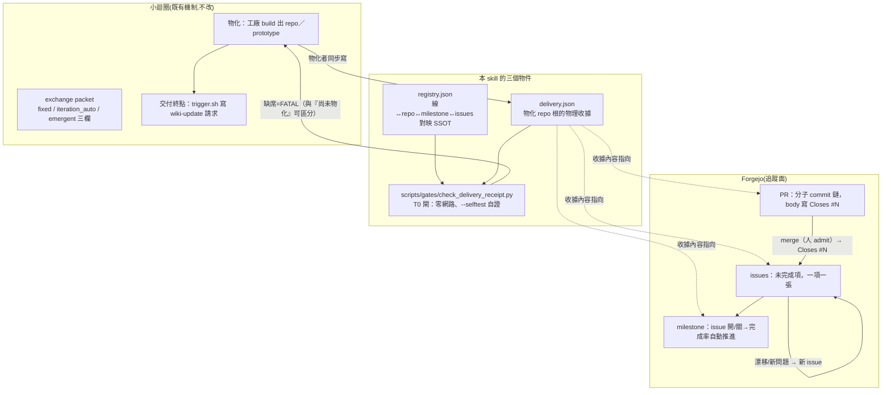

# delivery-mechanism.md — 前因後果全紀錄(低壓縮版)

本模組回答五個「為什麼」,每個結論都附它的來歷;讀完不需要任何本文以外的隱式知識即可裁決。
§7 是本地化帳:上游 GitHub 版 → 本地 Forgejo 版的逐機制對照與誠實缺口。

## 1. 為什麼需要這個 skill(問題的來歷)

上游(skill-bettor,2026-08-06)的 GCR 0c25bfd 線暴露三個斷點,每個都真實發生過:

- **交付狀態只活在對話裡**:11 顆分子 commit、5 張 issues、1 個 PR、1 個看板,全在 chat 裡長出來;
  session 結束後「哪條線對到哪個 repo 的哪些 issues」沒有任何檔案記得,下個 session 要靠人回憶。
- **工作面與追蹤面沒有綁定**:同機同時存在兩條線,切錯 repo 開 issue 的風險只靠人小心。
- **小迴圈物化 repo 後沒有強制交付步驟**:寫完就算完,是否開了 issues／PR／掛了橫向視圖,
  全憑當事 session 自覺。憑自覺的步驟,遲早被跳過。

解法抄自放置契約的手法(新檔先對映槽位,`check_placement.py` 機械擋):
**把「交付了沒」變成一張機械可驗的收據,沒收據就擋**。

本 repo(bettor-arena)承接同一問題的證據:遷移期間 22 張 issue、2 個 PR、6 波 workflow 的狀態
一度只活在 chat 與 session 記憶裡;儀表板搬進 Forgejo(人裁 2026-08-06)之後才有 session 外的真相。

## 2. 機制全景(每個箭頭都有物理載體)

因果敘述(不依賴圖):小迴圈物化 repo 的那一刻,物化者必須同步寫 `delivery.json`——這不是提醒,
是 T0 閘的可驗面。收據裡的 issue／PR／milestone 位址把本地檔案與 Forgejo 追蹤面釘在一起;
之後任何 session 進到這條線,跑 `--line <id>` 就拿回全部追蹤上下文,不必回憶。

## 3. 為什麼湧現提示禁入規範模組(分界的來歷)

三種提示是 exchange-format 既有欄位,不是本 skill 發明。分界的理由:

- 規範模組(`modules/development-standards.md` 一類)的每一行都經過人 admit,改動＝治理事件,
  下游閘直接消費它。
- 湧現提示是**執行中冒出的未裁決新知**。若直接寫進規範模組,等於讓未裁決內容穿上規範外衣——
  正是「禁把 candidate 升格為 proof」要擋的路徑。
- 正道:湧現先落 packet 的 `emergent_prompt_context`、對應 issue 內文、與 openwiki 原生 backlog
  (可追溯、帶時間點與證據),沉澱後由 fold-in 判 durable home;真值得成為規範,才由人 admit 升格。
- 本 repo 有機械守衛:工廠測試對規範模組跑 grep 負控,湧現字段出現即紅(先證會紅再信其綠)。

## 4. 執行循環與漂移回圈(每步的失敗出口)

| 步 | 動作 | 失敗出口(顯式,不靠猜) |
|---|---|---|
| 1 | goal 設定「完成 <line> 全部 open issues」 | goal 條件寫明 line-id,避免跨線誤掃 |
| 2 | `check_delivery_receipt.py --line <id>` 取上下文 | registry 無此線＝FATAL,先登記再開工 |
| 3 | 每張 issue:隔離工作面 → /tdd → /code-review | 測試紅＝停在該 issue,不吞著開下一張 |
| 4 | PR body `Closes #N`,人 merge | merge 被擋＝人未 admit,等人 |
| 5 | 漂移或新問題 | 開新 issue 掛同 milestone,回步 2——**不**在當前 PR 裡順手夾帶 |

「漂移」的判準:實作與計畫文件 as-run 節不符、或發現計畫沒覆蓋的新事實。寫成 issue 而不是塞進
進行中的 PR,是為了讓每顆分子 commit 的 Intent-Slice 保持單一意圖。本 repo 的實例:遷移途中
發現的既有漂移(golden-seed 期望值 stale、delegated-executable 未分類、engine_nv.sh 從未建造)
各自開票(#24／#26),沒有一條夾帶進當時進行中的切片。

## 5. 這個機制自己怎麼維護(吃自己的藥)

- 程序改動走小迴圈沙盒迭代(loop-harness-standard 八大基座),T0 錨＝`--selftest`
  (內建 good／hollow 正負對照:合格收據放行、缺欄位收據被抓)。
- 經驗回填走 fold-in:操作鐵律進 SKILL.md(Layer A),來歷與 know-why 進本模組(Layer B)。
- 本 skill 自身的交付也留收據:見 registry 的 `bettor-arena-migration` 線。

## 6. 四層原生機制(為什麼不自建進度工具)

- 每層的狀態轉移都由 Forgejo 原生事件驅動(merge→close→milestone 進度),零自建代碼＝零維護面＝
  零「儀表板本身漂移」的新病種。
- `delivery.json` 收據記的正是這四層的位址——收據把「本地物化的 repo」釘到四層上,
  T0 閘只驗收據存在與形狀,**不**在 commit 時打網路查活狀態(零網路是 T0 的硬約束;
  活狀態由 `/delivery` 命令按需拉取)。
- 新開一條線的鋪法:PRD issue(決策完整才算)→ 逐張 slice issue(`## Parent` 回鏈＋checkbox＋
  `Blocked by`)→ 掛 milestone → registry 登記 → 實作期每張 slice 走隔離工作面→tdd→code-review→
  PR `Closes #N` → 物化時寫 delivery.json → T0 閘自此看守。

## 7. 上游 → 本地的重靶帳(逐機制,含誠實缺口)

| 上游(GitHub 版) | 本地(Forgejo 版) | 判準 |
|---|---|---|
| `gh` CLI | Forgejo API + 既有 git credential helper | 秘密只在記憶體;`check_credential_hygiene.py` 守不落盤 |
| `github_repo` 欄位 | `forgejo_repo` | registry 零 github.com 字樣 |
| Projects 看板(第四層) | **milestone** | Forgejo 9.0.3 `has_projects=true` 但 projects API 實測 404;milestone 是唯一 API 可驅動且原生投影進度者 |
| `scripts/check_github_delivery.py` | `scripts/gates/check_delivery_receipt.py` | 閘本來就零網路、與 host 無關,故去掉 host 字樣並落入本 repo 的 gates 槽位 |
| `.claude/commands/delivery.md` 轉發層 | 同形(本 repo `.claude/commands/delivery.md`) | 命令檔零邏輯,程序 SSOT 在 skill |
| 收據欄位 `project_url` | `milestone_url` | 收據指向真正存在的橫向視圖,不指向不可驅動的看板 |

**誠實缺口(不修飾)**:
1. **看板不由機器維護**。Forgejo UI 有 projects,但 agent 不能建卡/移卡;若人手動用 UI 看板,
   它與 milestone 之間沒有自動同步——真相仍在 issue 狀態,看板與 milestone 都是投影。
2. **無 `Closes #N` 的跨 repo 自動關閉保證**:本地實例都在同 repo 內,跨 repo 自動關閉未實測,
   要用先驗一次再宣稱。
3. **收據不驗活狀態**:T0 零網路只驗收據形狀;「收據裡的 issue 真的存在且開著」需要 `/delivery`
   命令按需拉取,那是顯式審計面,不是常設閘——同 `resolve-refs --peer` 的分層。
