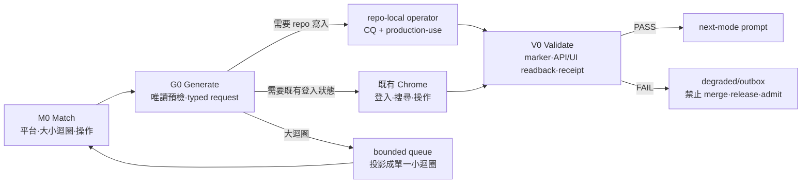

# Forgejo Loop Ops

本 Skill 是大小迴圈到本機 Forgejo 的操作層，不是另一個 Git writer。
先執行確定性 router，再依 route 只載入需要的 operator。

```bash
bun run .claude/skills/forgejo-loop-ops/scripts/route.ts --input <route-input.json>
```

## 不變量

1. 只允許 `http://localhost:3000` 與 `http://127.0.0.1:3000`。
   GitHub、GitLab、外部 Forgejo、webhook、mirror 與 remote runner 不適用。
2. 需要瀏覽器狀態時只用使用者現有 Chrome 與 `chrome:control-chrome`。
   禁止開測試瀏覽器、無痕視窗或新的登入 profile。
3. 登入頁確實出現時，先查現有 Chrome 是否已有 session。
   若仍未登入，才可用 `git credential fill` 取得 `localhost:3000` 憑證並直接填入表單。
   憑證只留在記憶體；禁止回顯、寫檔、寫 receipt、貼進 issue 或 commit。
4. Forgejo 是工作狀態與下一步投影，不是真相來源。
   Git commit、source lineage、typed receipt 與 schema readback 才是證據 SSOT。
5. 大迴圈只排程、限流與投影。每個外部 mutation 必須下沉成一個小迴圈。
   小迴圈只處理一個 terminal slice，並以 idempotency marker 回讀。
6. repo 內容、branch、remote、push 與 commit 只交給輸出 repo 的
   `repo-terminal-operator`。本 Skill 不切主工作樹 branch、不改 `origin`、不 force push、
   不使用 `--allow-unrelated-histories`，也不提供任何 skip-gate 入口。
7. `automatic_execution:false`、缺 admission、缺 repo identity、缺 marker search 或 auth 失敗時，
   mutation 必須 fail closed。HTTP 成功但 response body／readback 不符也算失敗。
8. 私人 Gmail／Gemini／DR／GCR 原文不得進 Forgejo；issue 只放 paraphrase、acceptance criteria、
   artifact path、claim ID 與 hash-bound lineage。

## Stateful workflow



### M0 — Match

建立 `forgejo-loop-route-input@v1`：

- `platform`：只有 `local-forgejo` 會觸發。
- `loop_size`：`large` 只編排；`small` 才可執行一個外部 mutation。
- `operation`：`status | login | repository-bootstrap | issue | pull-request | merge | git-write | recover`。
- `auth_state`：`authenticated | login-required | not-selected`。
- `request_state`：`absent | projected | admitted`。
- `repo_local_operator_ready`：repo-local CQ／production-use 與 branch handoff 是否已就緒。

執行 router 並採用輸出的唯一 `actor`、`mode`、`mutation_allowed` 與 `next_prompt`。
不得在模型內另寫一套平行路由規則。

### G0 — Generate and preflight

1. 唯讀確認 Forgejo version、目前 auth、精確 repository full name、Git remote 與 branch。
   repository 不存在時不得把 issue 404 當暫時錯誤重試；先投影一個獨立的
   `repository-bootstrap` 小迴圈，建立後回讀 owner／name／visibility，再交 repo-local operator 配 remote。
2. issue 類操作先產生並驗證 `forgejo-terminal-issue-request@v1`。
   現有入口是 `runtime/forgejo/project-terminal-issue-request.ts`；
   schema 驗證入口是 `runtime/contracts/validate-packet.ts`。
3. 在 mutation 前搜尋完整 idempotency marker。
   找到便回用既有 issue，不得建立第二張。
4. 若 route 指向 `repo-terminal-operator`，只交付 typed terminal packet；
   operator 完成 focused CQ／production-use 與分子 commit 後再回本流程。
5. 若 route 指向 Chrome，先讀並使用 `chrome:control-chrome`；
   操作現有 tab，逐步觀察頁面，不以預期 UI 冒充實際結果。

### V0 — Validate and advance

每次操作完成都重新讀取目標物，至少核對 repository、issue／PR number、marker、head／merge SHA
與 HTTP/UI 狀態。任何不一致回 `failed`，保留原始錯誤因果與下一個修復 prompt。

- 小迴圈 PASS：回傳單一 terminal receipt、Forgejo URL／number 與下一個合法 mode。
- 大迴圈 PASS：只更新 queue projection；一次最多十個 open gaps、每個 repo 最多一個
  `in-progress` terminal slice。
- merge、release、admission 永遠需要各自的 typed readback 與人閘；issue 關閉不能代理 admission。

## 降級與恢復

Forgejo 不健康時只在使用者已授權服務恢復的範圍內做最多三次有界重啟。
每次都重新跑 version／auth／repository canary。三次仍失敗就把操作寫入 append-only outbox，
保留 idempotency key 與 payload hash；本機實作可繼續，但 merge、release、admit 一律禁止。
恢復後按 key 重播；payload 不同則建立 decision issue，不做 last-write-wins。

## 驗證

改動本 Skill、router 或 cases 後執行：

```bash
bun run .claude/skills/forgejo-loop-ops/scripts/route.ts --selftest
bun test tests/forgejo/forgejo-loop-ops-route.test.ts
```

完整契約與舊經驗取捨見 [references/contracts.md](references/contracts.md)。
