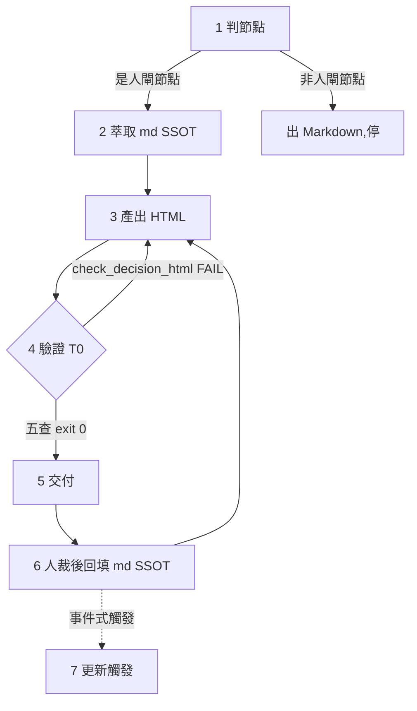

# Skill: html-for-decisions — LAND-DECISION 節點的 HTML 決策面

> **Role**：`ARCHITECTURE.md` §8「人閘清單」
> ——merge admit／holdout 畢業判／案例輪替／
> spawn 新子技能或家族／對外發佈，
> 這 5 類人閘節點要出高決策密度 HTML 時的
> **操作 SSOT**。
> 只管「怎麼產、怎麼驗、怎麼更新」；
> 哪個節點算 LAND-DECISION 由 §8 定義，
> 本 skill 不重複定義判準。
>
> **結構**：SKILL.md＝確定性程序＋不變量；
> 為何這樣設計、northstar／antigravity
> 兩手 retarget 脈絡
> → [modules/media-know-why.md](modules/media-know-why.md)。
>
> **現況誠實標記（2026-07-11 更新）**：
> 首個 worked instance 已誕生——
> `dashboard/decision-pinescript-audit.html`
> （決策面 v2，checker 五查 exit 0；
> v1→v2＝事件式重生首例，
> 變更觸發＝心跳敘事人核）
> ＋三個觀測面（session trace／家族指標板／產品後台）。
> 投影不入 git（`dashboard/` gitignored），
> 反-husk 錨＝各頁 footer 的再生指令＋本 skill `scripts/` 真檔。
> antigravity 參照 HTML 降級為純歷史對照
> （banner 已標明非 skill-bettor 內容）。
>
> **channel-B live cockpit（2026-07-21 人 admit 的邊界擴充）**：
> 第二 worked instance＝`loop_wiki/dx-adversarial-fix/`（活對齊決策 cockpit）——
> 這是本 skill「Not For」原標「誠實不做」的 long-poll／運行時寫回的**人 admit 變體**：
> 三欄固定框架 `decision-shell.html`（shell／data 分離，零 LLM 維護）
> ＋同源 `decision_server.py`（POST 決策寫回＋一次性狀態機 pending→ready→consumed
> ＋敘述閘 409＋`/version` srcsig 自動刷新）。
> **決策接收＝Monitor（非 client long-poll、非「不做接收」）**：
> server 收 POST 後 `print("DECISION: <json>", flush=True)`（`decision_server.py:406`，
> 並靜音 request log 使 stdout 只留 DECISION／SERVE 事件）→ 編排 session 由 **Monitor**
> 串流即時接收該事件（per-occurrence），或 `await_decision.sh` wait-until-ready 迴圈
> （一次性狀態機防重放）→ 派 `decision_router`。
> 「網頁上的決策由 Monitor 接收」是物理交付；channel-A 才「誠實不做」live 接收，
> channel-B 用 Monitor 事件流替代 long-poll（同一目的、不同機件）。
> **左欄頂＝已接線自動化完整目錄（孤兒接自動化的決策上下文）**：
> channel-B 左欄頂渲染「終極防禦形態·完整自動化拓撲」
> （`_automation_map` source-read `check_all_skills`，6+1 tier；
> 每節點資料流歸屬＋wired 狀態＋模組內元件可點連右欄檔案）——
> 讓「每個對話分片的孤兒該不該接自動化」這類決策**看得到哪些接了／哪些還沒**＝不缺上下文
> （不變量 8「不能缺上下文讓人裁」的視覺版；拓撲事實 SSOT 仍在 harness-wiki 組件卡，此處只記它是決策上下文來源）。
> 復用入口＝`scripts/open_decision_cockpit.sh <pack-dir>`（見 Scripts）。
> 迴圈拓撲/資料流/收斂閘的 SSOT 在 **harness-wiki 組件卡「dx-adversarial-fix 活對齊決策 cockpit」列**
> （本 skill 只記 HTML／敘述面事實，拓撲指針不抄；commit 88658ee）。
> 跨界誠實標：此為 channel-B（原 channel-A＝靜態投影仍「誠實不做 long-poll」）；
> 人明確 admit 才建，非本 skill 預設能力。
>
> **Lineage**：移植自 antigravity
> `.agents/skills/html-for-decisions/`。
> antigravity 原版引用它自己的卡片盒系統編號
> （「06 §A C03/C04 卡」）
> ——skill-bettor 沒有這套卡目，
> 編號引用不搬，概念（三受眾媒介矩陣、HTML 稅）保留，
> 見 [modules/retarget-map.md](modules/retarget-map.md)。

## When to Use
- 一個家族／演化 op 走到 `ARCHITECTURE.md` §8 的人閘節點
  （merge admit、holdout 畢業判、案例輪替、
  spawn 新子技能/新家族、對外發佈），
  要把已知/未知、判定帳本、決策佇列做成高決策密度的 HTML 給人裁。
- 人裁完落定，要**回填並重生**既有決策面。
- merge/畢業前要出**理解 quiz**（全對才 admit）。
- 要看 **session 底層**（逐 turn token 經濟／cache 命中／
  工具軌跡／D7 oracle）
  → 走**觀測面** `scripts/context_trace.py`
  （零 LLM 機械投影，與決策面語義隔離，見不變量 7）。
- 要看**家族全指標**（雙軌現值／結構契約 vs 實況／
  context 足跡 vs 上限／基線帳分段／使用統計／輪替 registry）
  → 觀測面 `scripts/family_metrics_board.py`。
- 要看**產品後台**（落地階段梯／心跳倒數／訂閱與方案×成本／
  數據驅動決策規則／家族資產現值）
  → 觀測面 `scripts/product_board.py`
  （源＝`product/state.json`＋各家族 FAMILY.yaml）。

## Not For
- ❌ 過程性報告/進度更新（如家族 `changelog/` 日誌本身、
  `PLAN.md` 迭代軌跡）
  → Markdown（HTML 只給決策節點——防 HTML 稅）。
- ❌ 運行時雙向狀態同步視覺化（daemon＋watch＋拖拽寫回）
  → 那是 northstar `viz-sync` 的 live-draw-mcp 基座，
  skill-bettor 無此基座，**誠實不做**（見 modules retarget 表）。
- ❌ 標註式 plan-review long-poll session
  → 那是 northstar `solo-pipeline` 的 lavish-axi 基座；
  skill-bettor 回饋通道＝對話＋md 回填
  （人 admit 走 `ARCHITECTURE.md` §8 清單，非長輪詢標註）。
  **例外（2026-07-21 人 admit）**：上兩條「誠實不做」的 long-poll／運行時寫回，
  已由 channel-B live cockpit（`loop_wiki/dx-adversarial-fix/`）以**人明確 admit 的變體**實現
  ——POST 寫回＋一次性狀態機＋敘述閘，非長輪詢標註而是同源 fetch POST（見現況誠實標記）。
  預設仍走 channel-A 靜態投影；channel-B 須人 admit 才建、非本 skill 自動能力。
- ❌ 產物該用哪個驗證標準/tier
  → [judge-loop-chooser](../judge-loop-chooser/SKILL.md)。
- ❌ 圖表設計細節
  → 全局 `dataviz` skill（本 skill 只固定「必跑 validator」這一步）。

## 不變量（違反即停）
1. **HTML 只給 LAND-DECISION 節點**；過程產物一律 Markdown。
   判準：這頁存在的目的是「等人裁」，不是「給人讀進度」。
2. **markdown＝源、HTML＝投影**：
   頁面必帶「本頁為投影非 SSOT」宣告＋快照日期；
   **禁在 HTML 側改判定內容不回寫 md**
   （回寫順序：先改 md SSOT → 再重生 HTML 同路徑覆蓋）。
3. **自包含**：零外部請求（inline CSS/JS、無 CDN）；
   CJK 用系統字型堆疊
   （**別**把 CJK 字型 data-URI 內嵌——體積不可行）。
4. **quiz 全對才 admit；approve 永遠人**：
   agent 永不對自己的產出發 approve、
   永不把「沒回饋」視同通過
   （與 `ARCHITECTURE.md` §8「人 admit 後 merge」同源紀律）。
5. **語意真相標態**：預判／已 admit／已鎖 分開標，
   預判不冒充定案；
   狀態變更只來自 md SSOT 的人裁記錄。
6. **狀態色過 validator**：
   `node <dataviz-skill>/scripts/validate_palette.js "<hex,...>" --mode
   light`
   ——注意**分段相鄰順序**影響 CVD 判定
   （實測：紫緊鄰藍 FAIL，重排分段序即 PASS）。
7. **決策面與觀測面語義隔離**
   （northstar viz-adapter／mf-adapter 同款 D3 先例）：
   決策面＝LLM 從 md 萃取判定（有 quiz、有人閘語義）；
   觀測面＝腳本從 session JSONL 機械投影
   （**零 LLM、無 quiz、無判定**）。
   **永不混同一頁、永不共用 schema**
   ——把觀測數據塞進決策面＝用機器帳偽裝判定，
   反之＝給觀測報表掛假人閘。
8. **channel-B 人話敘述必經物理閘（2026-07-21 fold；僅 live cockpit 適用）**：
   live cockpit 的決策內容**不能壓縮到缺上下文就讓人裁**——
   每決策須 context／why_matters／option.explain 足量（追語意真相 by Opus／codex／agy，
   走 [judge-loop-chooser](../judge-loop-chooser/SKILL.md)），
   且敘述 provenance 的 **verdict_by 必 opus**（judge-tier 硬約束，永不 agy／sonnet-as-verdict）。
   這道閘**物理綁在 `scripts/check_narration.py`**：POST 決策前驗 context≥60／why≥40／explain≥25／
   jargon 帶定義／`raw_prompts[]` 有源＋provenance verdict_by 含 opus，任一缺 → server 回 **409 擋提交**
   （不是散文建議，是壓縮過度就交不出決策）。static channel-A 用 quiz 閘（不變量 4），channel-B 用敘述閘——
   兩者都禁「缺上下文的決策」，只是機件不同。

1. **判節點**：不是人閘節點 → 出 Markdown，停。
   是 → 對照 `ARCHITECTURE.md` §8 定位這是 5 類節點的哪一種
   （merge admit／holdout 畢業判／案例輪替／
   spawn 新子技能或家族／對外發佈），
   據此找到 md SSOT 落在哪（見下）。
2. **萃取**：md SSOT 依節點類型而定
   ——merge admit 看 `families/<family>/evals/results/`
   ＋比較基準；
   holdout 畢業看 `evals/baselines/`
   ＋沙盒 `PLAN.md` 畢業段；
   案例輪替看 `evals/candidates/`↔`evals/holdout/`；
   spawn 新家族/子技能看提案來源
   （`proposals/` 或人工發起紀錄）；
   對外發佈看 `families/<family>/changelog/`。
   收集決策佇列（每項：裁什麼/選項/出處檔）、
   判定分佈、已知/未知象限、待驗命門。
   **只投影不新增判定**。
3. **產出**：用
   [prompts/decision-report.prompt.md](prompts/decision-report.prompt.md)
   （schema v1：S0-S10 section 物理邊界＋槽位表＋
   固定狀態色 tokens＋checker 自驗迴圈）
   ——親寫或交執行 LLM（Sonnet 級即可，
   代入 `{{SOURCE_DIR}}`/`{{SNAPSHOT_DATE}}`/`{{OUTPUT_PATH}}`）。
   骨架照
   [reference/antigravity-example-decision-dashboard.html](reference/antigravity-example-decision-dashboard.html)
   複用（antigravity 歷史範例，只取其 DOM/CSS 骨架，
   **判定資料一字不留**；
   本檔非 skill-bettor 案例，見上方「現況誠實標記」）；
   「必」槽缺料顯式 N/A 禁靜默省略。
4. **驗證（T0 機械）**：
   `python3 <本skill>/scripts/check_decision_html.py <file>`
   ——五檢查（投影宣告/快照日期/自包含/quiz 閘/title）
   exit 0 全過、2 任一 FAIL
   （首次用或改 checker 先跑 `--selftest` 正控
   ——本移植版 selftest 已改為**合成 fixture**，
   不依賴 reference/ 內任何檔案存在，見 retarget-map）；
   狀態色過 dataviz validator（不變量 6）；
   `open <file>` 本地目檢一次
   （label 碰撞/溢出——validator 不管版面）。
5. **交付**：Artifact 發佈可能被 hook 白名單擋
   （antigravity 側 live 實測；`~/.claude/hooks/
   auto-approve.sh` 是使用者全局 hook，
   skill-bettor 同樣受其管，非 repo 特有）
   → fallback：`open <file>` 直接開本地檔。
   檔位：op 沙盒期放 `loop_wiki/evolve-<family>-<op>/`
   或 session scratchpad；
   要跨 session 存活放家族目錄或沙盒目錄
   （投影可再生，預設不入 git，人裁）。
6. **人裁後回填**：人的裁決先寫進 md SSOT
   （如沙盒 `PLAN.md` 的畢業段、
   家族 `changelog/` 的當日決策記錄）
   → 依 md 重生 HTML（同路徑覆蓋＋快照標記 vN）。
7. **更新觸發**＝事件式
   （人閘裁決落定/判定表變動/總閘狀態變化），
   **非定期重生**；
   頻率低於價值時降級為里程碑式（每個 op 收口一次），
   人裁並記入家族 `changelog/`。

## Gotchas
- **Artifact 被 PreToolUse hook 擋**
  （`~/.claude/hooks/auto-approve.sh` 白名單，
  antigravity 側實測，
  該 hook 是使用者全局設定非本 repo 專屬）：
  別重試原樣調用；
  直接走本地 `open` fallback，
  或人把 Artifact 加白名單後再發佈。
- **quiz 題庫隨載荷更新**：
  題目對準「載荷最重的判定」
  （完成率來源/驗證器隔離/判官分頻這類），
  不是形式題；
  出不出得了好題本身就是理解訊號。
- **reference 範例是 antigravity 的真實案例，不是 skill-bettor 的**：
  複用時只取其**骨架與不變量落法**，資料層全換；
  別把範例裡 antigravity 的判定內容當 skill-bettor 事實引用。
  skill-bettor 累積自己的第一份真實決策面之後，
  應考慮以其替換或並列此參照。
- **分段順序即 CVD 命門**：
  堆疊條的相鄰段決定 validator 過不過；
  語義順序（採納→借形→待裁→僅記錄→husk）
  恰好也是 CVD-safe 序，別隨手重排。
- **觀測面 selftest 的隔離斷言查機件不查字面**
  （2026-07-11 首跑實犯）：
  banner 寫「無 quiz」三個字會撞樸素字串檢查
  ——斷言對象＝`type="radio"`／判卷函式等真實機件。
  已解於 `family_metrics_board.py`／`product_board.py` 的
  `--selftest`。
  **禁回退用子字串 "quiz" 判隔離。**
- **禁投影假數**（產品證據鏈紅線的投影端）：
  訂閱數等未上線指標＝`state.json` 的 `null`
  → 頁面顯示「未上線(N/A)」；
  估算與實測以 `measured` flag 分離並在頁面標示。
  板子只讀機器帳，**永不因為「版面好看」補一個數字**。
- **`--as-of` 禁系統時間**：
  三個觀測面產生器與 `check_rotation.py` 同款
  ——日期由調用者傳入，同輸入同輸出才可重放；
  板子裡任何倒數/到期計算都從 `--as-of` 推。

## Modules / Reference / Scripts
- [modules/media-know-why.md](modules/media-know-why.md)
  — 三受眾媒介矩陣、為何 md=源/HTML=投影、HTML 稅、
  northstar `viz-sync`／`solo-pipeline`
  一路 retarget 到 skill-bettor 的脈絡
  （借什麼/拿掉什麼/為何不是簡化）。
- [reference/antigravity-example-decision-dashboard.html](reference/antigravity-example-decision-dashboard.html)
  — **antigravity 歷史範例**（決策面 v0.1，
  帶明確 banner 標明非 skill-bettor 內容）：
  純作 schema DOM/CSS 骨架研讀，
  見 SKILL.md 現況誠實標記＋retarget-map
  「為何保留這份、為何不保留另一份」。
- [prompts/decision-report.prompt.md](prompts/decision-report.prompt.md)
  — **生成契約（schema v1）**：
  S0-S10 section 物理邊界＋槽位表＋
  投影者鐵律（禁發明判定）＋固定色 tokens＋checker 自驗迴圈
  ——讓不同家族/op 產同構報告。
  schema 演化＝改此檔＋同步 checker；
  骨架只由真實案例替換。
- [scripts/check_decision_html.py](scripts/check_decision_html.py)
  — 不變量 T0 機械驗證（五檢查，exit 0/2/1；
  `--selftest`＝合成 good/hollow 正控鑑別，防 placebo checker；
  已改為不依賴外部 reference 檔，見 retarget-map）。
  **只驗不產**——HTML 生成走 prompt 契約由 LLM 親寫（無轉換器）。
- [scripts/open_decision_cockpit.sh](scripts/open_decision_cockpit.sh)
  — **決策 cockpit 唯一復用入口**（2026-07-21 補，codex 對抗式審查 med4）。
  接「決策包目錄」參數（含 `decision-shell.html`＋`decision-data.json`），
  腳本串聯＝`dj.py reset-pending`（清舊決策防 stale）→ `decision_server.py --pack <pack>`
  （server 已參數化，可服務任意 pack，不再綁死沙盒）→ 印 URL。
  **復用命令**：`bash .../open_decision_cockpit.sh <pack-dir> [port]`；`--selftest` 驗全鏈。
  參考引擎（server＋`dj.py`）現居 `loop_wiki/dx-adversarial-fix/`；一次性狀態機
  pending→ready→consumed 與 server 端 narration_gate 物理閘見該處 `await_decision.sh`／`decision_server.py`。
- [scripts/family_metrics_board.py](scripts/family_metrics_board.py)
  — **觀測面·家族層**：
  `family_metrics_board.py <family_root> -o out.html --as-of 日期`
  ——雙軌現值/結構（家族內部契約 vs 檔案系統實況，
  契約源＝ARCHITECTURE.md §2，
  含子技能 <500 行閾值機械比對）/
  context 足跡 vs 上限紅線/
  基線帳（跨量尺/口徑分段標示，絕不連線）/
  使用統計/輪替 registry。
  `--selftest`＝合成正控
  （含「無 quiz 機件」隔離斷言＋契約內/超約兩態鑑別）。
- [scripts/product_board.py](scripts/product_board.py)
  — **觀測面·產品層（後台）**：
  `product_board.py <repo_root> -o out.html --as-of 日期`
  ——落地階段梯/心跳倒數/
  訂閱與方案×token 成本（null→未上線、估算/實測分離）/
  數據驅動決策規則表/家族資產。
  源＝`product/state.json`
  （規則與數值的機器帳，SSOT＝PRODUCT.md）＋FAMILY.yaml。
  `--selftest` 同款正控。
- [scripts/context_trace.py](scripts/context_trace.py)
  — **觀測面（零 LLM 全路徑）**：
  `context_trace.py <session.jsonl> [-o out.html]`
  讀 Claude Code session transcript
  → 逐 call token 經濟
  （in/out/cache_read/cache_creation 5m·1h 桶）
  ＋context 成長曲線＋**D7 oracle 判定**
  （cache_read>0 逐 call＋驟降事件=疑 prefix miss）
  ＋工具調用分佈＋去重（同 message.id 串流分片）。
  確定性渲染器在此是對的
  （資料=結構化機器真相非散文 md，零幻覺、同輸入同輸出）；
  `--selftest`＝合成 fixture 正控
  （本檔完全可攜，見 retarget-map，
  未附 skill-bettor 自己的輸出樣品——首次真用時自然產生）。
  session JSONL 位置＝`~/.claude/projects/<project-slug>/
  <session-id>.jsonl`。
- [modules/retarget-map.md](modules/retarget-map.md)
  — antigravity → skill-bettor 逐項移植帳本、
  兩份 reference HTML 為何一份留一份不留、
  腳本 selftest 改法的理由、鐵錨驗證記錄。
