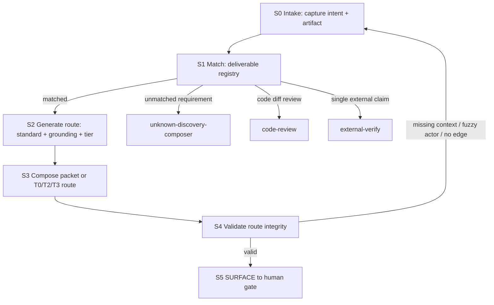

# Skill: judge-loop-chooser — state graph 路由語意真相

> **Role**:給一個**可判 deliverable**,選它該用的驗證標準、grounding 三態、獨立性 tier、
> 判官封裝包與人閘。這支 skill 是 **recipe-not-engine**:只路由 + SURFACE,不執行 verifier,
> 不把任何 LLM 分數、G 閘綠、跨家族 findings 自動升級成 admit。
>
> **核心修正(2026-07-22)**:本 skill 不能再寫成一段大型 prompt。匹配、生成、驗證必須是
> state graph 節點,每個節點都有輸入、判準、輸出與 conditional edge。skill 本文與它產出的
> route surface 都要讓 fresh LLM 在缺乏對話上下文時仍能判斷:判什麼、憑什麼、誰判、何時升級、
> 何時停在人閘。
>
> **Layer A / Layer B 分工**:本檔只放 load-bearing workflow、deliverable registry、輸出契約、
> Gotchas。know-why 放 modules:
> [grounding-and-independence.md](modules/grounding-and-independence.md) 解釋三態 grounding 與
> T0-T3 為何正交;
> [intent-drift-review.md](modules/intent-drift-review.md) 是 zero-access reviewer payload;
> [retarget-map.md](modules/retarget-map.md) 是 antigravity → skill-bettor 誠實帳本。
>
> **SSOT 活基座**:grounding 的真錨仍是家族 `evals/runner.py`、`evals/judge.py`、`evals/cases/`、
> `evals/holdout/`、`selftest.sh` good/hollow 正控與 ARCHITECTURE.md §4 Verify 三層;
> 獨立性政策仍以 ARCHITECTURE.md §5 tier-dispatch、§8 人閘清單為準。若本檔敘述與活實作衝突,
> 以活實作與 ARCHITECTURE 為準。

## Canonical Terms(路由時不可換詞)

| Term | Definition | Avoid |
|---|---|---|
| `deliverable` | 可被判斷的具體產物,必須有 artifact 與 original intent SSOT。 | 散文目標、上文那個東西 |
| `original_intent_ssot` | reviewer 判斷忠實度時唯一可用的原始意圖錨。 | producer 自述、計劃自稱 |
| `artifact_under_judgment` | 本次被判的實物:diff、proposal、plan packet、judge report 或證據表。 | 泛稱輸出 |
| `semantic_question` | 本輪真正要回答的一句語意問題。 | 審查品質、看看有沒有問題 |
| `route surface` | S5 交人的低壓縮路由結果,不是 verdict。 | 結論、放行令 |
| `grounding_state` | 判決底下是否有真實技術實現的狀態。 | 分數、通過率 |
| `technical_equivalent` | 已錨到真 fixture/script/selftest good-hollow 覆蓋的判決。 | 看起來等價、名字相似 |
| `candidate` | 真 fixture/rubric 存在但本輪未掙覆蓋。 | 失敗、[推論] |
| `[推論]` | 無真實現或只靠 LLM/pattern/相鄰事實推斷。 | technical_equivalent |
| `human_required` | negative-space、scope 裁量、spawn、admit 等不可約人裁。 | 高 tier 模型裁決 |
| `independence_tier` | 判斷誰的權重與脈絡在發力的階梯。 | 模型強弱排名 |
| `zero-access packet` | fresh reviewer 只靠 packet 可判,不看 producer 對話史。 | 把上文給 judge |
| `needs_diamond` | zero-access 仍不可重現或同權重殘餘太高,需 T2/T3。 | 多派一個同類 judge |
| `findings-only` | agy/Codex/Opus 報告只產證據或攻擊向量,不產 admit。 | verdict、approved |
| `admit` / `LAND-DECISION` | 人對 merge、holdout、spawn、publish、plan acceptance 的最終裁決。 | LLM PASS |
| `hollow-T0` | 機械獨立但沒驗到真缺陷的 T0 check。 | T0 綠=真 |
| `Same-Weights` | producer 與 reviewer 同模型家族/權重造成共享盲點。 | Opus 比 Sonnet 強所以獨立 |

## Semantic Loss Ledger(HEAD → state graph rewrite)

| 舊版語意 | 處置 | 現在落點 |
|---|---|---|
| D1-D4 決策樹 | ACTIVE_IN_SKILL 並擴成 D1-D6 | S1 registry + Deliverable defaults |
| grounding 三態快查 | ACTIVE_IN_SKILL,細節下放 | S2 + modules/grounding-and-independence.md |
| 獨立性 T0-T3 快查 | ACTIVE_IN_SKILL,細節下放 | S2 actor 定責 + modules/grounding-and-independence.md |
| recipe-not-engine / 人閘 | ACTIVE_IN_SKILL | STOP + 不變量 + S5 |
| SSOT 活基座 | ACTIVE_IN_SKILL | 本段 SSOT 活基座 + S2 anchors |
| STOP 合理化表 | ACTIVE_IN_SKILL | STOP + Gotchas,語意保留但不保留表格形式 |
| frontmatter ASCII `: ` 會讓 skill 靜默消失 | ACTIVE_IN_SKILL | Gotchas + skill-authoring 指針 |
| 通過率/案例太弱不是 grounding | ACTIVE_IN_SKILL | Gotchas + intent-drift-review 已知風險錨 |
| 無 code-branch | ACTIVE_IN_SKILL | Not For + S1 code-review edge + 不變量 |
| 建/驅動演化小迴圈邊界 | ACTIVE_IN_SKILL | Not For → loop-harness-standard |
| 單一外部 claim 邊界 | ACTIVE_IN_SKILL | Not For + S1 external-verify edge |
| 新建/通用 skill authoring 邊界 | CANONICAL_OWNER_WITH_LEGACY_COPY | Not For → fold-in + skill-authoring |
| `llm_judge skipped` 是 candidate | ACTIVE_IN_SKILL | D2 defaults + Gotchas |
| pattern check hollow 風險 | ACTIVE_IN_SKILL | D1 defaults + Gotchas |
| agy quota silent no-op | ACTIVE_IN_SKILL | D3 defaults + Gotchas |
| 無機器閘判 grounding 本身 | ACTIVE_IN_SKILL | Gotchas |
| 一致性不等於正確性 | ACTIVE_IN_SKILL | Gotchas + truth-verify-loop 指針 |
| `path-b-reduction` T2 方法 | CANONICAL_OWNER_WITH_LEGACY_COPY | 本地 path-b-reduction skill,本檔只路由不複製協議 |
| 執行漂移探針 | ACTIVE_IN_SKILL | D5 defaults |
| antigravity lineage / port 帳 | PRESERVED_IN_MODULE | modules/retarget-map.md |
| 5-axis 技術選型 fit-scoring | PRESERVED_IN_MODULE | Not active route; Not For + retarget-map + legacy snapshot 保留理由與舊語意 |
| 原版 SKILL.md 全文 | LEGACY_ARCHIVED | modules/legacy-skill-2026-07-22.md,僅作 loss-audit source |

## STOP — 先擋三種失敗

1. **模糊 actor**:若輸出寫 `Opus or Codex or agy`、`按需驗證`、`交高 tier 判官`,但沒有說明
   各 actor 的語意角色、可見輸入、輸出責任與不可替代理由,停止重寫 route。
2. **壓縮掉原意圖**:若 fresh reviewer 只看到 artifact,看不到 original intent SSOT,它只能用語感補洞。
   停止,回 S0 補原始意圖錨。
3. **把 findings 當 verdict**:llm_judge PASS、Opus 報告、agy/Codex findings、external-verify 官方事實
   都只是給人的證據。merge admit、holdout 畢業 admit、spawn、對外 publish 仍是人。

## When to Use

- 一個演化 op 沙盒 T0 全綠、`STATUS` 轉 `candidate`,要判 G 閘全綠是不是真的服務底層缺陷偵測。
- holdout 畢業段要判 Opus fresh 判官 verdict 該信到哪一層獨立性。
- 一份 DR proposal 要轉入家族前,要判 claim 是否約分到可執行驗證,是否跑偏 origin question。
- 要決定是否 spawn 新子技能/新家族,需要區分真缺口、negative-space 與主觀感覺。
- 一份計劃包、debate packet、dispatch packet 要做意圖漂移或忠實度審查,不能再硬套 D3 近親。
- 某份報告的證據品質標明「留 D3 semantic review」,需要把語義錨驗、裸根域錨、license/URL claim
  等路由給合適的判官或工具。

## Not For

- 審一段程式碼改動是否符合 Standards/Spec → 走 `code-review`,本 skill 不重複造 code 判決表。
- 建/驅動演化小迴圈、選 driver、iterate-until-pass、stop-loss → 走
  [loop-harness-standard](../loop-harness-standard/SKILL.md)。
- 查證單一外部 claim 的真假 → 走 [external-verify](../external-verify/SKILL.md)。
- 判「該不該新建 skill」或通用 skill 寫法 → 先走 [fold-in](../fold-in/SKILL.md),家規看
  [skill-authoring](../skill-authoring/SKILL.md)。
- 5-axis 技術選型 fit-to-plan → 本 repo 無 OSS 堆疊選型基座,已在 retarget-map 誠實退休。

## State Graph(不可壓成 prompt)



### S0 Intake — 先取得可判物與原始意圖

**目的**:防止 reviewer 用產物自述取代原始意圖。語意真相的第一步是把「人本來要什麼」和
「產物現在說自己做了什麼」拆開。

**輸入必有**:
- `original_intent_ssot`:用戶逐字指派、`PROMPT.md` 任務段、proposal origin question、changelog 已知問題、
  或決策題本身。不能只寫「見上文」。
- `artifact_under_judgment`:被判物路徑或內容摘要,例如 diff、proposal、plan packet、judge report。
- `claimed_completion`:producer 自稱已完成/已驗證/已對齊的 claim 清單。沒有就寫 `none observed`。
- `scope_boundary`:哪些看似省略其實由 shared/sibling family/roadmap/另一 phase 負責。

**輸出**:`intake_complete=true` 加四欄。缺任一欄不得進 S1。

**failure edge**:
- 找不到原始意圖 → 先回用戶或上游文件補 SSOT,不要讓判官猜。
- 只有散文 goal、沒有可判 artifact → `unknown-discovery-composer`。

### S1 Match — 匹配 deliverable registry

**目的**:先判「這是什麼型的可判物」,再選驗證標準。禁止憑相似性寫「D3 近親 + D4 成分」後讓
下一個 LLM 自己補規則。混合型可以列 primary / secondary,但 primary 必須唯一。

| id | deliverable 型 | artifact | intent SSOT | 語意問題 | 預設起點 |
|---|---|---|---|---|---|
| D1 | 演化 op T0 聚合 | `verify.sh` exit、`runner.py --compare` G 閘、家族 diff | 沙盒 `PROMPT.md` + proposal/changelog 編號 | G 閘綠是真的抓到底層缺陷,還是 hollow-T0 / Goodhart | T0 聚合；hollow 判斷 T1 起 |
| D2 | holdout 畢業 | holdout 結果、llm_judge checks、Opus verdict | 家族 eval 契約 + holdout 一次性規則 | PASS/FAIL 是否忠實評品質,有無同家族自我確認 | T1 fresh Opus + 人 admit |
| D3 | DR proposal | `proposals/YYYY-MM-DD-<topic>.md` | proposal frontmatter `origin_question` / 大迴圈研究題 | claim 是否約分到可執行驗證,是否跑偏原題 | T2 findings + T3 admit |
| D4 | spawn 新子技能/新家族 | spawn 決策、changelog known gaps、candidate evidence | 人閘④ 或產品/架構缺口 | 這是真 negative-space 缺口,還是主觀感覺 | T3 human |
| D5 | 計劃包 / debate packet | `docs/plans/.../plan/`、`debate/packet.md`、dispatch matrix | 用戶逐字指派 + plan narrative anchor | 計劃是否忠實保留意圖、是否偷換敘事中心、是否把未證事實當事實 | T1 fresh reviewer；核心無錨升 T2/T3 |
| D6 | semantic evidence-quality review | D3 review 靶、證據表、anchor/license/url/claim 質量 | 報告或模板標明的 claim/rubric | 證據品質是否支撐 claim,機械可達是否被誤當語義支持 | T0/T2 混合；品質 verdict T1/T3 |

**conditional edge**:
- artifact 是 code diff 且問題是 Standards/Spec → `code-review`,不是 D1。
- artifact 是單一外部事實 claim → `external-verify`,不是 D3/D6。
- artifact 同時是計劃包與 spawn 決策 → primary=D5,secondary=D4;先驗計劃忠實度,再把殘餘交人裁 spawn。
- registry 無法匹配 → `unknown-discovery-composer`,輸出為「不可判原因」而不是硬套。

**輸出**:`deliverable_type`, `primary_reason`, `secondary_types`, `not_for_edges_checked`。

### S2 Generate Route — 生成驗證標準、grounding、獨立性 tier

**目的**:把「該怎麼驗」拆成兩條正交軸。grounding 問判決底下有沒有真實技術實現;
independence 問誰的權重在判。T0 機械不等於 technical_equivalent,同 vendor 更強不等於跨家族。

**grounding 三態**:
- `technical_equivalent`:判決可約分到真 planted-defect fixture / script / selftest good-hollow 覆蓋,並能引用路徑。
- `candidate`:真 fixture/rubric 存在但本輪未掙覆蓋,例如 llm_judge `skipped`。
- `[推論]`:無真實現,包含 bespoke pattern、純 LLM PASS/FAIL、相鄰官方事實錨被誤用成方法等價物。
- `human_required`:negative-space、戰略 spawn、scope 裁量、原意圖是否滿足等不可約問題。

**獨立性 tier**:
- `T0 script`:exit code、runner compare、selftest、checker。無權重,但可能 hollow,仍要跑 grounding。
- `T1 Opus fresh zero-access`:同 Claude 家族 author × judge 時的最低語意審查層。破脈絡相關,不破權重相關。
- `T2 cross-family findings`:agy/Gemini 或 Codex/OpenAI 作第二家族 attack vectors/findings,external-verify 官方源,
  或 path-b-reduction claim 約分。agy/Codex/path-b/external-verify 都只產 findings/evidence,不產 admit verdict;
  Codex 也不得在失敗 run 後接手改寫來證自己正確。
- `T3 human`:merge/holdout/spawn/publish/核心意圖裁量。不是模型 tier。

**actor 定責**:
- 腳本/T0:判機械結構、schema、可達性、fixture pass/fail;不能判語意真相。
- Opus/T1:判 whole-artifact 意圖忠實度、Goodhart backstop、claim-vs-evidence;輸出 report-only。
- agy/T2:跨家族研究/反證/第二意見;輸出 attack vectors/findings,不做 verdict。
- Codex/T2:跨家族工程/審計 findings,尤其可對 packet、state graph、可執行 route 做 adversarial review;不做 admit。
- 人/T3:消費 route surface 與 findings,裁定 land decision。

**輸出**:`validation_standard`, `grounding_state`, `anchor_refs`, `independence_tier`, `verifier_role`,
`needs_diamond`, `human_gate`。

### S3 Compose Packet — 產生 zero-access packet 或非 LLM route

**目的**:把 route 交給下一個 actor 時,不能讓它靠原對話補上下文。若選 T1/T2 reviewer,必須組 packet;
若選 T0/T3,也要說清該跑哪個腳本或交人裁什麼。

**T1 packet 必含**:
1. 原始意圖 SSOT:逐字或路徑 + 章節,不是 producer 自述。
2. 被判 artifact:路徑/摘要/必要全文,以及不可讀哪些脈絡。
3. scope boundary:排除 shared/sibling/roadmap/phase 的假陽性。
4. rubric:本次 semantic_question + SI 探針或 D6 evidence-quality 問題。
5. output contract:findings-only,逐 claim 證據,needs_diamond 標記,不得 admit。
6. contamination controls:zero-access、fresh、禁 fork;若 persona hook 或上下文注入會污染,先解污染再派。

**T2 route 必含**:
- 給 agy/Codex/external-verify/path-b-reduction 的最小可證偽問題,不是「看看有沒有問題」。
- 希望它產生的 artifact:官方源摘錄、反證列表、attack vectors、alternative implementation comparison。
- 明確禁止:不讓 T2 findings 直接變 verdict,不讓 agy/Codex 改寫原產物後自證成功。

**D5/D6 特別要求**:
- D5 計劃包必列 `original_user_request`、`narrative_anchor`、`plan_artifacts`、`extraction_or_dispatch_artifacts`,
  並說明「計劃未執行」是否 scope boundary。
- D6 evidence-quality 必列 claim 表:claim、source/ref、機械可判部分、語意需判部分、可能的 false anchor。

**輸出**:`packet_required`, `packet_contents`, `non_llm_route`。

### S4 Validate Route Integrity — 自查路由是否可交給 fresh LLM

**目的**:在 SURFACE 前先抓壓縮失敗。這是本 skill 自身的 validate 節點,不是外部 judge。

逐項檢查:
- 是否有唯一 primary deliverable type。
- 是否有 original_intent_ssot 與 artifact_under_judgment。
- 是否寫出 semantic_question,而不是只寫「審查品質」。
- grounding_state 是否附 anchor 或誠實標 `[推論]` / `human_required`。
- independence_tier 是否說明 actor、可見輸入、輸出責任、不可替代理由。
- 是否還有 `Opus or Codex or agy`、`按需驗證`、`處理相關問題` 這類未裁決占位。
- T1/T2 是否有 packet/output contract。
- human_gate 是否明確說明人要裁什麼。

任一項不過 → 回 S0/S2/S3 補,不得 SURFACE。

### S5 Surface — 交人,不放行

**目的**:把路由矩陣和殘餘不可約問題交人。S5 不是 verdict,更不是 merge/publish 指令。

固定格式:
```text
deliverable_type: <D1-D6/unmatched>
original_intent_ssot: <path/quote/section>
artifact_under_judgment: <path/summary>
semantic_question: <one clear question>
validation_standard: <T0/T1/T2/T3 method>
grounding_state: <technical_equivalent/candidate/[推論]/human_required + anchors>
independence_tier: <T0/T1/T2/T3 + actor role>
packet_required: <yes/no + contents>
needs_diamond: <yes/no + why>
failure_edges_checked: <code-review/external-verify/path-b-reduction/unknown-discovery/etc>
human_gate: <merge admit/holdout admit/spawn/adopt proposal/publish/plan acceptance>
route_notes: <short residuals, no verdict laundering>
```

## Deliverable-specific route defaults

### D1 演化 op T0 聚合
- 先讀 `verify.sh` exit、`runner.py --compare`、expect.yaml check kind、selftest good/hollow。
- program/absent check 只有在真 fixture + 正控覆蓋下才可標 `technical_equivalent`。
- pattern 命中但無否定排除,或只看關鍵字,標 `[推論]` 或 hollow risk。
- 若 diff 本身疑似只讓 G 閘綠而沒修底層問題,組 T1 intent-drift packet。

### D2 holdout 畢業
- holdout 只跑一次;任何迭代期偷看/改 holdout 是紅旗。
- llm_judge PASS 是 evidence,不是 admit。缺 `--judge-cmd` 的 skipped 是 `candidate`,不是 fail。
- Claude author × Claude judge 必 fresh zero-access Opus;同 vendor 殘餘核心判斷標 `needs_diamond`。

### D3 DR proposal
- 原意圖錨是 `origin_question` 或大迴圈 research 指派,不是 proposal 自述。
- schema/license/url T0 只證結構與可達性;市場空位、競品不存在、ROI、平台政策語義需 D6/T2/T3。
- agy 產 proposal 時,Claude 審 agy 是跨家族起點,但 agy findings 仍非 verdict。
- agy quota 耗盡可能零輸出 exit 0;D3 可用性看輸出檔非空且合法,不是只看 exit code。

### D4 spawn 新子技能/新家族
- 多數是 `human_required`:判斷真缺口、範疇歸屬、是否新建 vs fold。
- 先要求證據:已知問題、negative-space、現有 skill 無法覆蓋的行為、並列量測或失敗軌跡。
- 路由通常是 fold-in / skill-authoring / 人閘④,不是讓模型自動 spawn。

### D5 計劃包 / debate packet
- Primary 問題是「計劃是否忠實服務用戶逐字意圖與 narrative anchor」。
- 必須把計劃包自己的 scope-boundary 寫進 packet,防 SI7 假陽性。
- 若計劃把 UNVERIFIED claim 當事實使用,走 SI5/SI6/D6;若只是排 truth-verify 任務,可能是 scope boundary。
- 另跑執行漂移探針:方向沒漂但「該收手的點」漂了也算 drift。看三件事:
  供給/基建比例是否倒掛、最大未知(需求/WTP)是否被後推、核心賣點是否只能靠跑卻沒跑。
  這條通常由正反 fresh reviewer 對辯後 SURFACE,不得遞迴審計「審計是否過度」。
- 正反 lens 可以並行,但每個 lens 都是 findings-only;合成檔仍只 SURFACE 給人。

### D6 semantic evidence-quality review
- 先拆 claim:哪部分是 schema/URL/license 可機械驗,哪部分是語意品質。
- URL 可達不等於 source 支撐 claim;SPDX 字串命中不等於授權語義正確。
- 重複 ≥2 例或 Goodhart 逃逸級 finding,升 T0 checker 候選,但改判定式需人核 + good/hollow fixtures。

## 不變量

1. **recipe-not-engine**:本 skill 不跑 verifier、不改 artifact、不 accept verdict。
2. **三態 grounding,不二元化**:`technical_equivalent` / `candidate` / `[推論]` / `human_required` 必誠實標。
3. **獨立性看權重與脈絡,不是看模型強度**:Opus 比 Sonnet 強,但仍同 Claude vendor;T2 才觸跨家族。
4. **產物低壓縮**:route surface 必足夠讓 fresh LLM 接手;不能靠「見上文」。
5. **negative-space 不可約人**:靜默省略、範圍裁量、spawn/merge/publish 最終落 T3。
6. **無 code-branch**:程式碼 review 走 `code-review`;本 skill 只管驗證標準與獨立性路由。

## Gotchas

- **description 別混 ASCII `冒號+空格`**:frontmatter description 內會讓 YAML 解析出錯;多行用 `|` block scalar。
- **通過率不是 grounding**:高分可能是案例太弱,不是 skill 真強。
- **llm_judge 的 `skipped` 是 candidate 不是失敗**:真 rubric 存在但本輪未執行,排除分母;別降成 `[推論]`。
- **T0 可以 hollow**:exit code 是獨立的,但 check 可能沒驗到真缺陷。
- **T1 不等於跨家族**:fresh Opus 破上下文,不破 Claude-family 權重。
- **T2 findings 不等於 verdict**:agy/Codex/external-verify 給證據或反證,不給 land decision。
- **計劃包不要再硬套 D3+D4**:用 D5 primary,必要時 secondary=D4。
- **D6 不要被 URL 可達性騙過**:可達只證 reachable,不證 claim support。
- **無法寫出 semantic_question 就還不可判**:先回 unknown-discovery,不要派判官猜。
- **無機器閘判 grounding 本身**:`verify.sh`/`runner.py --compare` 可綠,但 grounding 三態仍是 SURFACE-only,人 VERIFY。
- **一致性不等於正確性**:跨家族一致 SUPPORTED 仍可能共享網路語料盲點;若要引用實測,指向 truth-verify-loop 或本地 changelog,不要繼承外 repo 數字。

## Modules

- [modules/grounding-and-independence.md](modules/grounding-and-independence.md) — 三態 grounding 與
  T0-T3 獨立性階梯的 know-why;當你要解釋為何 T0 可能 hollow、為何 Opus 不等於跨家族時讀。
- [modules/intent-drift-review.md](modules/intent-drift-review.md) — T1 zero-access reviewer payload;
  D1/D3/D5 意圖漂移 packet 需要 reviewer prompt 時讀。
- [modules/retarget-map.md](modules/retarget-map.md) — antigravity → skill-bettor 的 port 帳本;
  只有要改 deliverable registry 或追 lineage 時讀。
- [modules/legacy-skill-2026-07-22.md](modules/legacy-skill-2026-07-22.md) — HEAD 版 SKILL.md 保真快照;
  只作 semantic-loss audit source,不要當 active workflow 執行。
