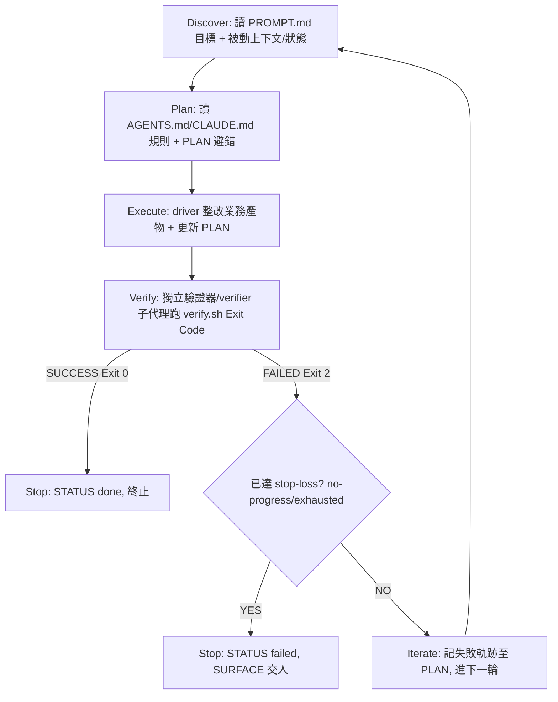

# Skill: loop-harness-standard — 大小迴圈八大基座設計標準（跨 agy／Claude Code／codex）

> **Role**：antigravity 大小迴圈架構的基座標準設計圖——建一條小迴圈沙盒（八大基座）、選 driver、分層 verify、
> 把單體 skill 轉沙盒化。**三種 driver 共用同一套八大基座**：agy（Gemini-author，質數迴圈 MVP 已跑通）、
> `claude -p`（Claude-author，`design_governance` pilot 已驗證：三維度收斂＋cache oracle D7② CONFIRMED＋
> D6.1 semantic 判官逮 Goodhart）、**codex（GPT-author，2026-07-17 新增，經官方 codex-companion
> runtime；`loop_wiki/codex_demo` 端到端已證：直呼 `run.sh` 與經 `engine.sh` 兩條路徑皆真 fire 收斂，
> 見 harness-spec.md §9❼ 格 5）**。改基座、加 Hook、升驗證器前先對照本圖組件與不變量。
> 與 **antigravity-harness-wiki**（記錄**有哪些**迴圈的全景圖）職能不同、兩 skill、互指針不重疊（D2）。
> **結構**：SKILL.md ＝ 跨 LLM 基座組件卡＋迴圈判斷邏輯＋8 防退化鐵律＋Gotchas；技術規格 know-why 在
> [modules/harness-spec.md](modules/harness-spec.md)；資料流歸屬＋迴圈判斷邏輯
> 全境圖在 sibling [antigravity-harness-wiki/loop-architecture-ssot.md](../antigravity-harness-wiki/modules/loop-architecture-ssot.md)（＋全 prompt SSOT 索引在其 composition-and-prompts.md，**皆非本 skill 模組、不重抄**）；evals 一次性設計法在
> [modules/evals-design-method.md](modules/evals-design-method.md)。
> **活基座（改判定以這些真檔為準）**：`loop_wiki/_template/`（標準沙盒骨架）· `loop_wiki/design_governance/`
> （第一支已驗證沙盒化小迴圈＝Claude-author MVP 活實例）· `loop_wiki/RETARGET-VERIFIED.md`（D5 tracer 落檔）·
> `kb-ingest/`（已證 agy-author 引擎）· `loop_wiki/drift_audit_gate/`（audit-liveness canary 閘＝
> oracle-gate 運行時兄弟；sealed drift 探針＋檢出率 checker＋selftest 綠；10 judge×3 家族真跑錨）。
> **Lineage**：八大基座概念與 agy 側寫法源起 ix-agy loop-harness MVP（2026-07-06 質數迴圈跑通、排除
> `agy -p` stdin 無限卡死、驗證者隔離、目標/狀態分離、8 基座靜態校驗 100%），經 `loop-harness-panorama`
> 計劃**擴展出 Claude Code 側技術等價物並在 antigravity 驗證**。本檔自足：agy 側 canonical 範例材化於 `loop_demo/agy`、融合版於 `loop_demo/claude_agy`（不依賴外部 ix-agy 檔）。

## When to Use
- 在運作中的 antigravity CWD 專案**建一條新小迴圈**（`loop_wiki/[loop]/` 沙盒）——照八大基座＋driver 選型接上。
- 把**單體 skill 轉成沙盒化小迴圈**——照 skill→小迴圈 recipe（[harness-spec.md](modules/harness-spec.md) §6 Monolithic 映射）。
- 建**非互動自動執行迴圈**（背景/排程），要確保不卡死時。
- 改任何基座組件（被動上下文／settings／hooks／驗證器）之前。

## Not For
- ❌ 記錄**現有**迴圈的資料流歸屬/收斂閘/prompt 索引 → [antigravity-harness-wiki](../antigravity-harness-wiki/SKILL.md)。
- ❌ 選某迴圈的驗證標準與獨立性 tier → [judge-loop-chooser](../judge-loop-chooser/SKILL.md)。
- ❌ SDLC 多階段計劃編排 → [sdlc-plan-composer](../sdlc-plan-composer/SKILL.md)。
- ❌ 判「該不該造新 skill／怎麼寫」 → [antigravity-skill-authoring](../antigravity-skill-authoring/SKILL.md)。

## 大小迴圈八大基座組件卡（跨 LLM 技術等價物；agy 側 ↔ Claude Code 側並列）
> 小迴圈沙盒＝`loop_wiki/[loop]/`；骨架＝`loop_wiki/_template/`；Claude-author 活實例＝`loop_wiki/design_governance/`。
> **兩側是技術等價物、非二選一**：per-loop driver 家族決定用哪側（agy=Gemini 作者／claude -p=Claude 作者）。

| # 基座組件 | agy 側（Gemini-author；範例 `loop_demo/agy`） | Claude Code 側（claude -p，antigravity 擴展） | 驗證閘與約束 | SSOT 職責 |
|---|---|---|---|---|
| **1 規則／被動上下文** | `AGENTS.md`（根，≤300 行 standing rules） | 沙盒 `CLAUDE.md`（≤300 行）——**D5 tracer：`claude -p` 認 subdir CLAUDE.md＋cascade parent、不認 AGENTS.md** | ≤300 行（超過→上下文腐化 91.6%→71.3%）；prefix 字元級穩定（禁 timestamp/uuid）；禁塞輸出控制指令（模型會識破拒發） | 每次啟動最優先常駐上下文；檔名綁 driver 家族 |
| **2 專案設定／授權** | `.agents/settings.json`（`autoExecutionPolicy: EAGER`） | `.claude/settings.json`（受全局 hook 保護寫不得）＋ driver `--permission-mode acceptEdits` CLI 旗標（B4 降權 2026-07-11） | agy：缺 EAGER＋stdin `/dev/null`→無限卡死（DB Lock 超時）。Claude：**跑 script（verify.sh）靠 hook allowlist 回核准 JSON**（B4 降權後 acceptEdits 得核准 Bash 類，V3 denials=0）＋hook allowlist | 無人值守自動授權 |
| **3 生命週期鉤子** | `.agents/hooks.json`（PostToolUse；payload `toolCall.name`/`toolCall.args`） | 併入 `.claude/settings.json` 的 `hooks` 鍵（Claude Code 家族慣例；payload schema 依現場定，需 hook 的 loop 才驗欄位名） | 絕對路徑配置 command；日誌寫沙盒本地 `logs/hook_run.log` | Tool 調用軌跡攔截、防退化 |
| **4 技能發現** | `.agents/skills.json`（顯式註冊表；CI/協作校驗用，非執行必需） | `.agents/skills/` 目錄 auto-discovery（frontmatter name/description）——**設計決策：不設獨立註冊表檔** | frontmatter 相符才載入（省 token）；禁 ASCII `": "`（YAML 靜默跳過 skill） | 技能可被發現／metadata 索引 |
| **5 特化技能目錄** | `.agents/skills/`（domain 技能） | 沙盒本地 `.agents/skills/`（同構） | 技能解耦：沙盒自帶 domain skills、與大迴圈 root 不共用 | 高頻 domain 指令 |
| **6 子代理人／獨立 verifier** | `.agents/agents/verifier.md`（`/agents` 自動發現，隔離審查） | `.claude/agents/verifier.md`（**條件式**）——跨家族已滿足「執行者≠判官權重」；**同家族（Claude×Claude）必落地 fresh zero-context subagent（禁 fork）** | 獨立乾淨 context 跑 `verify.sh`；杜絕 Same-Context 自欺（D6.1） | 驗證角色隔離 |
| **7 目標規範合約** | `PROMPT.md`（迭代時讀） | `PROMPT.md`（同名同職） | 定義 Success Criteria／Guard-Metric／stop-loss 兩型 | 目標規範合約 |
| **8 狀態帳本** | `IMPLEMENTATION_PLAN.md`（迭代時寫；STATUS: executing/done/failed） | `PLAN.md`（短名，同職） | 持久化迭代/失敗軌跡/收斂/cache oracle | 狀態檔案 |
| **＋ 調度入口** | `scripts/run_loop_demo.sh`（Orchestrator） | `scripts/run.sh`（per-loop driver switch；②的 CLI 旗標在此） | `(cd 沙盒 && bash run.sh)` 切 CWD 起 | 統一調度、背景無聲執行 |
| **＋ 分層驗證** | `scripts/validate_primes.py`（單體硬驗證器） | `scripts/<id>` ↔ `tests/<id>/fixtures` 成對（D8① 實作層重詮釋）＋`evals.json`——**設計決策：分層非單體** | 硬性 exit code（0=PASS/2=FAIL）；覆蓋率＝planted-defect 檢出率非行覆蓋 | Verify 閘（防 regression 最核心防線） |

## 迴圈判斷邏輯與拓撲（Discover→Plan→Execute→Verify→Iterate；driver＝agy 或 claude -p）

## 9 防退化鐵律（⚠️＝核心不可簡化；agy 側 ＋ Claude Code 側）
1. **非互動執行重導向**（⚠️）：driver 一律 `< /dev/null`。**agy**：無此重導向 `agy -p` 背景執行會偵測 stdin 阻塞、無限卡死零輸出。**Claude**：`claude -p < /dev/null` tracer VERIFIED exit 0 不 hang。**codex**：`codex exec` 即使 prompt 已給 arg，stdin 未關仍印 `Reading additional input from stdin...` 卡死等輸入（cc-20260717 grok proof-run 直呼實測）——`codex exec … < /dev/null` 即解。**經 `engine.sh` 的 codex driver 已內建重導向；只有直呼 `codex exec`（或用 `codex -C <dir> exec`）才會踩**。三 driver 家族同此鐵律，無例外。
2. **Hook 參數解析**：**agy** payload 為 `data["toolCall"]["name"]`/`["args"]`（非扁平 `tool_name`）。**Claude Code** hooks payload schema 依現場定，需 hook 的 loop 才驗欄位名（Path B-2），不預判寫死。
3. **驗證器／執行者拓撲隔離**（⚠️）：嚴禁執行寫入的模型自證。核心＝「執行者≠判官權重」，隔離發生在**家族層**——跨家族（Gemini 作者×Opus 判官）自動滿足；同家族（Claude×Claude）必落地 fresh zero-context subagent（**禁 fork**，D6.1）。
4. **絕對路徑**：hooks command／日誌／driver 跑 verify.sh 一律絕對路徑；相對路徑依 CWD 漂移。
5. **授權自動化**：**agy** `settings.json` `EAGER`。**Claude** driver `--permission-mode acceptEdits`（B4 降權）＋全局 hook 對唯讀驗證腳本 allowlist 回核准 JSON（缺→driver 跑不了 verify.sh、退而讀源碼自證＝D6 完整性風險）。
6. **大／小迴圈沙盒分工**：大＝主 session 編排＋全局 Hook／進度合約；小＝`loop_wiki/` 高頻修改自癒。禁在大迴圈根跑子任務高頻修正（狀態/Hook 污染）。
7. **小迴圈 Hook 獨立自包含**：沙盒本地 hooks/log，絕對路徑導向沙盒 `logs/`，不共用大迴圈全域 Hook。
8. **編譯與實機驗證**（⚠️）：Verify 閘除靜態斷言外，必接**真實執行環境（真 exit code）、禁 LLM 模擬環境**（按 domain 接編譯/E2E/verify.sh；07 N13 硬條款）；防靜態過關掩蓋真缺陷。
9. **反饋上下文物理到達每個 driver**（⚠️）：`run.sh` 的 iteration_auto_context（`$CONTEXT`／engine `--feedback`）必須物理注入**每一個** driver 的 prompt——claude／agy inline 注入、**codex 分支同樣須 `if [ -n "$CONTEXT" ]` 注入**（曾漏＝codex 自建靜態 prompt 丟掉反饋 → 跨家族 driver 收不到迴圈回授、神經連結斷）。三 driver 家族同此鐵律無例外；守衛＝黑箱 parity 測試（stub 捕 driver 實收 prompt，claude／agy／codex 皆須含反饋 marker＋負向控制）。why＋測法 → [harness-spec.md §9](modules/harness-spec.md)。LIVE 錨 `loop_wiki/evolve-unknown-discovery-plan-truth/{run.sh,scripts/test_driver_feedback_parity.sh}`。

## Gotchas（踩坑警告）
- **Slash 指令退化（agy）**：`agy --print` 非互動下無法呼叫 `/hooks` 類互動指令，會被當普通提問。
- **工具名稱落差（agy）**：Antigravity 本地 Tool 名＝`write_to_file`/`create_file`/`edit_file`，hook matcher 用正則涵蓋。
- **無聲失敗（Ralph Wiggum）**：無硬驗證器時模型會用「2,3,5,7,11(已驗證)」自欺空轉。→ 增補阻斷（0-claims/空產物→阻斷）；覆蓋率＝planted-defect 檢出率。
- **SQLite DB Lock（agy）**：孤兒 `agy` 進程/未解鎖嵌套→無限掛起。重啟前 `ps -ef | grep agy` 清孤兒。
- **迭代期間禁 commit**（D7①）：git 快照入 cache scope，commit→prefix 全 miss。
- **headless driver 跑 script 靠 hook allowlist 回核准 JSON（Claude；B4 降權 2026-07-11）**：slice 05 修好 hook 後 `acceptEdits` 得核准 Bash 類 verify.sh（V3 denials=0、42→2 turns）；hook 不繞（BASH_BLACKLIST/DANGER 照擋）；**禁回退 bypassPermissions 除非 acceptEdits denied 復發**。錨 `loop_wiki/design_governance/run.sh`。
- **已收斂跳過（Skip-if-Converged）**：`CONVERGED=true`/`history.json` 去重→前置退出，省重複 LLM 調用。
- **單體 skill 拆分沙盒化**：見 [harness-spec.md](modules/harness-spec.md) §6 skill→小迴圈 recipe（Monolithic 映射）。
- **prototype→MVP 沙盒 scaffolder＝`kb-ingest/setup-prototype.sh <plan> <mvp_repo> [pip...]`**（對稱 `setup-repo.sh`）：建 `prototype/<plan>/<repo>/`（八大基座+venv+**每個獨立 git**+NOTES 模板，gitignored）。**大迴圈驅動小迴圈從 prototype 迭代 MVP repo 產品**的等價物映射/dual-score 畢業/效益疊加 → [mvp-builder-and-adlc-equivalents.md](modules/mvp-builder-and-adlc-equivalents.md)（沙盒能力＝八大基座本體+此 scaffolder，**不另立 skill**＝反 inflation）。
- **audit-liveness canary＝`loop_wiki/drift_audit_gate/`（oracle-gate 運行時兄弟，閘零件非迭代迴圈）**：oracle-gate 判「task-type 有無可信神諭」（靜態），drift gate 判「這輪 audit judge 對已知飄移還抓不抓得到」（動態）。sealed drift 探針＋純 shell 檢出率閾值（planted-defect 從設計期→運行時抽樣）；engine 接線點＝oracle-gate「判官每 K 輪引擎外跑」處，**不硬接**（人 admit；硬接後「LLM 自動填 ledger」＝越 Layer-3 線）。**真跑重定位（10 judge×3 家族 detection 全 1.0，tier 效應未現）：drift gate 是 judge-liveness 信號（抓 judge 壞/劫持/沒真判，如 Opus agent tool_uses=0 亂回），非飄移偵測主力（強 judge 使 sealed ledger 冗餘）——別當「飄移偵測器」升級**。完整方法論＋證偽 → [evals-design-method.md §audit-liveness](modules/evals-design-method.md)。
- **agy 當 tier-掃描 judge：完整 model 名是命門**（`--print "
" --model "Gemini 3.1 Pro (High)" < /dev/null` 可判斷型回應；`--model gemini` 直接報錯）。修正舊「判斷型 silent-no-op」過度概括（部分是名/語法錯）；不衝突全景圖不變量 5（生產判官仍 session 內 Opus，agy Gemini 只當實測 judge）。錨記憶 `agy-judge-full-model-name`。
- **driver 反饋物理投遞是 per-driver 的（Codex 曾漏）**：claude／agy 把 `$CONTEXT` inline 進 prompt，codex 分支自建靜態 prompt 曾**丟掉反饋** → 跨家族迴圈回授斷。加新 driver 必比照注入，黑箱 parity 測試守。**禁回退用「codex 只讀檔不注入反饋」**。錨 `loop_wiki/evolve-unknown-discovery-plan-truth/run.sh` codex 分支（鐵律 9）。
- **同一迴圈跨多 root 鏡像：git-aware 且目標式，禁 blanket 覆蓋權威**：同一小迴圈存在於 N 個獨立 git repo（如 antigravity／skill-bettor／ts-skill-bettor）時只改一邊即分叉。`migrate_golden_seed.py --verify-mirror`（root-neutral 完美鏡像 gate）先看清分叉、`--direction` 雙向可逆、git-aware gate（dirty peer 即拒）；權威邊有大量分叉時**目標式**傳播硬化 delta，**禁 blanket 覆蓋**（會毀權威分叉）。詳 [mvp-builder-and-adlc-equivalents.md](modules/mvp-builder-and-adlc-equivalents.md)。
- **固定計數 baseline 漂移走治理 packet，非手改/繞測試**：loop 內新增腳本會漂 dataflow-stats 等固定計數；經 baseline-update 治理 packet（human_gate）＋ `update_dataflow_baseline.py --write` 更新，非直接改 JSON、非改測試硬編碼繞過（後者＝改 fixture 使其過，違防退化鐵律）。

## Modules
- [modules/harness-spec.md](modules/harness-spec.md) — 技術規格與設計決策 know-why（驗證器隔離／300 行腐化／stdin hang 除錯／hook payload／沙盒轉換兩分類），每點含 agy＋Claude Code 兩側。
- ↗ **跨 skill 全景 SSOT（非本 skill 模組）**：[antigravity-harness-wiki/loop-architecture-ssot.md](../antigravity-harness-wiki/modules/loop-architecture-ssot.md)（資料流歸屬＋迴圈判斷邏輯 全境圖）＋其 [composition-and-prompts.md](../antigravity-harness-wiki/modules/composition-and-prompts.md)（全 prompt SSOT 索引）——改任一迴圈階段前先讀。
- [modules/evals-design-method.md](modules/evals-design-method.md) — evals.json 一次性 pre-registered 行為驗證設計法（D8；Claude Code 側新增維度）。
- [modules/mvp-builder-and-adlc-equivalents.md](modules/mvp-builder-and-adlc-equivalents.md) — **大迴圈驅動小迴圈從 prototype 迭代 MVP repo 產品**：northstar flywheel/adlc/sandbox → 八大基座完整等價物映射＋dual-score 畢業閘＋效益疊加＋架構優化（LIVE 錨 `prototype/llm-timeline-editing/cutplan/` 13 輪 executor≠判官 RIP）。
- [modules/execution-feedback.md](modules/execution-feedback.md) — **執行反哺迴圈**：N-diverse-variant oracle-aware 執行 → Opus 判官挑最佳＋逐斷言比對軌跡偵測隱式飄移 → SURFACE（改執行方式迴圈自主／plan-delta 人 admit）；四個機械 checker（心證放水/隱形 plan-delta 擋層）落 [scripts/execution-feedback/](scripts/execution-feedback/)（`verify.sh` good/hollow 自證）。source：`docs/plans/2026-07-19-composer-integration-oracle-completion/02-execution-feedback-loop.md`。
