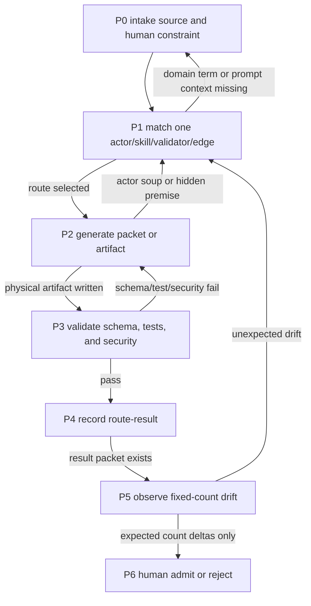

# Module: production-seed-loop — production-ready small-loop seed method

> Owner: [`loop-harness-standard`](../SKILL.md). This module captures the
> cross-loop method learned from
> `loop_wiki/evolve-unknown-discovery-plan-truth/`. The concrete plan-truth
> domain files remain owned by that loop and indexed by `harness-wiki`.

## Scope

Use this method when a small loop must become a reusable production seed, not
just a one-off verifier sandbox.

The fold-in rule is two-way:

- **Big-loop domain experience -> big-loop skill**: reusable harness method,
  state graph discipline, route ownership, prompt registry discipline, and
  production gate taxonomy fold into this module and the parent `SKILL.md`.
- **Domain execution methodology -> small-loop eight bases**: domain terms,
  task-local actors/skills, packet schemas, fixtures, validators, and concrete
  dataflow stay inside the small loop's eight-base assets.

Do not fold domain content into this module. Fold only the cross-loop method.

## Production Seed Definition

A production seed loop is a small loop whose input/output wiring can be
physically computed before execution and whose runtime drift is observable by
tests.

Required properties:

| property | technical equivalent | failure if missing |
|---|---|---|
| Stateful workflow | separate Match / Generate / Validate / Record / Observe / Admit nodes with conditional edges | one giant prompt becomes the state and later LLMs make fuzzy route decisions |
| Hardened exchange format | typed schema plus shell entrypoint validator | node-to-node context silently changes shape |
| Physical delivery trigger | packet file plus trigger script that writes an exchange context | chat text becomes the hidden trigger |
| Route-result materialization | result packet after a route executes | execution outcome is trapped in logs or memory |
| Baseline governance | baseline-update packet plus update script | count drift is normalized by editing JSON directly |
| Schema replay | migration packet plus replay validator | schema changes strand old packets |
| Template lifecycle gate | promotion packet plus metadata validator | templates accumulate without evidence |
| Behavior eval packet | behavior cases and pass/fail values on disk | production claims stay narrative |
| Seed scaffold | scaffold script plus hardcoded-path check | "reusable seed" is tied to the source repo |
| Trend observation | JSONL trend recorder for count categories | lifecycle drift has no history |
| Security boundary | validator rejects unsafe paths, URLs, traversal, and shell metacharacters | packets become command-injection or path-smuggling surfaces |
| Fail-fast deterministic preflight | minimum content-addressed lineage before read-only format, typed lint, and strict typecheck; behavior/operator work runs later | cheap deterministic defects consume behavior, LLM, or production verification budget |
| Verification-axis separation | fast receipts carry an explicit preflight-only claim boundary; if Code Quality or Production Use is claimed, each needs physical request, terminal receipt, stale projection, and promotion gate | observed quick checks silently promote an incomplete asynchronous axis |

## State Graph

The graph is not optional for production seeds. A production seed may add
domain nodes, but it must not collapse Match / Generate / Validate into a
single prompt body.

## Prompt And Context Contract

Production seed loops exchange **context packets**, not ad-hoc prompts.

Every packet-like exchange must preserve:

- `fixed_prompt_context`: stable context read before a node runs;
- `iteration_auto_context`: runtime-generated context for this iteration;
- `emergent_prompt_context`: extra surfaced context or explicit `N/A-none`;
- `schema_version`: exact packet schema version;
- artifact identity: source, output, hashes or explicit `N/A-*` reasons, and
  input git commit identity.

Raw prompt ownership is not this module. The single source of truth for prompt
ownership is `harness-wiki/modules/prompt-registry.md`. This module only
defines the rule: prompt text must have a physical owner, and no panorama may
copy it as a second source.

## Dataflow Count Contract

A production seed must expose fixed numbers for the count categories below:

| category | minimum physical owner |
|---|---|
| common envelope fields | typed packet schema |
| defined packet kinds | typed packet schema |
| per-kind required fields | typed packet schema |
| packet examples | packet queues plus terminal products |
| physical edges | packet input/output pairs |
| module files | small-loop `modules/` |
| script files and executable scripts | small-loop `scripts/` |
| template files and lifecycle states | template registry |
| documented directory rows | domain dataflow module |
| documented concrete dataflow rows | domain dataflow module |

Changing a count is allowed only when the owner SSOT and paired test change in
the same patch. Baseline updates must go through an admitted or reviewed
governance packet, not direct JSON editing.

## Big-loop / Small-loop Ownership

| layer | owns | must not own |
|---|---|---|
| Big loop | eight-base harness standard, driver choice, multi-loop orchestration, route-ledger, human admit, fold-in destination | small-loop domain facts or final semantic adoption |
| Small loop | domain/task actors, domain skills, concrete packet schemas, fixtures, validators, terminal products, local production gates | sibling-loop orchestration or hidden global policy |

The directory names may mirror each other (`.agents/agents`, `.agents/skills`,
`ROUTES.md`), but the responsibilities do not mirror. Mirroring creates
exchange points; it does not move authority.

## Worked Instance

`loop_wiki/evolve-unknown-discovery-plan-truth/` is the current worked instance.
It adds:

- `modules/production-readiness.md`;
- `packets/outbox/{baseline-update,behavior-eval,schema-migration,seed-scaffold,template-promotion}-*.yaml`;
- `scripts/{replay_packets,write_route_result,update_dataflow_baseline,migrate_exchange_schema,check_template_promotion,record_dataflow_trend,scaffold_seed_loop,check_production_readiness}.py`;
- `scripts/test_production_readiness.sh`;
- fixed dataflow baseline counts and target verifier anchors.

The worked instance is evidence, not a template to copy line-for-line. Future
domains may use different packet kinds or scripts, but they must preserve the
production seed properties above or explicitly downgrade from "production seed"
to "candidate loop".

## Fold-in Checklist

Before claiming a production seed fold-in is complete:

- [ ] `harness-wiki` has a component-card row for the loop.
- [ ] `harness-wiki/modules/prompt-registry.md` names every raw prompt owner
  and every generated prompt/context owner.
- [ ] `loop-harness-standard` names the reusable method without copying domain
  content.
- [ ] The small loop has schema validation, trigger/fallback tests, production
  readiness tests, and fixed-count drift tests.
- [ ] The plan or PLAN ledger records the real verifier numbers.
- [ ] Runtime artifacts remain ignored; committed evidence is packet, product,
  baseline, module, or ledger state.
- [ ] Minimum-lineage and low-cost static gates run before behavior work, and
  their receipts cannot promote asynchronous Code Quality or Production Use.
