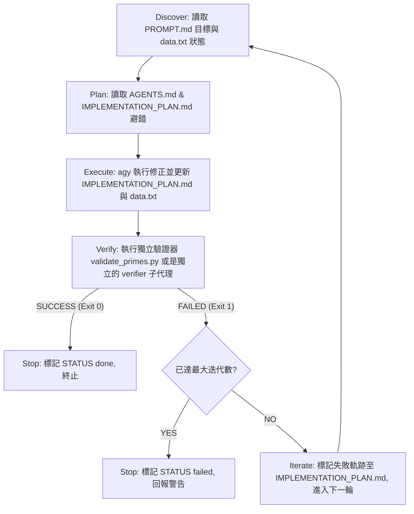

# Skill: loop-harness-standard — 迴圈工程與基座設計標準規格(SSOT 指針)

> **Role**: 本專案與後續所有自動化迴圈的基座標準設計圖。任何人（含未來的你）修改基座、新增 Hook 腳本、升級驗證器、或部署 Cron 自動化前，必須對照本圖的基座組件與不變量——**本檔只指針，永不抄寫內容**（抄寫＝製造會漂的第二份配置，husk 之源）。
> **引擎 SSOT**: [.agents/hooks.json](file:///Users/neon/ix-agy/.agents/hooks.json) (生命週期鉤子) · [.agents/settings.json](file:///Users/neon/ix-agy/.agents/settings.json) (專案設定) · [.agents/mcp.json](file:///Users/neon/ix-agy/.agents/mcp.json) (MCP 定義) · [.agents/skills.json](file:///Users/neon/ix-agy/.agents/skills.json) (技能註冊) · [scripts/run_loop_demo.sh](file:///Users/neon/ix-agy/scripts/run_loop_demo.sh) (迴圈調度器)。
> **帳本 SSOT**: [PROMPT.md](file:///Users/neon/ix-agy/PROMPT.md) (目標規範) · [IMPLEMENTATION_PLAN.md](file:///Users/neon/ix-agy/IMPLEMENTATION_PLAN.md) (狀態檔案) · [scripts/validate_primes.py](file:///Users/neon/ix-agy/scripts/validate_primes.py) (硬性驗證器)。
> **校驗工具**: [tests/test_harness_configs.py](file:///Users/neon/ix-agy/tests/test_harness_configs.py) (8 基座靜態結構校驗腳本)。
> **Lineage**: 本規範總結自 2026-07-06 於 `ix-agy` 實際跑通的素數迴圈測試案。在排除「非互動式執行 `agy -p` 無限阻塞卡死」的重大 bug、將子代理人與技能完全解耦、引進目標與狀態分離（PROMPT/PLAN）、並通過 8 基座靜態測試套件 100% 通過率校驗後，整理成此基座規格標準；技術等價與 know-why 映射 → [modules/harness-spec.md](modules/harness-spec.md)。

---

## When to Use
- 在任何運作中的 Antigravity CWD 專案中**從零建立基座**時。
- 為專案新增**生命週期鉤子 (Hooks)**（如 `PostToolUse`、`PreToolUse`、`Stop`）並對特定工具進行攔截時。
- 欲建立一個**非互動式自動執行迴圈**（例如排程 Cron、GitHub Actions 或是背景 Shell 腳本），需要確保執行不卡死時。
- 改動任何基座組件（如 `.agents/hooks.json`、`AGENTS.md`、`settings.json`）之前。

## Not For
- ❌ 選擇具體迴圈的驗證標準與獨立性 Tier → `judge-loop-chooser` (本 skill 提供實作硬體基座, 不做決策路由)。
- ❌ 專案 SDLC 多階段開發計劃編排 → `sdlc-plan-composer` (應交由其編排，本 skill 僅定義底層 Harness 設計)。
- ❌ 未知需求收斂 → `unknown-discovery-composer`。

---

## 基座組件卡 (八大 Harness 檔案與目錄結構)

| 檔案/組件 | 本地實體路徑 | 驗證閘與約束限制 | SSOT 職責 |
| :--- | :--- | :--- | :--- |
| **1. 規則規範** | **[AGENTS.md](file:///Users/neon/ix-agy/AGENTS.md)** (根目錄) | 字數保持在 **300 行以內**；否則引發上下文腐化 (完成率從 91.6% 暴跌至 71.3%)。 | 每次啟動時的最優先常駐上下文 (Standing Context)，定義目錄結構、架構、可用指令與禁止事項。 |
| **2. 專案設定** | **[.agents/settings.json](file:///Users/neon/ix-agy/.agents/settings.json)** | 優先權大於個人設定；禁止在其中直接寫入敏感金鑰。 | 配置專案範圍的 sandbox 狀態與模型預設值。 |
| **3. 生命週期鉤子** | **[.agents/hooks.json](file:///Users/neon/ix-agy/.agents/hooks.json)** | **必須使用絕對路徑**配置執行命令；`matcher` 篩選工具，攔截日誌寫入 `data/log/hook_run.log` | 註冊 lifecycle hooks (如 `PostToolUse`)，觸發 Hook 腳本記錄執行軌跡。 |
| **4. 技能註冊表** | **[.agents/skills.json](file:///Users/neon/ix-agy/.agents/skills.json)** | JSON 物件可包含 `entries` 陣列。 | 技能註冊檔。用於協作校驗與 Metadata 索引，本地 CLI 加載技能以目錄 Auto-Discovery 為主。 |
| **5. 特化技能目錄** | **[.agents/skills/](file:///Users/neon/ix-agy/.agents/skills/)** | YAML Frontmatter 包含 `name`, `description`；相符時才載入，省 token。 | 存放專案高頻重複性指令的詳細步驟，供代理人隨時按名稱調用。 |
| **6. 子代理人目錄** | **[.agents/agents/](file:///Users/neon/ix-agy/.agents/agents/)** | 採用 `.md` 格式，YAML Frontmatter 包含 `name`, `description`, `tools`, `model`。 | 定義子代理人行為，透過 CLI 的 `/agents` 機制進行自動發現與面板渲染，確保隔離審查。 |
| **7. 目標規範** | **[PROMPT.md](file:///Users/neon/ix-agy/PROMPT.md)** | 迴圈每次迭代時讀取。 | 作為目標規範（Goal Specification）合約，定義任務成功指標（Success Criteria）。 |
| **8. 狀態與 PLAN** | **[IMPLEMENTATION_PLAN.md](file:///Users/neon/ix-agy/IMPLEMENTATION_PLAN.md)** | 迴圈每次迭代時寫入。 | 作為狀態檔案與 PLAN，持久化記錄已嘗試、已變更、與 `STATUS`（`executing` / `done`）。 |

---

## 迴圈判斷邏輯與拓撲



---

## 嵌套小迴圈沙盒化設計規範 (Mini-Loop Sandbox Design Specification)

為了確保大/小迴圈的沙盒化分工（Harness vs. Sandbox）得以在物理結構上落地，所有小迴圈（如 `loop_wiki/[loop_name]/` 與 `loop_demo/`）必須遵循以下**標準自包含目錄結構**與設計規範：

### ❶ 統一八大基座沙盒目錄結構圖 (Unified 8-Harness Structure)
所有嵌套小迴圈（包括 `/Users/neon/ix-agy/loop_demo/` 與 `loop_wiki/[loop_name]/`）必須採用完全同構的目錄拓撲。以下為標準的自包含沙盒物理結構圖：

```text
<loop_root>/                      # 迴圈沙盒根目錄 (如 loop_demo 或 loop_wiki/repo_wiki_converge)
├── run.sh                        # 1. 統一調度入口腳本 (觸發執行內部 Orchestrator)
├── PROMPT.md                     # 2. 目標規範合約 (Goal Spec / 驗證成功指標)
├── IMPLEMENTATION_PLAN.md        # 3. 狀態與 PLAN 帳本 (記錄迭代 STATUS: done/executing/failed)
├── AGENTS.md                     # 4. 規則與 Standing Context (防上下文腐化規則)
├── data.txt                      # 5. 變更目標數據 (業務資料，在 loop_wiki 中對應 wiki 目錄)
├── .agents/                      # 6. 本地配置目錄
│   ├── settings.json             # 6.1. 專案設定 (必須顯式配置 "autoExecutionPolicy": "EAGER")
│   ├── hooks.json                # 6.2. 生命週期監控 (PostToolUse 寫入攔截)
│   ├── hooks/                    # 6.2.1. 本地鉤子指令目錄
│   │   └── on_write.py           # 6.2.1.1. 本地攔截器 (將 Tool 軌跡寫入本地日誌)
│   ├── skills.json               # 6.3. 技能註冊表 (可選)
│   └── agents/                   # 6.4. 子代理人目錄
│       └── verifier.md           # 6.4.1. 特化審查代理人 (verifier.md)
├── scripts/                      # 7. 硬性驗證與執行腳本目錄
│   ├── run_loop_demo.sh          # 7.1. 迴圈調度主程式 (Orchestrator，或 run_loop.sh)
│   └── validate_primes.py        # 7.2. 獨立硬性驗證腳本 (驗證 Exit Code，或 verify-claims.sh)
└── data/                         # 8. 運行時臨時目錄
    └── log/
        └── hook_run.log          # 8.1. Hook 寫入攔截日誌 (PostToolUse 歷史紀錄)
```


### ❷ 執行路徑與 CWD 約束
* **CWD 獨立**：在大迴圈發起小迴圈時，執行命令必須使用 `(cd loop_wiki/[loop_name] && bash run.sh)` 切換 CWD，或在腳本內部使用絕對路徑以確保 `.agents/settings.json` 的 EAGER 配置能被 `agy` 正確加載。
* **狀態隔離**：小迴圈內部的 `agy` 命令產生的任何 log，必須寫入其專屬的沙盒目錄下（例如 `loop_wiki/[loop_name]/logs/` 或 `repo/ixsecurity/agy-*.log`），禁止向大迴圈根目錄傾倒臨時檔。

---

## 不可簡化的不變量 (Harness 防退化鐵律)


1. **非互動執行重導向不變量 (⚠️ 核心鐵律)**:
   在任何自動化腳本 or Cron Job 中，調用 `agy --print` (或 `agy -p`) 時**必須追加 `< /dev/null`**。若無此重導向，`agy` 在背景執行時會因偵測/等待 interactive 控制權而無限卡死，無 any stdout/stderr 輸出。
   **孿生鐵律（同一 `agy -p` 調用的另一面）**：**須加 `--print-timeout` ≥ 驗證週期時長**——預設 5m，自癒週期含真機 run（建置+journey ≈3min）之全週期 >5m 即 timeout，正是「agy 自癒零實例」的根因（判官型 30m／自癒型 20m）。know-why → [modules/resolved-harness.md](modules/resolved-harness.md) 「agy `--print-timeout` 逾時」條。
2. **Hook 參數解析不變量**:
   `hooks.json` 所呼叫的指令程式在讀取 `stdin` 時，接收的是固定的 JSON 封裝格式。擷取 Tool 名稱與 arguments 必須對齊 `data["toolCall"]["name"]` 與 `data["toolCall"]["args"]`，而非貼平的 `tool_name` 欄位。
3. **驗證器與執行者隔離不變量**:
   嚴禁由「執行寫入」的模型自己驗證自己。必須提供**硬性、純代碼或獨立的驗證腳本**（如 `validate_primes.py` 或獨立 context 的 `verifier` 子代理人）來作為 Verify 閘門，防範模型放寬測試或吞掉錯誤。
4. **絕對路徑不變量**:
   在 `hooks.json` 中配置 of `command` 以及 Hook 腳本內所參照的輸出日誌，一律使用**絕對路徑**。相對路徑會依啟動時的 shell CWD 漂移，導致 "command not found" 或日誌寫錯位置。
5. **EAGER 自動授權不變量**:
   在自動化背景運行中，若要呼叫 CLI（特別是調度其他腳本），該目錄的 `.agents/settings.json` 必須配置 `"autoExecutionPolicy": "EAGER"`。否則在 stdin 重導向 `/dev/null` 的情況下，CLI 將因等待人工核准而無限卡死（DB Lock 超時）。
6. **大/小迴圈沙盒分工不變量**:
   大迴圈（主專案）負責生命週期全局 Hook 與進度合約監控；小迴圈（`loop_wiki/`）負責高頻修改自癒。禁止在大迴圈根目錄直接跑子專案的高頻修正，以防止狀態與 Hook 污染。
7. **小迴圈 Hook 獨立自包含不變量**:
    每個小迴圈沙盒必須部署獨立的 `.agents/hooks/on_write.py` 與 `hooks.json`，使用絕對路徑將寫入軌跡導向當前沙盒的 `data/log/hook_run.log`，不得共用大迴圈全域 Hook 腳本。
8. **小迴圈編譯與實機驗證不變量 (⚠️ 核心鐵律)**:
    每次小迴圈遞迴或 Verify 閘門調用時，除了執行靜態規則斷言外，必須依據專案類型強制完整執行編譯校驗（如 `xcodebuild` / `gradlew`）與實機自動化 UI 驗證（如 E2E 測試腳本），並由全域測試套件進行呼叫鏈路存在性斷言，防止因靜態代碼測試通過而掩蓋實際編譯或運行缺陷。詳見 [loop-architecture-ssot.md](modules/loop-architecture-ssot.md#L192)。
    **縱深防禦註（為何實機驗證不可省）**：source-grep 靜態閘（anchor pre-flight 抓 log 錨在場、功能等價 verify 抓賦值文字）有**系統性盲點**——盲於「文字在場但語義不執行」（註解錨、後續 override、死碼）。三者皆繞過靜態層、皆由本不變量的**實機四格驗證兜底**（06 WP-4 drill 真機實證）。靜態層＝fail-fast 優化，實機引擎＝最終 backstop。know-why → [modules/resolved-harness.md](modules/resolved-harness.md)「source-grep 靜態層系統性盲點」條。


---

## Gotchas (踩坑警告與限制)

- **Slash 指令退化**: 
  In `agy --print` 非互動模式下，無法在 prompt 中直接呼叫像 `/hooks` 這樣的 CLI 互動指令。CLI 會將其當作普通 LLM 提問處理，產生出乎意圖的答覆。
- **工具名稱落差**: 
  在 Antigravity 本地執行時，文件操作對應的內建 Tool 名稱是 `write_to_file` / `create_file` / `edit_file`，設定 Hook 的 matcher 時，需妥善使用 `create_file|edit_file|write_to_file` 正則表達式，以免漏掉觸發。
- **無聲失敗 (Ralph Wiggum Loops)**: 
  若沒有配置 `validate_primes.py` 這類的實體代碼校驗，模型會傾向藉由合理化語意（例如在 data.txt 內加入 "2, 3, 5, 7, 11 (已驗證)"）欺騙自己已完成，導致迴圈在沒產出真值的情況下空轉燒錢。
- **Monorepo 子專案 Git 判定**: 子專案目錄下通常無獨立 `.git` 資料夾，直接用 `[ -d "$TARGET/.git" ]` 判定會出錯，需改以 `{ [ -d "$TARGET/.git" ] || git -C "$TARGET" rev-parse --is-inside-work-tree; }` 相容 monorepo。
- **0 頁面機械過關漏洞**: 若編寫器因配額或 sandbox 掛載路徑錯誤產生了 0 個 markdown 頁面，機械驗證器因「無內容可錯」而判定 `PASS`，進而導致 gaps 檔案缺失陷入 Fatal 迴圈。因此在 `verify-claims` 前必須阻斷 `pages=0` 情況。
- **全域掃描超時與 GitIgnore 排除**: `agy` 啟動時預設會掃描當前 workspace（排除 gitignored）。若工作區內有巨大第三方代碼庫（如 `repo/`），會造成啟動超時或卡死。必須將這些巨大目錄永久寫入 `.gitignore`，以確保秒級啟動。
- **SQLite 數據庫鎖爭用 (DB Lock Contention)**: `agy` 底層使用 SQLite。若有孤兒背景行程仍在運行 `agy`，或大/小迴圈進行了未解鎖的嵌套調用，會引發 DB Lock 衝突使行程無限掛起。重啟迴圈前應執行 `ps -ef | grep agy` 並 `kill -9` 清理孤兒行程。
- **已收斂跳過優化 (Skip-if-Converged)**: 調度多個小迴圈時，各小迴圈腳本必須在前置檢查中判斷 `gaps-latest.md` 是否有 `CONVERGED=true`，若已收斂則直接退出，防止重複調用 LLM 造成資源浪費。
- **skip-build 陷阱 (Skip-Build-If-Unchanged 假綠/紅)**: 建置快取機制預設「目錄 HEAD 未變且工作區乾淨時跳過編譯，直接復用既有之 binary 執行檔」以省成本。但當進行缺陷修復或工作區回滾後，工作區狀態可能再度變乾淨，進而誤判 skip build，復用舊的 buggy binary 導致測試結果失真。還原或修復後必須手動或藉由腳本 invalidate 快取標記，強制重建。詳見 [resolved-harness.md](modules/resolved-harness.md)「快取 Skip-Build 跳過機制之假綠/紅陷阱」條。
- **單體 Skill 拆分沙盒化轉換**: 原先巨大的單體 Skill 應拆分成多個 CWD 隔離、自包含的嵌套小迴圈。各小迴圈沙盒配備獨立 of 8-Harness 基座檔案，以防跨迴圈的狀態與生命週期 Hook 污染 —— 詳見 [loop-architecture-ssot.md](modules/loop-architecture-ssot.md#L146) 與 [harness-spec.md](modules/harness-spec.md#L26)。


---

## Modules
- [modules/harness-spec.md](modules/harness-spec.md) — 迴圈工程 Harness 技術規格的設計決策 know-why、踩坑排除與自動化移植。
- [modules/loop-architecture-ssot.md](modules/loop-architecture-ssot.md) — 迴圈架構與提示詞單一真相來源 (SSOT) 的「資料流歸屬 ＋ 迴圈判斷邏輯 ＋ 全部原始提示詞」封存檔，防範簡化退化。


