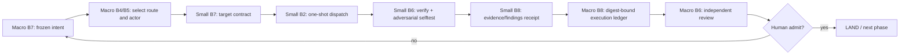

# Dual-loop eight-base contract

本模組說明大小迴圈如何共享一組介面名稱，卻不共享 owner 或裁決權。機器可執行 SSOT 是
[`../data/dual-loop-eight-base.json`](../data/dual-loop-eight-base.json)，由
`scripts/check_dual_loop_eight_base.py` 驗證；此處只解釋 why 與測試設計。

## Paired bases

| Base | Macro loop | Small loop | Physical proof |
|---|---|---|---|
| B1 rules/context | root entry 與架構規則 | sandbox passive context 與 driver entry | owner path 存在；entry 不形成第二治理 SSOT |
| B2 settings/authorization | repo hook 與 gate layer policy | `run.sh` 單發 driver 權限面 | L1 report；每個 driver 都收到 target/feedback，未知 driver 被拒 |
| B3 lifecycle/observation | commit/message/push transition | sandbox `logs/`、`anti/` 與 trajectory | hook/meta receipt；no-progress/no-change/exhausted 可區分 |
| B4 route discovery | 可用 Skill/actor/validator catalog | loop-local capability 與 packet route | catalog digest、unknown route 負控；catalog 不持有 plan DAG |
| B5 specialization | plan composer 與 independent judge | typed exchange/domain adapter | plan-package validator；unsafe/missing packet identity 負控 |
| B6 independent verification | repo-wide layered gates | `verify.sh` + `selftest.sh` | L1/meta output；good PASS 且 hollow/planted defect FAIL |
| B7 goal contract | versioned plan intent/acceptance/budget | `PROMPT.md` target/success/stop-loss | package digest；missing context/cycle/collision 負控 |
| B8 state ledger | execution topology/evolution receipts | `PLAN.md` iteration/Human edge | stale generation/HEAD/self-admit 負控；terminal result 可重播 |

共名的目的，是讓 macro 與 small loop 可以透過固定介面組合；不是讓兩邊鏡射同一份實作。Macro 可以
跨 loop 選 route、排 DAG、執行 repo gate；small 只能修改本地 target、回傳 evidence/findings，不能 LAND、
改 macro plan 或替自己簽 receipt。

## Automated-test fold-in from P0-P10

P0-P10 的可轉移經驗不是某一份 fixture，而是以下模組測試契約：

1. **Closed schema**：JSON 必須拒絕 unknown/duplicate key，不能靠 `json.load` 默認覆寫重複欄位。
2. **Public seam**：測試打公開 CLI/函式與真檔案邊界，不能只驗內部 helper 或 docstring。
3. **Positive + adversarial pair**：每個 base 至少一個正控與一個能證明 checker 有辨識力的負控。
4. **Hash + freshness binding**：receipt 綁 plan digest、HEAD、producer/validator hash、command hash 與 observation ID；
   重算自簽 hash 不能升級成外部 provenance。
5. **Replayability**：結構證據應能在乾淨 checkout 重播；機器本機狀態只可是顯式環境前置，不可冒充 target 結果。
6. **Layered gates**：便宜、確定性的 repo 靜態閘進 L1；閘的對抗自證進 meta；會呼叫模型或消費人裁的操作留在 op-time。
7. **Authority separation**：writer、consumer、judge 與 Human admit 各有不同輸入；任何 graph/report 都不能自帶 LAND。
8. **Outcome is not structure**：schema/fixture/selftest 綠只證 consumer 能辨識，actual output/outcome 必須由獨立 producer
   與新鮮 probe receipt 證明。

## Data flow

## Anti-regression anchor

已解：P10 曾有 21 個預註冊測試，但 public `validate_measurement` seam 不存在，造成 10 個 O3 case 直接
`AttributeError`；補上 closed six-graph/ten-metric validator、`--selftest` 與 meta gate 後為 21/21。
禁回退：用「測試檔存在」「plan 寫了 acceptance」或 fixture 全綠冒充實作／真實 outcome。P10 的真 external
receipt、六圖與 report 未產生前仍是 pending。
