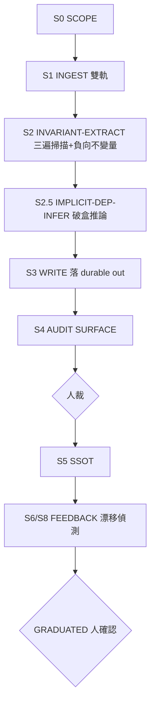

# repo-agent-native

對可讀 target，從 source of truth 抽出可逐字複驗的契約。核心交付是 L2 source-anchored invariants；
高風險、跨模組改造才加跑 L3 Specs-as-Code。分層與共同 sink 的 SSOT 是
[`kb-ingest/mastery-ladder.md`](../../../kb-ingest/mastery-ladder.md)：L1 `repo-wiki-converge` 只種子
scope；L2/L3 仍須回 source body 裁決。

## When to Use
- 計劃要 touch 一個既有家族的 `skills/`、`shared/`、`evals/`(
`sdlc-plan-composer` S-1 判定的 brownfield
  觸發條件之一)，或要動 `loop_wiki/engine.sh`／`_template/` 這類**所有已實例化沙盒共用**
的機械引擎本身之前，
  要把它的真實契約／隱含依賴／失敗模式**源碼級**抽出來，而非只憑印象手動讀一輪。
- 要回答「這個家族路由器承諾的 interface 到底是什麼、哪些假設其實不存在、
哪個 outgoing call 會靜默失敗」
  ——每個答案釘在 `檔案路徑:行號`。
- 對任意可讀 code repo 都適用，不限 skill-bettor 自己：本地家族(
`families/<family>/`)、共享 harness 引擎、
  或外部 OSS repo 皆可當 target。

## Not For
1. **只要 repo 廣度 wiki** → [`repo-wiki-converge`](../repo-wiki-converge/SKILL.md)；需要精確契約再升 L2。
2. **runtime-only 黑盒、flaky 或效能回歸** → `diagnose`／`diagnosing-bugs`；本 skill 只交付靜態已知事實。
3. **外部框架／版本能力 claim** → [`external-verify`](../external-verify/SKILL.md)。

## 能力與 MCP 契約

完整任務能力不綁任何 MCP；沒有 MCP 時用 `rg`、`rg --files`、`git`、直接讀 body，仍須完成所有階段。
差異只在導航速度，不在允許省略的證據或輸出。

| 能力 | 角色 | 使用前驗證 | 證據限制 |
|---|---|---|---|
| `grepai` | 可選語義搜尋／call-graph 候選 | `grepai_index_status.last_updated`＋target 唯一路徑／現行內容 canary 是硬閘；`grepai watch --status` 另作營運訊號 | sandbox 可能看不到 host watcher PID，不能單憑 status=false 判死；Connected 但 stale/canary 舊仍算不可用。trace 必回 source body 定案 |
| `Serena` | 可選符號、references、diagnostics | `activate_project(<target>)`，再以 `get_current_config` 核對 active project | references 只作導航；load-bearing claim 仍讀 callsite/body |
| `rag-local` | 不使用 | 不適用 | 本 repo 的 sink 是本地 `indexing.ingest_repodoc_cli`，不是 northstar `rag-local` |

MCP 不可用、索引失效或 canary 不通時立即退回 Tier 0；禁止猜索引狀態。

## Evidence Level

| 等級 | 定義 | 抽取方式(skill-bettor 實base) | 範例 |
|------|------|------------------------------|------|
| **A** | 直接讀 source body；behavior/perf 則完整 RIP 真跑 | `git show`／Read／完整端到端測試 | 可當 load-bearing fact |
| **A-** | 已讀 source callsite，確認路徑但未讀完整 callee | `rg`／symbol navigation 後讀 callsite | 只證路徑，不延伸 callee 行為 |
| **B+** | grepai／Serena 命中的候選，尚未回 body | 語義／符號導航 | 只作待驗 claim |
| **B** | 官方文檔／間接聲明 | `FAMILY.yaml`／`SKILL.md`／README／`shared/conventions.md` | `interface: audit-report/v1` 聲明 |
| **C** | 推測性類比 | 從其他家族類比(未讀本家族源碼) | 「大概跟 pinescript-audit 一樣」 |
| **D** | 無來源猜測 | 現有假設、無源碼支撐 | 未讀源碼的 config 名 |

> 負向不變量不能靠語義搜尋「沒命中」證明。A 級 absence 必須先用 `rg --files` 明確列出 scope，再以
> 確定性 `rg` 搜完該 scope 與同義 pattern，並記錄命令、scope、commit。

## 9 階段程序（確定性）



### S0 SCOPE
- 確認 target repo 路徑＋`git -C <target> rev-parse HEAD`(記
`commit`，供 S8 漂移偵測)。
- 決定 durable `<out>`：外部 repo 通常用 `repo/<repo_name>/`；本 repo 計畫用
  `docs/plans/<date>-<topic>/`。產物落 `<out>/invariants/<slug>/`，
`<slug>` 通常＝家族名或子系統名
  (如 `pinescript-audit-repaint-detection`、`loop_wiki-engine`
)。
- 若已有 `repo-wiki-converge` L1 產物，讀其子系統圖與 `covers` 作 candidate seed；否則讀 target 的
  manifest、入口、`SKILL.md`／`FAMILY.yaml`／README 建初始 scope。兩者都只決定先看哪裡，facts 仍由
  source body＋`source_ref` 裁決。

### S1 INGEST(雙軌)
- **軌 A 語義／符號(選配)**：先跑 MCP 契約的 target canary。`grepai_index_status` 只有 aggregate health，
  不能單獨證明 target 已在索引；Serena 必須核對 active project。任一不通即退回 Tier 0。
- **軌 B 全文**：`rg --files <target>` 列出 scope，再用 `rg` 排除／搜尋 `vendor`、`node_modules`、
  `__pycache__` 等非目標路徑；按需直接讀檔。
- **分塊**：符號邊界 > 檔案邊界 > 固定行數。每函數／class 一單位，附 `檔案路徑:行號`。

### S2 INVARIANT-EXTRACT(三遍掃描＋負向不變量)
四層精準度**從 Tier 0 起，禁跳層**：`ripgrep/find`(T0 找候選) →
`grepai_search`／Serena symbol search(T1 候選) → trace／references(T1 候選) → Read callsite/body 定案。
MCP 命中本身最高 B+；只有回 source 才能升 A-/A。
- **Pass 1 Message Contract**：ripgrep 找家族內部訊息/事件傳遞模式(如
`run.sh`↔`engine.sh` 的 exit
  code 約定、`evals/runner.py`↔`evals/judge.py`
的 check-result schema) → 追 trigger→handler→state→
  輸出 → Read body 讀實際欄位/格式(A 級)。
- **Pass 2 State Machine**：ripgrep
`STATUS|status|state|transition` → 讀 `PLAN.md`/`engine.sh`
找狀態
  轉移(如 `candidate`/`done`/`failed`/`awaiting-human-admit`)。
- **Pass 3 API Contract＋OPBE**：
讀 CLI/函數 entry point 提參數／預設值／timeout；**必跑 OPBE**(Optional
  Param Branch Exhaustion)——
枚舉所有 optional 參數及其 if/switch 分支效果(某 optional 參數常是 routing
  key，觸發完全不同路徑)。細節 → `modules/extraction-methodology.md`。
- **Pass 4 Outgoing Call Inventory**：ripgrep 對外呼叫(
`subprocess|requests\.|urllib|_URL|_HOST|_PATH`)
  → 列 `indexed: false` 的 callee ⇒ 觸發 S2.5。
- **負向不變量**：依 Evidence Level 下方的 deterministic absence protocol；語義搜尋空結果不構成 absence。

### S2.5 IMPLICIT-DEP-INFER(破盒推論)
對每個 `indexed: false` 的 outgoing call 跑五步：①未索引服務分類 → ②共享狀態耦合偵測(找檔案/DB **read**，
誰寫的？) → ③靜默失敗鏈(exit 0 但實際沒成功？) → ④逾時鏈(timeout 常數由什麼外部條件隱性決定？) →
⑤循環依賴檢查。每條隱含依賴標 Evidence Level＋`source_ref`＋
`resolution_status`。框架細節 →
`modules/extraction-methodology.md`。

### S3 WRITE(→ durable `<out>/invariants/<slug>/`)

外部 repo 通常以 `repo/<repo_name>/` 為 `<out>`；本 repo 計畫工作以
`docs/plans/<date>-<topic>/` 為 `<out>`。檔案本身是可審計產物，通過 S4 與人裁後再由 S5 ingest。

```
---
node_kind: RepoDoc
repo: <org/repo 或穩定 repo id>
title: <target> invariants and contracts
commit: <sha>
kind: invariants
page_type: invariants
covers: [message-contract, state-machine, api-contract, implicit-deps]
---
# <target> — 不變量與契約(source-anchored)
## Message Contracts
- INV-001 [A] <內容> — src: `<path>:<line>`
## Negative Invariants
- NEG-001 [A] <內容> — scope: `<scope>`; command: `<deterministic search>`
## Implicit Dependencies (S2.5)
- IMPL-001 [B] <內容> — silent_failure_chain: ...
## External Gaps(未填，見 Codebase Mastery 層 Step 3)
- <只有走 Codebase Mastery 層時才會有此節；純不變量抽取通常留空>
```

> `kind: invariants` 是 load-bearing：本地 ingestor 會把 kind 納入 RepoDoc ID namespace，避免 L1 prose、
> L2 invariants、L3 specs 的同名頁互相覆蓋。

### S4 AUDIT(SURFACE，非機器閘)
- 每條檢查 `evidence_level` 存在(缺 → 補或標)。C／D 級事實**不寫成事實**(標
`unverified`／`inferred`)。
- post-cutoff 外部 claim → `external-verify`。
- 產一行 SURFACE：`a_ratio=<A級/總>`、`unverified_count=<n>` 交人裁。**無 exit-code 閘**
——skill-bettor
  同 antigravity 皆無機器污染矩陣(`hallucination_audit.py` 這類工具北極星才有)
，誠實記錄這個能力差距。

### S5 INDEX／SSOT

人裁接受後，先 dry-run 整個 L2 root，保留 `<slug>/` 的相對路徑；dry-run 綠才可 live ingest：

```bash
python3 -m indexing.ingest_repodoc_cli <out>/invariants --dry-run
python3 -m indexing.ingest_repodoc_cli <out>/invariants
```

第二行寫 `.cache/kg/graph.json`；不要自動越過人裁。`--embed` 是選配，只有它需要 chromadb／Ollama；
基本 graph ingest 不依賴 MCP。per-target SSOT 表(行為→源檔→行號→Evidence Level→驗證日)仍併入頁面。

### S6/S8 FEEDBACK＋漂移偵測
- 收斂判定(SURFACE)：`a_ratio ≥ 0.80` ∧ `unverified`
清零 ∧ 該輪新事實趨零 → GRADUATED(人確認)。
- 漂移：下次要用同一份不變量頁前，比對 `git -C <target> rev-parse HEAD` vs 頁面
`commit`；不同 →
  STALE → 重跑 S1(這條純 git 機制，不需要 KG 才能做)。

### Empty-Output Contract(fail-loud，禁 Half-Bridge)
S2 產 0 不變量＋0 負向不變量時**禁**留空頁。**必**在頁面寫
`extraction_failure_reason:<why>`(Pass 1-4
哪環空／源路徑對不對／commit 是否最新／是否需 S2.5)，並在 SURFACE 標 `EMPTY_FAILED`
。空殼靜默寫進
`docs/plans/` ＝ 灌毒(比沒有更糟——下一個讀計劃的人會把「沒抽到」誤讀成「沒有不變量」)。

## Codebase Design Mastery / Specs-as-Code(選配深層，非每次 S-1 都需要)

在不變量抽取之上，本 skill 保留 antigravity 版的「完全掌握」規格配方——對一個可讀 target 產
`specs/{architecture_map,data_flow_and_api,security_and_bottlenecks}.md`
三檔正式規格。**判斷保留**：
方法論(4 步：SOURCE=SSOT 漏斗→8 條 implicit-design probe→外部缺口處理→evaluator-first＋RIP 封頂)
平台無關。`repo-wiki-converge` 提供 L1 廣度與 scope seed；本層提供 L3 隱含設計合約，兩者互補但不代理。
**優先序**：核心 9 階段不變量抽取是 S-1 的主要 delegate；本層是**選配深化**，
只在高風險 family-wide
整改前才值得跑一輪，非每次 brownfield 判定都要求。

Step 3 的真外部缺口按需求路由 `external-verify`、`research`，或本地 `gemini-conversation-research`。
後者仍須遵守自己的 `external_engine_required` receipt；skill 存在不等於外部 browser／DR engine 已本地化。
任何外部 finding 都不能跳過 source／primary-source 複驗。

- 方法論全文(funnel-inversion／8 probe／Step 4.5 RIP／輸出位置設計) →
[`modules/codebase-mastery-methodology.md`](modules/codebase-mastery-methodology.md)
- ready-to-paste 提示詞 →
[`modules/specs-as-code-prompt.md`](modules/specs-as-code-prompt.md)
- **入口**：直接觸發本 skill 的 Specs-as-Code mode；不假設不存在的 `/specs-as-code` command。

## 與 sdlc-plan-composer 的整合(S-1 delegate 契約)

`sdlc-plan-composer` 的 brownfield G-1 已優先委派本 skill。**契約**：

**輸入**(呼叫者需提供)：
1. `target`——絕對路徑，可以是 `families/<family>/`、
`loop_wiki/engine.sh`／`_template/`，或外部 repo。
2. `out`——外部 repo 的 durable `repo/<repo_name>/`，或本 repo 的 `docs/plans/<date>-<topic>/`。
3. `slug`——不變量頁子目錄名，呼叫者指定或依 `target` basename 推導。
4. (可選) 種子概念清單／範圍限定——哪些子系統/契約要優先抽；缺省時走 S0 SCOPE 的人工起手清單。

**輸出**(呼叫者可依賴的產物)：
1. `<out>/invariants/<slug>/<page>.md`——
含 typed `INV-*`/`NEG-*`/`IMPL-*` 條目
   (每條都有 Evidence Level＋`source_ref`)，供 S-1 GATE 表直接消費，
取代現行「無 typed ID、只能用檔案
   路徑/行號的散文格式」的降級寫法。
2. (可選，若跑了 Codebase Mastery 層)
`specs/{architecture_map,data_flow_and_api,security_and_bottlenecks}.md`
   ——見 §Output Contract 的 family-local vs out-scoped 路由規則。
3. 一行 SURFACE：`a_ratio=<..>`、`unverified_count=<..>`，供 G-1/V-1 消費。
4. 人裁後的 RepoDoc dry-run／live ingest receipt。

## Output Contract(Boundary Artifacts)

- **不變量頁**(核心 9 階段，durable out-scoped)：
`<out>/invariants/<slug>/<page>.md`
  (可選中間產物 `outgoing-calls.md`、`implicit-deps.md`，可併頁)。
- **Codebase Mastery 三檔**(選配深層，路由依 target 類型)：
  - **target 是 skill-bettor 自己的家族**(`families/<family>/`) → `families/<family>/specs/
    {architecture_map,data_flow_and_api,security_and_bottlenecks}.md`——**family-local 常駐資產**，
    理由見下方設計註。
  - **target 不是家族**(共享 harness 引擎、外部 repo) → `<out>/invariants/<slug>/specs/{同三檔}.md`
    ——**out-scoped**，跟不變量頁同一 durable root。

三檔各自必帶 `node_kind: RepoDoc`、穩定 `repo`、`commit`、`kind: specs`、`page_type: specs`、`covers`。
通過 evaluator-first、load-bearing source recheck、RIP 與人裁後，先 dry-run 再 ingest 該 `specs/` 目錄。

> **為何家族目標要 family-local 而非一律 out-scoped(設計理由)**：
> 這一分流不是我隨意加的分支，是照抄
> antigravity 原版自己的模式——它的 Codebase Mastery 層產物落在
> `<TARGET>/.knowledge_base/`，即**寫進
> target repo 自己**，跟不變量抽取落中性 `<OUT>`
> 是兩種不同的落點策略(mastery 規格是 target 的常駐資產，
> 不變量頁是抽取當下的快照)。skill-bettor 沒有「target 自己的 repo」
> 這個概念可寫(target 常常就是
> skill-bettor 自己的一部分)，但 `families/<family>/`
> 是最貼近「target 自己的常駐位置」的等價物——
> 一個家族的架構規格是它自己會被反覆諮詢的資產(未來多次 evolution op 都可能想看)，理應跟著家族本身走，
> 而非埋進某次計劃、計劃結束就沒人記得回頭看。若 target 不是家族(例如評估某個外部庫)，沒有這種「常駐
> 歸屬」，才退回 out-scoped。**兩者都是同一份 `.knowledge_base/` 概念換了名字＝`specs/`**
> (拿掉點狀
> 隱藏目錄慣例，改用 skill-bettor 沒有 dot-prefixed 內容目錄的既有習慣，
> plain 可見目錄更符合本 repo
> 慣例)。

## Modules
-
[modules/extraction-methodology.md](modules/extraction-methodology.md)
— 破盒推論五步／OPBE／
  Evidence Level 分級 know-why(全平台無關，近乎原樣映)。
-
[modules/codebase-mastery-methodology.md](modules/codebase-mastery-methodology.md)
— Codebase
  Design Mastery 配方全文(4 步＋8 probe＋evaluator-first＋RIP 封頂＋
輸出位置設計)。
-
[modules/specs-as-code-prompt.md](modules/specs-as-code-prompt.md)
— ready-to-paste 提示詞。
- [modules/retarget-map.md](modules/retarget-map.md) —
antigravity→skill-bettor 逐機制映射與誠實帳本。
