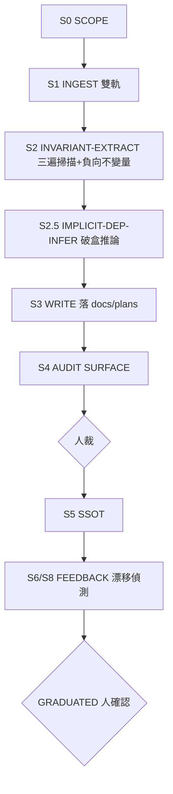

# repo-agent-native（skill-bettor）

> **這是 antigravity `repo-agent-native` 的 skill-bettor retarget，不是原樣搬**
> （antigravity 版本身已是
> northstar `repo-agent-native` 的 retarget——這是 northstar→
> antigravity→skill-bettor 這條鏈的**第三環**，
> 上一環帳本見 antigravity
> `.agents/skills/repo-agent-native/modules/retarget-map.md`
> ，本檔不重抄，只承
> antigravity→skill-bettor 這一段）。
> 命門＝抽取核心(9 階段／三類不變量／破盒推論／Evidence Level／
> source_ref 鐵律)一對一映；antigravity 專屬 sink 層(KG 入庫
> `indexing.ingest_repodoc_cli`／RepoDoc／
> ChromaDB)**不接入本 workflow**，改寫純 markdown 落
> `docs/plans/<date>-<topic>/`(本 repo 現有 `indexing/` lane，但本 skill 無 KG sink 契約，見下方
> §Output Contract 的設計理由)；antigravity 兩個 cross-reference 目標(
> `repo-wiki-converge`／
> `repo-fullstack-debugger`)中，前者已有本地 port，後者仍無本地基座 →
> [`modules/retarget-map.md`](modules/retarget-map.md)。
> know-why(破盒推論五步／OPBE／Evidence Level
> 分級細節) →
> [`modules/extraction-methodology.md`](modules/extraction-methodology.md)
> 。
> **Source Code＝SSOT 鐵律**：任何寫進不變量頁的事實必須附帶 `source_ref`(檔案路徑＋
> 行號)，否則視為幻覺、
> 不寫入。無錨的「效率提升／已優化」＝ Half-Bridge 散文——Path B 紀律，見本地
> [`path-b-reduction`](../path-b-reduction/SKILL.md)。

## When to Use
- 計劃要 touch 一個既有家族的 `skills/`、`shared/`、`evals/`(
`sdlc-plan-composer` S-1 判定的 brownfield
  觸發條件之一)，或要動 `loop_wiki/engine.sh`／`_template/` 這類**所有已實例化沙盒共用**
的機械引擎本身之前，
  要把它的真實契約／隱含依賴／失敗模式**源碼級**抽出來，而非只憑印象手動讀一輪。
- 要回答「這個家族路由器承諾的 interface 到底是什麼、哪些假設其實不存在、
哪個 outgoing call 會靜默失敗」
  ——每個答案釘在 `檔案路徑:行號`。
- 對任意可讀 code repo 都適用，不限 skill-bettor 自己：本地家族(
`families/<family>/`)、共享 harness 引擎、
  或外部 OSS repo 皆可當 target。

## Not For
1. **產 repo 理解 wiki／宏觀地圖** → 用本地 `repo-wiki-converge`。它可當 S0 的 candidate seed，
   但不可代替本 skill 回源碼定案。
2. **診斷反覆失敗的黑盒**(runtime-only 行為、靜態源碼無法 A 級解析)→
skill-bettor **無**
   `repo-fullstack-debugger`(antigravity 專屬)本地基座——最近替代是內建
`diagnose`／`diagnosing-bugs`
   (見下方 Handoff)，但這兩者是通用重度除錯迴圈,非本 skill「破盒推論」那種源碼級隱含依賴推導框架，
   交棒後紀律會變(見 modules/retarget-map.md §缺口 2)。
3. **外部框架／版本能力 claim 的查證** → 本地
[`external-verify`](../external-verify/SKILL.md)。

## Evidence Level 分級（retarget 到 skill-bettor 真實工具）

| 等級 | 定義 | 抽取方式(skill-bettor 實base) | 範例 |
|------|------|------------------------------|------|
| **A** | 直接讀源碼 body | `git show`／Read 源檔 body | 讀 `repo/agent-skills-repo/scripts/validator.py` body 確認某 check kind 的判分邏輯 |
| **A-** | 追蹤路徑但非完整讀 body | 已知 symbol 以 `rg`／compiler/LSP 追蹤並回讀呼叫點；GrepAI trace 單獨不足以升級 | 確認 `runner.py` 某函數呼叫 `judge.py` 某 check |
| **B+** | 語義搜索命中 | `grepai_search` 命中片段(同需索引) | 在 `loop_wiki/engine.sh` 找到 exit code 語意片段 |
| **B** | 官方文檔／間接聲明 | `FAMILY.yaml`／`SKILL.md`／README／`shared/conventions.md` | `interface: audit-report/v1` 聲明 |
| **C** | 推測性類比 | 從其他 target 類比(未讀本 target 源碼) | 「大概跟另一個 validator 一樣」 |
| **D** | 無來源猜測 | 現有假設、無源碼支撐 | 未讀源碼的 config 名 |

> **索引紀律(審計日：2026-07-29)**：
> skill-bettor 目前有 gitignored `.grepai/` 索引，但它是可再生工具狀態，不是知識 SSOT。每次使用前必須跑
> `grepai_index_status`(或 CLI `grepai status`)確認 target、最後更新時間與檔案範圍。本次實測：語義查詢能命中
> normalizer，但 `trace_callers` 對已知 caller 回空；因此 semantic hit 只是 B+ 候選，trace 必須用
> `rg`/源碼 body 交叉核對。依人裁，Serena 與 GrepAI 在 Claude Code／Codex 均常駐；2026-07-29 審計發現原設定只有 TypeScript，
> 現已在受版本控制的 `.serena/project.yml` 補 Python，新 session 仍必須核對 language/workspace。修正前實測曾漏
> 跨檔 test references，所以單次輸出不得當完整引用證明。

> **Production MCP 邊界**：repo 的可重現設定是 `.mcp.json`(Claude Code)、`.codex/config.toml`(Codex)
> 與 `.serena/project.yml`(共用 Serena policy)。兩個 host 均**設定為常駐** GrepAI＋Serena＋
> `repo-context-pack`；Codex 已驗 `enabled`，Claude 的 GrepAI/Serena 已連線，新加的 context-pack 仍須人做
> 一次 project MCP approval，批准前不可宣稱已常駐。
> Serena 固定到精確 commit、關 dashboard、只讀且只暴露 9 個符號／診斷工具；context-pack 只暴露 2 個
> Python 唯讀工具，且重新以 repo-relative path 開檔、拒絕 symlink 越界、綁 SHA-256、明標
> `completeness=partial`。`sites-design-picker` 在本 repo 停用。常駐是能力策略，不是「所有結果自動可信」；
> 任一 MCP 不健康都 fail closed 回 `rg`/Read/git。context-pack 不支援 TypeScript，也不宣稱本機 16KB
> page alignment 能控制遠端 KV cache。

## 9 階段程序（確定性）



### S0 SCOPE
- 確認 target repo 路徑＋`git -C <target> rev-parse HEAD`(記
`commit_hash`，供 S8 漂移偵測)。
- 決定計劃目錄：`docs/plans/<date>-<topic>/`(通常由呼叫者——例如
`sdlc-plan-composer` S-1——提供；獨立
  調用時自訂)。產物落 `docs/plans/<date>-<topic>/invariants/<slug>/`，
`<slug>` 通常＝家族名或子系統名
  (如 `pinescript-audit-repaint-detection`、`loop_wiki-engine`
)。
- 種子概念清單(要抽哪些契約／哪個子系統)：先讀 target 的 `SKILL.md`/`FAMILY.yaml`/`README`；
  若已有本地 `repo-wiki-converge` 產物，可當 candidate seed。facts 仍必須回源碼定案＋`source_ref`，
  seed 只決定「先看哪裡」，不當事實來源(funnel 不倒置)。

### S1 INGEST(雙軌)
- **軌 A 語義／符號候選**：`grepai_index_status`(或 `grepai status`)確認 target、時效與範圍；
  未建、過期或 target 不符就 fail closed 回 Tier 0。`grepai_search` 只找候選；`trace_*` 結果必須再用
  `rg` 與 body 審計。Serena 雖常駐，仍須先確認 language/workspace 健康才補 LSP references。
- **軌 A.5 減熵但不降真實性**：對本 repo 的 Python 候選，呼叫
  `build_python_context_pack(relative_path, symbol, max_bytes)`；只消費 source-hash 綁定且
  `completeness=partial` 的 evidence pack。找不到 symbol、路徑越界、解析失敗或 mandatory facts 超 budget
  都 fail loud；編輯前仍回讀實際 body。外部 repo 或非 Python 不得假裝有此能力。
- **軌 B 全文**：`find <target> -name '*.<ext>' -not -path '*/vendor/*' -not -path '*/node_modules/*'
  -not -path '*/__pycache__/*'` 列檔；按需 Read。
- **分塊**：符號邊界 > 檔案邊界 > 固定行數。每函數／class 一單位，附 `檔案路徑:行號`。

### S2 INVARIANT-EXTRACT(三遍掃描＋負向不變量)
四層精準度**從 Tier 0 起，禁跳層**：`ripgrep/find`(T0 找候選) →
`grepai_search`(T1 語義，需索引) →
`grepai_trace_callers/graph`(T1 候選，需健康索引；或常駐 Serena LSP；兩者都必須交叉核對) →
Python `repo-context-pack`(source-bound partial evidence；只對它實際包含的 facts 升級，不證 absence／完整性) →
Read body(A 級定案)。
- **Pass 1 Message Contract**：ripgrep 找家族內部訊息/事件傳遞模式(如
`run.sh`↔`engine.sh` 的 exit
  code 約定、`evals/runner.py`↔`evals/judge.py`
的 check-result schema) → 追 trigger→handler→state→
  輸出 → Read body 讀實際欄位/格式(A 級)。
- **Pass 2 State Machine**：ripgrep
`STATUS|status|state|transition` → 讀 `PLAN.md`/`engine.sh`
找狀態
  轉移(如 `candidate`/`done`/`failed`/`awaiting-human-admit`)。
- **Pass 3 API Contract＋OPBE**：
讀 CLI/函數 entry point 提參數／預設值／timeout；**必跑 OPBE**(Optional
  Param Branch Exhaustion)——
枚舉所有 optional 參數及其 if/switch 分支效果(某 optional 參數常是 routing
  key，觸發完全不同路徑)。細節 → `modules/extraction-methodology.md`。
- **Pass 4 Outgoing Call Inventory**：ripgrep 對外呼叫(
`subprocess|requests\.|urllib|_URL|_HOST|_PATH`)
  → 列 `indexed: false` 的 callee ⇒ 觸發 S2.5。
- **負向不變量**：確認某假設**不存在**必須用可枚舉的全文搜尋(如 `rg` 配明確
  include/exclude 範圍)＋目錄盤點；語義搜尋空結果**不能**證明 absence。

### S2.5 IMPLICIT-DEP-INFER(破盒推論)
對每個 `indexed: false` 的 outgoing call 跑五步：①未索引服務分類 → ②共享狀態耦合偵測(找檔案/DB **read**，
誰寫的？) → ③靜默失敗鏈(exit 0 但實際沒成功？) → ④逾時鏈(timeout 常數由什麼外部條件隱性決定？) →
⑤循環依賴檢查。每條隱含依賴標 Evidence Level＋`source_ref`＋
`resolution_status`。框架細節 →
`modules/extraction-methodology.md`。

### S3 WRITE(→ 計劃目錄，plain markdown，無入庫步驟)
skill-bettor 現有本地 `indexing/` lane，但本 workflow 沒有被承認的 KG／ChromaDB sink 契約，且
`rag-local` 與本 repo 內容隔離——
把 S2/S2.5 產出寫成一份 source-anchored 不變量頁，直接落
`docs/plans/<date>-<topic>/invariants/<slug>/<page>.md`：**檔案本身即產物，無 ingestion 步驟**
。

```
---
target: <target 絕對路徑>
title: <target> invariants and contracts
commit_hash: <sha>
covers: [message-contract, state-machine, api-contract, implicit-deps]
extracted_at: <YYYY-MM-DD>
---
# <target> — 不變量與契約(source-anchored)
## Message Contracts
- INV-001 [A] <內容> — src: `<path>:<line>`
## Negative Invariants
- NEG-001 [A] <內容> — <抽取方式確認空結果，如 grep 全 repo 無 ChromaDB 引用>
## Implicit Dependencies (S2.5)
- IMPL-001 [B] <內容> — silent_failure_chain: ...
## External Gaps(未填，見 Codebase Mastery 層 Step 3)
- <只有走 Codebase Mastery 層時才會有此節；純不變量抽取通常留空>
```

> **為何落 `docs/plans/` 而非中性 scratch 目錄(設計理由，非簡化)**：
> antigravity 原版落 `<OUT>`(KG 中性暫存，餵 `ingest_repodoc_cli`)。skill-bettor 現雖有一條本地
> RepoDoc indexing lane，但本 skill 的受承認下游仍只是**同一份計劃**的 `sdlc-plan-composer` S-1 步驟(讀
> `00-intent-and-knowhow.md` 時直接讀本頁的 `INV-*`/`NEG-*`/
> `IMPL-*` 條目，取代其現行的手動盤點程序)。
> 與其寫進一個計劃結束就沒人再讀的中性暫存，不如直接落**計劃自己的目錄**——artifact 跟著需要它的規劃
> 工作走，是 **KG-scoped → plan-scoped** 的設計轉向，
> 見 modules/retarget-map.md 完整推導。

### S4 AUDIT(SURFACE，非機器閘)
- 每條檢查 `evidence_level` 存在(缺 → 補或標)。C／D 級事實**不寫成事實**(標
`unverified`／`inferred`)。
- post-cutoff 外部 claim → `external-verify`。
- 產一行 SURFACE：`a_ratio=<A級/總>`、`unverified_count=<n>` 交人裁。**無 exit-code 閘**
——skill-bettor
  同 antigravity 皆無機器污染矩陣(`hallucination_audit.py` 這類工具北極星才有)
，誠實記錄這個能力差距。

### S5 SSOT
per-target 一張表(行為→源檔→行號→Evidence Level→驗證日)，併入不變量頁。

### S6/S8 FEEDBACK＋漂移偵測
- 收斂判定(SURFACE)：`a_ratio ≥ 0.80` ∧ `unverified`
清零 ∧ 該輪新事實趨零 → GRADUATED(人確認)。
- 漂移：下次要用同一份不變量頁前，比對 `git -C <target> rev-parse HEAD` vs 頁面
`commit_hash`；不同 →
  STALE → 重跑 S1(這條純 git 機制，不需要 KG 才能做)。

### Empty-Output Contract(fail-loud，禁 Half-Bridge)
S2 產 0 不變量＋0 負向不變量時**禁**留空頁。**必**在頁面寫
`extraction_failure_reason:<why>`(Pass 1-4
哪環空／源路徑對不對／commit 是否最新／是否需 S2.5)，並在 SURFACE 標 `EMPTY_FAILED`
。空殼靜默寫進
`docs/plans/` ＝ 灌毒(比沒有更糟——下一個讀計劃的人會把「沒抽到」誤讀成「沒有不變量」)。

## Codebase Design Mastery / Specs-as-Code(選配深層，非每次 S-1 都需要)

在不變量抽取之上，本 skill 保留 antigravity 版的「完全掌握」規格配方——對一個可讀 target 產
`specs/{architecture_map,data_flow_and_api,security_and_bottlenecks}.md`
三檔正式規格。**判斷保留**：
方法論(4 步：SOURCE=SSOT 漏斗→8 條 implicit-design probe→外部缺口處理→
evaluator-first＋RIP 封頂)完全
平台無關。skill-bettor 已有 `repo-wiki-converge` 廣度理解工具；本層專注 source-grounded 深度契約，
兩者不競爭第二份 wiki。
**優先序**：核心 9 階段不變量抽取是 S-1 的主要 delegate；本層是**選配深化**，
只在高風險 family-wide
整改前才值得跑一輪，非每次 brownfield 判定都要求。

**外部缺口路由**：本地已有 `gemini-conversation-research`，但它的 live browser/DR 能力有
`external_engine_required` 邊界。只在外部引擎已受承認且任務需要迭代研究時交棒；否則標
`⚠ 需人工二次確認`，或單次調用 `research`。不得把 skill 存在推論為外部引擎已可用。

- 方法論全文(funnel-inversion／8 probe／Step 4.5 RIP／輸出位置設計) →
[`modules/codebase-mastery-methodology.md`](modules/codebase-mastery-methodology.md)
- ready-to-paste 提示詞 →
[`modules/specs-as-code-prompt.md`](modules/specs-as-code-prompt.md)
- **無獨立入口 command**：antigravity 有薄 router `/specs-as-code`；
skill-bettor 是單一 `.claude/skills/`
  平面，本層直接是本 skill 的一部分，不另立第二個 skill 造成兩個入口指同一件事。

## 與 sdlc-plan-composer 的整合(S-1 delegate 契約——供日後接線核對)

`sdlc-plan-composer` 現行 S-1 是「本檔內建的手動盤點程序」(其 SKILL.md §S-1、
modules/retarget-map.md
§1 明言這是「真實能力差距」)。本 skill 落地後即是它應該委派的對象。**契約**：

**輸入**(呼叫者需提供)：
1. `target`——絕對路徑，可以是 `families/<family>/`、
`loop_wiki/engine.sh`／`_template/`，或外部 repo。
2. `plan_dir`——`docs/plans/<date>-<topic>/`(呼叫者的計劃目錄；
獨立調用可用任意 scratch 目錄代替)。
3. `slug`——不變量頁子目錄名，呼叫者指定或依 `target` basename 推導。
4. (可選) 種子概念清單／範圍限定——哪些子系統/契約要優先抽；缺省時走 S0 SCOPE 的人工起手清單。

**輸出**(呼叫者可依賴的產物)：
1. `docs/plans/<date>-<topic>/invariants/<slug>/<page>.md`——
含 typed `INV-*`/`NEG-*`/`IMPL-*` 條目
   (每條都有 Evidence Level＋`source_ref`)，供 S-1 GATE 表直接消費，
取代現行「無 typed ID、只能用檔案
   路徑/行號的散文格式」的降級寫法。
2. (可選，若跑了 Codebase Mastery 層)
`specs/{architecture_map,data_flow_and_api,security_and_bottlenecks}.md`
   ——見 §Output Contract 的 family-local vs plan-scoped 路由規則。
3. 一行 SURFACE：`a_ratio=<..>`、`unverified_count=<..>`——
供 S-1(f) 反幻覈段落引用，取代現行「skill-bettor
   連這道 SURFACE 都沒有」的降級寫法。

**尚未做的事**(誠實標記，供協調 session 核對)：本檔只定義契約，**不修改**
`sdlc-plan-composer` 自己的
S-1 章節去接線——那是協調 session 的工作；本檔只確保接線時輸入/輸出介面清楚可核對。

## Output Contract(Boundary Artifacts)

- **不變量頁**(核心 9 階段，永遠 plan-scoped)：
`docs/plans/<date>-<topic>/invariants/<slug>/<page>.md`
  (可選中間產物 `outgoing-calls.md`、`implicit-deps.md`，可併頁)。
- **Codebase Mastery 三檔**(選配深層，路由依 target 類型)：
  - **target 是 skill-bettor 自己的家族**(`families/<family>/`) → `families/<family>/specs/
    {architecture_map,data_flow_and_api,security_and_bottlenecks}.md`——**family-local 常駐資產**，
    理由見下方設計註。
  - **target 不是家族**(共享 harness 引擎、外部 repo) → `docs/plans/<date>-<topic>/invariants/<slug>/
    specs/{同三檔}.md`——**plan-scoped**，跟不變量頁同一份計劃目錄下。

> **為何家族目標要 family-local 而非一律 plan-scoped(設計理由)**：
> 這一分流不是我隨意加的分支，是照抄
> antigravity 原版自己的模式——它的 Codebase Mastery 層產物落在
> `<TARGET>/.knowledge_base/`，即**寫進
> target repo 自己**，跟不變量抽取落中性 `<OUT>`
> 是兩種不同的落點策略(mastery 規格是 target 的常駐資產，
> 不變量頁是抽取當下的快照)。skill-bettor 沒有「target 自己的 repo」
> 這個概念可寫(target 常常就是
> skill-bettor 自己的一部分)，但 `families/<family>/`
> 是最貼近「target 自己的常駐位置」的等價物——
> 一個家族的架構規格是它自己會被反覆諮詢的資產(未來多次 evolution op 都可能想看)，理應跟著家族本身走，
> 而非埋進某次計劃、計劃結束就沒人記得回頭看。若 target 不是家族(例如評估某個外部庫)，沒有這種「常駐
> 歸屬」，才退回 plan-scoped。**兩者都是同一份 `.knowledge_base/` 概念換了名字＝`specs/`**
> (拿掉點狀
> 隱藏目錄慣例，改用 skill-bettor 沒有 dot-prefixed 內容目錄的既有習慣，
> plain 可見目錄更符合本 repo
> 慣例)。

## Modules
-
[modules/extraction-methodology.md](modules/extraction-methodology.md)
— 破盒推論五步／OPBE／
  Evidence Level 分級 know-why(全平台無關，近乎原樣映)。
-
[modules/codebase-mastery-methodology.md](modules/codebase-mastery-methodology.md)
— Codebase
  Design Mastery 配方全文(4 步＋8 probe＋evaluator-first＋RIP 封頂＋
輸出位置設計)。
-
[modules/specs-as-code-prompt.md](modules/specs-as-code-prompt.md)
— ready-to-paste 提示詞。
- [modules/retarget-map.md](modules/retarget-map.md) —
antigravity→skill-bettor 逐機制映射與誠實帳本。
