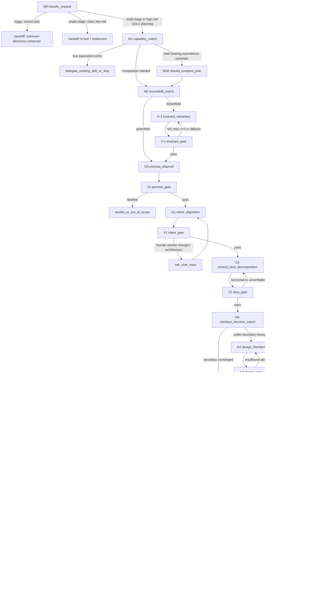

# sdlc-plan-composer
## Role
Plan a multi-stage task as a **stateful workflow**, not as a single large prompt.
The output is a plan package under `docs/plans/<date>-<topic>/` that another agent can execute without guessing:
- route decisions are recorded in `route-ledger.md`;
- user intent and why are recorded in `00-intent-and-knowhow.md`;
- domain terms are recorded in `CONTEXT.md`;
- each vertical slice is recorded as `NN-<slice>.md`;
- cross-slice execution truth is recorded in `execution-topology.json`, not inferred from prose order;
- immutable intent/context hashes are recorded in `plan-lock.json`;
- bounded repair generations and plan digests are recorded in `evolution-ledger.json`;
- validation and actor choices are explicit, grounded, and not left as interchangeable model alternatives;
- plan prose carries enough context for a fresh LLM to execute without guessing.
Every artifact and dispatch packet must carry the fixed-context pointer
`loop_wiki/evolve-unknown-discovery-plan-truth/modules/semantic-truth-context.md`. If the physical source context is
insufficient for a fresh actor to choose a route, return to context intake; do not continue generation from compressed
chat memory.
This skill follows the truth discipline of `judge-loop-chooser`: every load-bearing decision must say what is being judged, which evidence grounds it, who is allowed to judge it, and whether the result is `technical_equivalent`, `candidate`, `[推論]`, or `human_required`.
## Not For
- Do not use this skill to implement code. Execution goes to `implement`, `tdd`, `diagnose`, Codex, or the relevant harness after the plan exists.
- Do not use this skill for a vague starting point. If success criteria, scope, or target are still foggy, route to `unknown-discovery-composer`.
- Do not use this skill for a clear single-stage request. Route to `to-prd + implement`.
- Do not use this skill to judge a deliverable directly. Route validation strategy to `judge-loop-chooser` or code changes to `code-review`.
- Do not rewrite delegated atomic skills inline. This composer routes and records contracts; it does not duplicate the logic of `repo-agent-native`, `design-an-interface`, `autoresearch-composer`, or `judge-loop-chooser`.
## Invariants
1. **Stateful, not one-shot**: Always proceed through Match -> Generate -> Validate nodes. A plan that jumps straight to final prose is incomplete.
2. **Route before write**: Before writing slice content, record why the workflow is using this skill, which capabilities already exist, whether the work is brownfield, and which actor or validator is responsible.
3. **No name-based equivalence**: A skill or family is `technical_equivalent` only after reading its real contract and showing how it satisfies the requested behavior. Names, descriptions, memory, and superficial similarity are at most `candidate` or `[推論]`.
4. **Load-bearing uncertainty requires comparison**: If a reused component is load-bearing and equivalence is uncertain, add a rebuild or compare slice, or stop for human decision. Do not hide the uncertainty inside implementation text.
5. **Brownfield truth first**: Brownfield plans must extract invariants before premise disproof, intent alignment, slicing, or interface decisions rely on existing system facts.
6. **LLM verdict is evidence, not admit**: Fresh GPT judges, Codex execution, optional external adapters, and llm_judge can produce evidence or findings. Final LAND-DECISION stays human.
7. **Actors have semantic roles**: Mechanical scripts judge deterministic facts; fresh non-forked GPT sessions produce semantic verdict evidence; Codex native sessions implement and reproduce; optional external adapters research and cross-check facts. Do not list them as interchangeable alternatives.
8. **Semantic truth survives output**: Skill text and generated plans must be understandable by a fresh LLM without conversation context. Expand compressed labels into goal, evidence, actor reason, validator, admit point, and failure edge.
9. **Three attempts then stop**: If a node fails three times, record what failed, question the abstraction, and switch approach rather than retrying the same shape.
10. **Topology is an operational SSOT**: Every slice is a node in `execution-topology.json` with dependencies, actor,
    isolation, writer-set, artifact root, trigger profile, success commands, negative controls, completion evidence,
    failure edge, and human-admit semantics. Markdown diagrams are views, not the DAG SSOT.
11. **Plan evolution is bounded and non-self-signing**: A plan generation may be repaired at most three times. Every
    generation has a unique plan digest and strictly increasing defect coverage. Duplicate digest, no progress, or a
    third failed generation stops at the human gate. The author session cannot serve as the fresh plan judge.
12. **Physical gate before semantic gate**: `scripts/check_sdlc_plan_package.py <plan-dir>` must pass before a fresh GPT
    judge sees the frozen plan. A judge receipt is evidence; final admit remains human.
## STOP - You Are Rationalizing
| Thought | Reality |
|---|---|
| The user asked for a plan, so I can just write the plan. | No. First classify the request and record the route. |
| This sounds like an existing skill, so I will reuse it. | Not enough. Read the actual skill or family contract or mark it `candidate` or `[推論]`. |
| Brownfield is obvious from memory. | Not enough. Run `repo-agent-native` or record a source-linked fallback inventory. |
| S1 is conversational, so I can infer intent. | If a missing answer would change architecture, ask the user or record `human_required`. |
| S3 can be one sensible interface. | No. Interface changes require at least two distinct designs via `design-an-interface` or an explicit fallback comparison. |
| Any available model can handle it. | Wrong abstraction. Choose one actor by semantic role and record why. |
| The judge passed it, so the plan is done. | A judge result is evidence. The plan must still expose grounding and human admit points. |
## State Graph

## Grounding Labels
Use these labels in `route-ledger.md`, slice validation contracts, and final gates.
| Label | Meaning | Allowed use |
|---|---|---|
| `technical_equivalent` | The existing component was read and, where relevant, run or compared. It actually performs the needed job. | Can be used as a plan premise or delegation target. |
| `candidate` | A real component, fixture, rubric, or source exists, but coverage or equivalence has not been proven. | Can justify an investigation or comparison slice, not a final premise. |
| `[推論]` | No direct source or fixture proves the claim. This is an inference, LLM judgment, or pattern guess. | Must be surfaced as risk, assumption, or human question. |
| `human_required` | The choice changes architecture, scope, admit, or product intent and cannot be decided from repo facts. | Must be asked or listed as unresolved. |
## Route Ledger Contract
Every plan package must include `route-ledger.md`. This ledger is the workflow truth surface: it lets a future LLM understand why the plan took each edge without reading the full conversation.
Use this table shape:
```md
| state | decision | evidence | grounding | chosen edge | unresolved |
|---|---|---|---|---|---|
| M0 classify_request | multi-stage SDLC | touches families/... and requires pre-planning | candidate | M1 | none |
```
Rules:
- Every Match node must write one row.
- Every Generate node that relies on a premise must cite the evidence row or source file.
- Every Validate node must record pass or fail and the reason.
- Do not write `appropriate`, `as needed`, `consider`, or interchangeable model lists as an unresolved instruction. Either decide, ask, or mark `human_required`.
- Do not compress context into labels like `semantic truth`, `judge it`, or `validate later`; write what is judged, with which evidence, by whom, and what failure means.
## Node Contracts
### M0 classify_request
Purpose: Prevent foggy requests from becoming fake plans, and prevent simple work from being taxed by a six-stage workflow.
Inputs:
- User request.
- Mentioned paths, systems, families, harnesses, or deliverables.
- Whether the user asked to plan before implementation.
Decision Rule:
- If success criteria, scope, target, or constraints are too unclear to make a plan, route to `unknown-discovery-composer`.
- If the task is single-stage, clear, and low risk, route to `to-prd + implement`.
- If the task is multi-stage, high-risk, brownfield, cross-family, harness-level, or explicitly plan-first, continue to M1.
Semantic Grounding:
- `technical_equivalent`: only when a concrete alternative workflow fully covers the request.
- `candidate`: when the request appears likely to fit SDLC planning but still needs capability matching.
- `human_required`: when scope choice itself changes the architecture or work boundary.
Output:
- Add `M0 classify_request` row to `route-ledger.md`.
Validation Gate:
- The row must explain why the other two exits were not chosen.
Failure Edge:
- If classification depends on missing intent, ask the user or route to `unknown-discovery-composer`.
### M1 capability_match
Purpose: Prevent duplicate skills and prevent name-based false equivalence.
Inputs:
- `~/.claude/skills/*/SKILL.md`
- `.claude/skills/*/SKILL.md`
- `families/*/SKILL.md`
- Similar implementations mentioned by the task.
- `modules/mattpocock-skill-inventory.md` only as a candidate index, not as proof.
Decision Rule:
- Mark `technical_equivalent` only after reading the real target contract and explaining how it satisfies the needed behavior.
- Mark `candidate` when a real target exists but equivalence is not proven.
- Mark `[推論]` when the match is from names, summaries, memory, or an LLM guess.
- If a `technical_equivalent` target fully handles the request, delegate or stop rather than composing a new plan.
- If composition is needed, continue to M2.
- If load-bearing equivalence is uncertain, go to M1B.
Semantic Grounding:
- A source path is mandatory for every claimed capability.
- If the target is load-bearing and comparison is cheap enough to plan, prefer a compare slice over confident reuse.
Output:
- Add a capability matrix to `route-ledger.md`:
```md
| candidate | source | needed behavior | grounding | decision |
|---|---|---|---|---|
```
Validation Gate:
- No row may claim equivalence without a source reference and explanation.
Failure Edge:
- If all matches are `[推論]`, write a rebuild or compare slice, or ask for human choice before relying on them.
### M1B rebuild_compare_plan
Purpose: Convert maybe-already-exists into a measurable comparison instead of letting the model reuse by convenience.
Inputs:
- Candidate component from M1.
- Desired behavior.
- Available fixture, eval, smoke test, or manual rubric.
Decision Rule:
- Add a comparison slice when the component is load-bearing, equivalence is uncertain, and a wrong choice would waste or corrupt later work.
- The slice must define same input, same output expectation, same evaluator, and acceptance rule for both existing and rebuilt variants.
- If no meaningful comparison can be constructed, mark `human_required`.
Output:
- A `NN-compare-<capability>.md` vertical slice.
- A `route-ledger.md` row linking the comparison to M1.
Validation Gate:
- The comparison must be capable of proving non-equivalence, not just confirming the preferred option.
Failure Edge:
- If the comparison cannot be made concrete, return to M1 or ask the user whether to accept the risk.
### M2 brownfield_match
Purpose: Decide whether the plan depends on existing system truth.
Decision Rule:
- Brownfield if the plan touches existing `families/<family>/skills`, `families/<family>/shared`, `families/<family>/evals`, `loop_wiki/engine.sh`, `loop_wiki/_template`, harness skills, shared schemas, or multi-family contracts.
- Greenfield if the work is a wholly new family from template, a new independent skill with no existing contract dependency, or pure documentation.
Output:
- Add `brownfield: yes/no + reason` to `00-intent-and-knowhow.md`.
- Add M2 row to `route-ledger.md`.
Validation Gate:
- Brownfield must enter G-1.
- Greenfield must record why S-1 is N/A.
Failure Edge:
- If unsure and the touched path exists, treat as brownfield.
### G-1 invariant_extraction
Purpose: Extract repo truth before using existing contracts as premises.
Inputs:
- Target path.
- Plan directory.
- `.claude/skills/repo-agent-native/SKILL.md`.
Decision Rule:
- Prefer delegating `repo-agent-native`.
- Use fallback only if the skill is unavailable, the target is unsuitable, or the necessary index or path support is unavailable.
- Fallback must read actual source files and record path-backed assumptions. It is weaker than delegated extraction and must say so.
Fallback Inventory:
1. Read target family `SKILL.md`.
2. Read `FAMILY.yaml` for interface and metric contracts.
3. Read `shared/conventions.md` and `shared/glossary.md` if present.
4. Inspect eval fixture names and metadata without reverse-engineering holdout answers.
5. If harness-level, inspect `loop_wiki/engine.sh` or relevant template or harness skill contracts.
Output:
- Delegated path: `invariants/<slug>/<page>.md`.
- Fallback path: `00-intent-and-knowhow.md` section `Assumed Invariants`.
Validation Gate:
- Every load-bearing invariant has a source reference.
- `unverified` facts are not used as reliable premises in G0, G1, G2, or G3.
Failure Edge:
- Retry extraction up to three times. Then stop and record why S-1 cannot be trusted.
### V-1 invariant_gate
Purpose: Check that brownfield truth is usable before the SDLC stages consume it.
Pass Conditions:
- Brownfield reason is recorded.
- Delegated invariant page exists and is non-empty, or fallback assumptions are source-linked.
- SURFACE fields such as `a_ratio`, `unverified_count`, or fallback confidence are visible when available.
Failure Edge:
- Return to G-1 for missing sources.
- Stop if the plan would rely on unverified facts as hard premises.
### G0 premise_disproof
Purpose: Try to prove the request should not exist before planning how to build it.
Inputs:
- User intent.
- Capability matrix from M1.
- Brownfield invariants from G-1 when applicable.
- Existing decisions under `docs/decisions/` or plan-local decision notes.
Decision Rule:
List at least three falsifiable reasons the demand may be false or unnecessary:
- Existing skill or family already solves it.
- Existing decision record rejected the same direction.
- Brownfield invariant shows the change would violate a contract.
- The requested plan is too broad, too speculative, or lacks a real verification surface.
Output:
- `00-intent-and-knowhow.md` section `Premise Disproof`.
Validation Gate:
- If any disproof succeeds, stop and write a `wontfix` or out-of-scope rationale.
- If none succeeds, record why and proceed to G1.
Failure Edge:
- If disproof depends on missing source truth, return to M1 or G-1.
### G1 intent_alignment
Purpose: Fix the human goal, language, and why before slicing work.
Inputs:
- User request and follow-up answers.
- Brownfield invariants.
- Existing glossary or conventions.
- `grill-with-docs`, `grill-me`, or `domain-modeling` when intent is ambiguous.
Decision Rule:
- If a missing answer would change architecture, ask the user.
- If the user is unavailable, write an explicit reconstruction and open questions. Do not pretend the grill is complete.
- Use `CONTEXT.md` for canonical terms and `00-intent-and-knowhow.md` for original intent, know-how, and why.
Output:
- `CONTEXT.md`.
- `00-intent-and-knowhow.md` sections for intent, why, assumptions, and open questions.
Validation Gate:
- Every canonical term is sourced from user language, repo source, or marked assumption.
- Every architecture-changing open question is in `route-ledger.md` as `human_required`.
Failure Edge:
- Ask the user or route back through `unknown-discovery-composer` if the task is not yet plannable.
### G2 vertical_slice_decomposition
Purpose: Produce executable slices that carry value and verification through the stack.
Inputs:
- Intent artifacts.
- Capability matrix.
- Brownfield invariants.
- `to-prd` and `to-issues` as generation aids.
Decision Rule:
- Each slice must include goal, why now, patch boundary, dispatch plan placeholder, validation contract placeholder, known risks, human decisions, and completion evidence.
- A vertical slice must connect the relevant data, logic, interface, and test or eval surface. Equivalent non-code slices must still have an artifact and validation surface.
- Brownfield slices must account for affected fixtures, harness behavior, or shared contracts.
- Every slice must have exactly one matching node in `execution-topology.json`; prose order is not a dependency edge.
- Potentially parallel nodes must have disjoint writer-sets and resource namespaces. Shared interface, schema, registry,
  baseline, orchestrator, lock, or materializer writes require an explicit dependency or serial integration node.
Output:
- `01-<slice>.md ... NN-<slice>.md`.
- Initial `execution-topology.json` nodes with dependency and success-contract placeholders filled, not omitted.
Validation Gate:
- No horizontal-only slices.
- No slice without a validation surface.
- No hidden dependency on an unresolved human decision.
- No missing node, dependency cycle, unreachable terminal node, or parallel writer-set collision.
Failure Edge:
- Return to G2 until slices are vertical and verifiable.
### M3 interface_decision_match
Purpose: Decide whether interface design is load-bearing.
Decision Rule:
- Go to G3 when the plan changes public API, schema, CLI, skill contract, family interface, evaluator contract, or handoff artifact shape.
- Skip G3 only when the plan changes internal implementation without altering a boundary. Record which boundary is unchanged.
Output:
- `route-ledger.md` row `M3 interface_decision_match`.
Validation Gate:
- Skipping G3 requires explicit evidence that the public boundary is unchanged.
Failure Edge:
- If unsure, go to G3.
### G3 design_interface
Purpose: Prevent the model from choosing the first plausible interface without comparison.
Inputs:
- Slices that change boundaries.
- Existing interface contracts.
- `design-an-interface`.
Decision Rule:
- Delegate to `design-an-interface` when available.
- Require at least two meaningfully different abstractions, not two phrasings of the same design.
- Write a decision record only if all sparse-decision conditions are true: hard to reverse, surprising without context, and based on a real tradeoff.
Output:
- `docs/decisions/<slug>.md` when the sparse conditions pass.
- Otherwise a design rationale inside the affected slice.
Validation Gate:
- Single-option design fails.
- Tradeoff-free decision records fail.
- Interface changes that contradict `FAMILY.yaml` or existing contracts fail unless explicitly planned as breaking changes with human admit.
Failure Edge:
- Return to G3 for more alternatives or ask the user if the tradeoff is product or architecture-level.
### M4 execution_actor_match
Purpose: Choose the actor by semantic job, not model brand or convenience.
Inputs:
- Slice list.
- Validation needs.
- `modules/multi-model-dispatch.md` when actor selection is non-trivial.
- `modules/codex-integration.md` only after choosing Codex.
- `ARCHITECTURE.md` tier-dispatch facts when needed.
Decision Rule:
- **Mechanical script**: Use deterministic shell, test, runner, or checker when it can answer the question. This is cheaper and more independent than LLM judgment.
- **Fresh GPT judge**: Use a different, non-forked, read-only session for verdict evidence, semantic judging, design
  challenge, and plan review. Record the resolved model from trusted runtime metadata. If unavailable, queue the verdict;
  do not let the author session self-sign.
- **Codex native execution**: The current Codex main session owns orchestration and integration. Write-capable delegated
  execution requires a native-worktree isolation receipt and a disjoint writer-set. Codex self-report is not completion
  evidence; verify files, commands, logs, and receipts from the main session. CLI cannot rebind an active session's
  workspace root: after creating and validating the Git worktree, start `codex -C <worktree>` for a fresh transcript or
  `codex fork <session-id> -C <worktree>` for a new thread that preserves the source transcript.
- **agy**: Use for external research, cross-model fact findings, DR proposal generation, and broad truth checks. agy produces findings, not verdicts.
- **Main session**: Owns the state graph, route ledger, user questions, integration of slice plans, and all LAND-DECISION handoffs.
- **Leaf skills**: `design-an-interface`, `code-review`, and `improve-codebase-architecture` already own their internal subagent structure. Do not wrap them in another layer of subagent dispatch.
Output:
- `Dispatch Plan` section in every `NN-<slice>.md`.
- M4 row in `route-ledger.md`.
Validation Gate:
- No unresolved actor alternatives such as model lists or `GPT as appropriate`.
- Every external CLI or tool dependency has a tracer or availability check planned before use.
- Every Codex task has completion evidence based on files, tests, or logs, not status text.
- Every agy finding has a consumer that knows it is not a verdict.
- Every write-capable delegated task names native-worktree isolation, writer-set, artifact root, cancellation, and partial-result handling.
Failure Edge:
- Return to M4 if role, independence, or evidence semantics are unclear.
- Ask the user only when the actor choice changes cost, latency, or human review burden materially.
### G4 dispatch_plan
Purpose: Write a concrete dispatch plan for each slice.
Output Shape:
```md
## Dispatch Plan
- actor: mechanical-script | current-codex-main-session | codex-native-execution | fresh-gpt-judge | agy | leaf-skill:<name>
- reason: <semantic reason this actor owns the work>
- input packet: <files/artifacts/prompts the actor receives>
- output packet: <artifact expected back>
- completion evidence: <file/test/log/verdict matrix>
- fallback: <what happens if the actor/tool is unavailable>

## Topology Contract
- node id: <stable id>
- depends on: <node ids; empty is explicit>
- isolation: <native-worktree/read-only/local-artifact namespace>
- writer-set: <repo-relative identities>
- artifact root: <isolated output root>
- trigger profile: <structural-fast/runtime-standard/full-golden/external>
- failure edge: <named node/context-intake/stop-human>
```
Validation Gate:
- The output packet must be checkable by M5.
- Dispatch prompts written ad hoc during execution must be saved under `dispatches/<role>-<slug>.md` before use.
- The same fields must exist in the matching `execution-topology.json` node; Markdown and JSON disagreement fails.
Failure Edge:
- Return to M4 if actor ownership or completion evidence is not concrete.
### M5 validation_strategy_match
Purpose: Select validation standards instead of inventing judge logic inside the plan.
Inputs:
- Slice deliverables.
- Dispatch plans.
- `judge-loop-chooser` for judgeable non-code deliverables.
- `autoresearch-composer` for metric iteration loops.
- `code-review` for code changes.
Decision Rule:
- Code artifact -> `code-review`.
- Evolution op T0 aggregate, holdout graduation, DR proposal, or spawn new family or skill decision -> `judge-loop-chooser`.
- Bounded metric-driven `modify -> verify -> keep/discard` task -> `autoresearch-composer`.
- Ordinary implementation -> `tdd`, `diagnose`, and `handoff` contracts.
Semantic Grounding:
- A validation method with true fixture plus good or hollow selftest can be `technical_equivalent`.
- A real rubric or fixture without proven coverage is `candidate`.
- LLM-only judgment, bespoke pattern checks, or unanchored claims are `[推論]`.
- `[推論]` may be evidence for a human gate, never an automatic completion criterion.
Output:
- `Validation Contract` section in every `NN-<slice>.md`.
- M5 row in `route-ledger.md`.
Validation Gate:
- Every slice names its validator and grounding state.
- Every human admit point is explicit.
Failure Edge:
- Return to M5 or route to `judge-loop-chooser` if the validation tier itself is unclear.
### G5A judge_loop_contract
Purpose: Route judgeable non-code deliverables to the existing validation router.
Decision Rule:
- Do not inline the D1-D4 decision tree from `judge-loop-chooser`.
- State which deliverable type appears to apply, what evidence packet will be sent, and where the human admit happens.
Output:
```md
## Validation Contract
- validator: judge-loop-chooser
- deliverable kind: <D1/D2/D3/D4 or candidate>
- evidence packet: <files and summaries>
- grounding before judge: technical_equivalent | candidate | [推論]
- human admit: required
```
Validation Gate:
- The contract must not treat judge PASS or FAIL as auto-accept.
### G5B autoresearch_contract
Purpose: Route bounded metric iteration to `autoresearch-composer` without duplicating its full contract.
Decision Rule:
- Use only when the slice has a measurable metric, direction, guard, iteration bound, and keep or discard semantics.
- Otherwise return to ordinary implementation or intent clarification.
Output:
```md
## Validation Contract
- validator: autoresearch-composer
- route reason: metric-driven bounded iteration
- required fields to obtain: Goal, Scope, Metric, Direction, Verify, Guard, Iterations
- human admit: required before accepting iteration result
```
Validation Gate:
- No vague optimize slice may pass without a metric and guard.
### G5C tdd_diagnose_handoff_contract
Purpose: Give ordinary implementation slices executable acceptance criteria.
Decision Rule:
- Use `tdd` for planned feature or fix work where tests can be written first.
- Use `diagnose` for hard, flaky, intermittent, or poorly reproduced bugs.
- Use `handoff` or `claude-handoff` when context transfer is part of execution.
Output:
```md
## Validation Contract
- validator: tdd | diagnose | handoff | combination
- acceptance commands: <tests/checks>
- failure mode: <what failure proves>
- completion evidence: <logs/files/diff/verdict>
```
Validation Gate:
- There must be at least one concrete acceptance command or a stated reason why validation is human-only.
### V5 final_plan_gate
Purpose: Ensure the final plan is executable by a fresh LLM without hidden conversation context.
Pass Conditions:
- `route-ledger.md` has rows for M0, M1, M2, G-1 and V-1 when brownfield, G0 and V0, G1 and V1, G2 and V2, M3, M4 plus G4 plus V4, and M5.
- Every `NN-<slice>.md` has `Goal`, `Why now`, `Patch boundary`, `Fixed Semantic Context`, `Topology Contract`, `Dispatch Plan`, `Validation Contract`, `Known risks`, `Human decisions`, and `Completion evidence`.
- Every delegated skill exists or has an explicit fallback.
- Every `candidate`, `[推論]`, and `human_required` item is visible and not silently converted into a premise.
- No execution instruction depends on `as appropriate`, `consider`, `if needed`, or undecided model-alternative language.
- A fresh LLM can read the plan package without the original conversation and recover the goal, source evidence, actor choice, validator, human admit point, and stop condition.
- `execution-topology.json`, `plan-lock.json`, and `evolution-ledger.json` exist and
  `python3 scripts/check_sdlc_plan_package.py <plan-dir>` exits 0.
- The plan digest is recorded exactly once for the current generation; intent/context hashes match the lock.
Failure Edge:
- Return to the named failing node and record a new bounded generation. After three failed repair generations, a
  duplicate plan digest, or a generation with no added defect coverage, stop and write a failure ledger with tried
  steps, errors, and a simpler alternative path.

### V6 fresh_adversarial_plan_gate
Purpose: Prevent the plan author and V5 structural checker from self-signing semantic completeness.
Inputs:
- Frozen plan-package digest that passed V5.
- User intent, source-backed invariants, execution topology, all slice contracts, and unresolved ledger entries.
- Fixed context `loop_wiki/evolve-unknown-discovery-plan-truth/modules/semantic-truth-context.md`.
Decision Rule:
- Dispatch one fresh GPT judge in a different, non-forked, read-only session.
- Blind the judge to author preferences and ask it to find missing dependencies, contradictory success criteria,
  ungrounded actor choices, unreachable outcomes, scope drift, weakened negative controls, and self-verification.
- The judge writes findings only. It cannot edit the plan, relax a criterion, promote a generation, or admit LAND.
- Every blocking finding maps to one named state/slice and one falsifiable repair. A vague finding returns to context
  intake rather than opening an unbounded rewrite.
Validation Gate:
- A `JudgeReceipt` records frozen plan digest, resolved model, context-forked=false, read-only tool policy, findings,
  and artifact hash.
- No blocking finding may disappear without evidence, a named repair, or `human_required` disposition.
- If repair produces a duplicate digest, no higher defect coverage, or reaches generation three while still blocked,
  stop at the human gate. Never start generation four.
Output:
- `receipts/plan-audit-generation-<n>.json` and an evolution-ledger entry.
- Human LAND-DECISION only after V5 remains green and V6 has no unresolved blocking finding.

## Unique Execution Entry

Every generated plan package is inspected and advanced through one public runtime seam:

```sh
python3 scripts/execute_sdlc_plan.py <plan-dir> validate
python3 scripts/execute_sdlc_plan.py <plan-dir> status
python3 scripts/execute_sdlc_plan.py <plan-dir> next [--profile structural-fast]
python3 scripts/execute_sdlc_plan.py <plan-dir> run --node <node-id> [--isolation-receipt <file>]
python3 scripts/execute_sdlc_plan.py <plan-dir> admit --node <node-id> --admit-receipt <file>
```

- Directly invoking a slice acceptance command is a bypass, not plan execution evidence.
- `run` advances exactly one dependency-ready mechanical node and writes an atomic receipt bound to the current plan
  digest. A stale or failed receipt never unlocks a dependent node.
- A mechanically executable node marked `human_admit` stops in `awaiting_human_admit`; it does not unlock dependents.
  `admit` only consumes an external `sdlc-human-admit@0.1.0` receipt bound to the node and plan digest. It never
  manufactures that evidence.
- A node assigned to `fresh-gpt-judge`, validated by a human, or containing `human-only:` is a manual execution
  boundary. The entry must stop; it cannot dispatch, judge, or synthesize evidence for that node.
- Any isolation string containing `native-worktree` requires an external `native-worktree-receipt@0.1.0` matching the
  node, plan digest, live worktree path, HEAD, Git common-dir, and `codex doctor` repo detection. Create it **inside
  the execution worktree** with
  `python3 scripts/native_worktree_receipt.py <plan-dir> --node <node-id> --output <receipt.json>`; a self-declared
  Boolean is not proof. The runner consumes and rechecks the proof but does not create the worktree itself. `/fork`
  alone only branches the chat; it does not create a worktree or satisfy this receipt.
- Runtime receipts default to `docs/plans/.execution-receipts/<plan>/<digest>/`, outside the frozen plan package, so
  executing the plan cannot change the digest it is claiming to execute.
- `scripts/check_sdlc_plan_package.py` is the package gate called by the entry, not a second execution route.

## Public Artifacts
```text
docs/plans/<date>-<topic>/
├── route-ledger.md              # Required: workflow decisions and grounding
├── 00-intent-and-knowhow.md     # Required: original intent, why, S0, assumptions
├── CONTEXT.md                   # Required when terminology matters
├── execution-topology.json      # Operational DAG and per-node success contract SSOT
├── plan-lock.json               # Immutable intent/context hashes; changes need human admit
├── evolution-ledger.json        # Bounded generations, unique plan digests, defect coverage
├── invariants/<slug>/<page>.md  # Brownfield delegated extraction, when applicable
├── dispatches/<role>-<slug>.md  # Required for ad-hoc prompts used during execution planning
├── receipts/                    # Fresh plan-audit receipts; evidence, never auto-admit
├── 01-<slice>.md
├── 02-<slice>.md
├── docs/decisions/<slug>.md     # Only when sparse decision conditions pass
├── implementation-notes.md      # Execution phase ledger
├── implement/                   # Execution diff mirror, historical evidence not SSOT
└── fold-in/                     # Fold-in diff mirror, historical evidence not SSOT
```
Slice file shape:
```md
# <slice title>
## Goal
## Why now
## Patch boundary
## Fixed Semantic Context
## Topology Contract
## Dispatch Plan
## Validation Contract
## Known risks
## Human decisions
## Completion evidence
```
## Module Routing
Read modules only when their edge is active:
- `modules/mattpocock-skill-inventory.md`: read during M1 if matching against global Matt Pocock skills.
- `modules/multi-model-dispatch.md`: read during M4 when actor selection involves Codex native execution, fresh GPT judgment, optional external findings, fallback, or independence tiers.
- `modules/codex-integration.md`: read only after M4 chooses Codex for a slice.
- `modules/retarget-map.md`: read when auditing why a mechanism was ported, removed, or downgraded. Do not use it as the main workflow.
Historical lineage and backend gotchas are important, but they must not interrupt the state graph. The main SKILL.md is the workflow SSOT; modules are edge-local evidence.
## Test Scenarios
Use these as dry-run checks after editing or applying this skill:
1. **Foggy request**: A user says make this better without target or success criteria. Expected route: M0 -> `unknown-discovery-composer`. No SDLC plan should be generated.
2. **Clear single-stage request**: A user asks for one narrow code change with obvious validation. Expected route: M0 -> `to-prd + implement`. No S-1..S5 tax.
3. **Brownfield family change**: A user asks to modify `families/<family>/skills/<sub>`. Expected route: M2 -> G-1 `repo-agent-native`; later stages cite invariants.
4. **Possible existing equivalent**: A user asks for functionality that may already exist. Expected route: M1 marks real evidence; load-bearing uncertainty creates M1B compare slice.
5. **Semantic judge needed**: A slice produces a DR proposal or holdout verdict. Expected route: M5 -> `judge-loop-chooser`; judge output is evidence, not auto-admit.
6. **Implementation actor needed**: A slice requires code writing and tests. Expected route: M4 chooses Codex or TDD by role; completion evidence is files, tests, or logs, not self-report.
7. **External facts needed**: A slice depends on post-cutoff or external truth. Expected route: agy or external verification as findings; final verdict remains human or judge-loop as appropriate.
8. **Topology cycle**: Two slices depend on each other. Expected result: physical package gate fails before dispatch.
9. **Parallel writer collision**: Independent nodes name the same writer-set. Expected result: fail until dependency or
   serial integration is explicit.
10. **Plan drift**: A slice changes without a new evolution-ledger digest and evidence delta. Expected result: fail.
11. **Self-signed or unbounded audit**: Author context is forked into the judge, max generations is absent/greater than
   three, digest repeats, or defect coverage does not increase. Expected result: stop-human, never another generation.
## Experience Accumulation
After using this skill, fold new failure modes back into the smallest owning surface:
- workflow routing failure -> this SKILL.md;
- actor selection failure -> `modules/multi-model-dispatch.md`;
- Codex-specific completion or session issue -> `modules/codex-integration.md`;
- port or history discrepancy -> `modules/retarget-map.md`;
- global skill matching drift -> `modules/mattpocock-skill-inventory.md`.
Do not add more historical prose to the main state graph unless it directly changes a node, edge, or validation gate.
