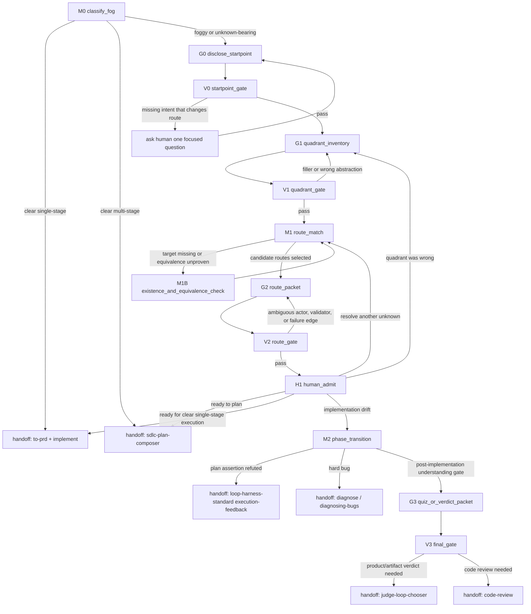

# unknown-discovery-composer

## Role
Run unknown discovery as a **stateful workflow**, not as a single prompt and not as a giant routing table.

This skill is the entry point when the task is not yet plan-ready. Its job is to make the fog inspectable:
- capture the human starting point before the model fills gaps with generic assumptions;
- classify unknowns into KK, KU, UK, and UU;
- choose the next skill or inline discipline for each unknown;
- emit a route packet that a fresh LLM can understand without the original conversation;
- stop at a human admit point before any downstream skill is executed.

The output is a **route packet in the chat**, not a file by default. The route packet must carry enough context for another agent to know what is being investigated, why that route was chosen, what evidence grounds it, who should act, who should validate, what the human must decide, and where to go if the route fails. If a packet depends on local terms such as `Blindspot Pass`, `保真語料 intake`, `顯式棄跑`, or `人理解閘`, read [modules/domain-lexicon.md](modules/domain-lexicon.md) and preserve the term meaning instead of paraphrasing it away.

## Not For
- Do not use this skill when the task is already clear and single-stage. Route to `to-prd + implement`.
- Do not use this skill when the task is clear but needs multi-stage SDLC planning. Route to `sdlc-plan-composer`.
- Do not use this skill to implement code. Execution belongs to `implement`, `tdd`, `diagnose`, Codex, or a concrete downstream workflow.
- Do not use this skill to judge a deliverable directly. Product or artifact judging goes to `judge-loop-chooser`; code review goes to `code-review`.
- Do not use this skill as a general skill catalog. If the user only asks which Matt Pocock skill fits, use `ask-matt`.
- Do not auto-chain from unknown discovery into planning, implementation, review, or merge. Every phase transition requires human admit.

## Invariants
1. **Stateful, not one-shot**: Always move through Match, Generate, and Validate nodes. A response that jumps from a vague request to a final recommendation is incomplete.
2. **Recipe-not-engine**: This skill only inventories, routes, and surfaces. It never executes the routed skill and never accepts a model verdict as completion.
3. **Semantic truth survives the output**: The skill text and every route packet must be understandable by a fresh LLM without hidden conversation context. Expand compressed labels into goal, evidence, grounding, actor reason, validator, human admit, and failure edge.
4. **No unresolved actor soup**: Never write `Opus or Codex or agy`, `as needed`, `適當驗證`, or `處理相關問題`. Choose the actor by semantic role or mark `human_required`.
5. **No name-based equivalence**: A downstream skill is `technical_equivalent` only after its real contract was read and, where relevant, run or compared. Name similarity is at most `candidate` or `[推論]`.
6. **Every quadrant is explicit**: KK, KU, UK, and UU each need at least one real item or explicit `N/A + why`. Filling a quadrant with generic filler is a failure.
7. **LAND-DECISION is human**: The human decides which unknown is worth resolving, whether residual uncertainty is acceptable, and whether to move to planning, implementation, review, or merge.
8. **Pivot is legal**: If later evidence shows a quadrant or route was wrong, return to the matching node and reclassify. Treat this as the designed correction path, not as failure.
9. **Compression has a ledger**: If simplifying text would move or compress a domain term or route idiom, preserve it in `modules/domain-lexicon.md` with meaning, route effect, and failure edge. Do not leave future agents to infer domain vocabulary from memory.

## Grounding Labels
Use these labels in every route packet.

| Label | Meaning | Allowed use |
|---|---|---|
| `technical_equivalent` | The target skill or mechanism was read and actually covers the needed behavior. If the choice is load-bearing and uncertain, it was also run or compared. | Can be used as a route target. |
| `candidate` | A real target exists, but coverage or equivalence has not been proven. | Can justify an investigation route, not a final premise. |
| `[推論]` | The route is inferred from names, summaries, memory, or model judgment without a direct contract proving coverage. | Must be surfaced as risk or converted into a validation task. |
| `human_required` | The choice changes scope, architecture, product intent, admit, or acceptable residual uncertainty. | Must be asked or listed as an explicit human admit point. |

## Actor Roles
Choose one actor per route. Do not list actors as interchangeable options.

| Actor | Use For | Not For |
|---|---|---|
| `main-session` | Unknown inventory, route packet writing, lightweight source inspection, and human-facing synthesis. | Final admit or independent verdict. |
| `leaf-skill:<name>` | A specific existing skill that owns the next workflow. | Work outside that skill contract. |
| `codex` | Code implementation, repair, reproduction, TDD driving, repo inspection with commands, and executable engineering work. | Semantic verdicts about whether the work should be accepted. |
| `opus-fresh-judge` | Zero-context semantic verdicts, intent drift review, and independent critique. | Implementation or automatic merge admit. |
| `agy-findings` | External research, cross-family fact findings, and post-cutoff or broad web truth checks. | Verdicts. agy produces findings, not LAND-DECISION. |
| `mechanical-script` | Deterministic checks such as tests, build commands, conformance scripts, and fixture-backed validators. | Taste, intent, or negative-space judgments. |
| `human` | LAND-DECISION, taste selection, acceptable residual uncertainty, merge admit, and scope tradeoffs. | Mechanical facts that the repo can prove. |

## State Graph



## Behavior Evals
Run `python3 scripts/check_unknown_discovery_routes.py` after changing this skill. This is the physical route-packet gate for unknown-discovery-composer. Its skill-asset test payload lives as a self-contained `cases.json` next to `SKILL.md`. The gate enforces 10-20 cases, `should_trigger` true/false each >=5, positive/negative each >=5, stateful packet sections, KK/KU/UK/UU rows, target evidence, grounding, actor, validator, human admit, and failure edge.

It is intentionally separate from `scripts/check_case_baseline.py`, which guards family eval skills under `families/*/evals/cases/`. This skill is an orchestration skill, so its hard gate checks whether route packets preserve semantic truth and stop at human admit instead of executing downstream work.

## Route Packet Contract
Every route packet must use this shape. Keep it in chat unless the user asks for a file.

```md
## Unknown Discovery Route Packet

### Starting Point
- Human goal:
- Current understanding:
- Familiarity with this repo or domain:
- Collaboration expectation:
- Decisions the model must not make:

### Quadrant Inventory
| quadrant | unknown | why this quadrant | consequence if unresolved |
|---|---|---|---|
| KK |  | Known fact the user or repo already provides. |  |
| KU |  | Known question that can be answered by interview, source reading, or research. |  |
| UK |  | The human can recognize good or bad when shown examples, but cannot state the standard upfront. |  |
| UU |  | A blind spot the user probably has not considered. |  |

### Routes
| id | unknown | phase | target | target evidence | grounding | actor | validator | human admit | failure edge |
|---|---|---|---|---|---|---|---|---|---|
| R1 | Full sentence. | pre / during / post | `leaf-skill:name` or inline discipline | path or source checked | candidate | actor with reason | what is checked by whom | exact human decision | node or route to return to |

### Recommendation
- Resolve first:
- Why this first:
- What remains accepted for now:
- Stop condition:
```

Rules:
- `target evidence` must cite a real path, command output, or a clear reason why the target is missing.
- `actor` must name the semantic role, not just a model brand.
- `validator` must say what is validated and how. A validator is not the same as the actor unless the reason is stated.
- `human admit` must be phrased as a concrete decision question.
- `failure edge` must point to a node or named downstream skill. Do not write `retry` without saying what changes.

## Node Contracts

### M0 classify_fog
Purpose: Prevent foggy work from becoming a fake plan and prevent simple work from being taxed by unknown discovery.

Inputs:
- User request.
- Mentioned paths, systems, families, artifacts, or deliverables.
- Any explicit user statement that they do not know what to ask, cannot express taste, or want a blindspot pass.

Decision rule:
- If success criteria, scope, target, and constraints are clear enough for a single action, exit to `to-prd + implement`.
- If the task is clear but multi-stage, high-risk, brownfield, or plan-first, exit to `sdlc-plan-composer`.
- If any load-bearing part is foggy, continue to G0.

Output:
- One sentence classifying the request and naming the chosen edge.

Validation gate:
- The classification must explain why the other two exits were not chosen.

Failure edge:
- If one missing answer would change architecture, ask the human one focused question before continuing.

### G0 disclose_startpoint
Purpose: Surface the human starting point before the model substitutes generic domain assumptions.

Generate:
- What the human appears to want.
- What the human already seems to know.
- What the human may be assuming.
- What the model does not know about human taste, risk tolerance, or acceptable residual uncertainty.
- Which decisions must remain human.

Output:
- `Starting Point` section of the route packet.

Validation gate:
- The section must not overfit to one implementation path.
- The section must not be so vague that a fresh LLM would fall back to generic defaults unrelated to this repo.

Failure edge:
- Ask one human question only if the missing answer changes route selection.

### G1 quadrant_inventory
Purpose: Convert fog into four inspectable kinds of unknown.

Classify:
- **KK known knowns**: Facts that can already be written into a prompt or plan.
- **KU known unknowns**: Questions the human knows they need answered.
- **UK unknown knowns**: Taste, judgment, or tacit standards the human can recognize only after seeing examples.
- **UU unknown unknowns**: Blind spots outside the current user framing.

Output:
- `Quadrant Inventory` table.

Validation gate:
- Each quadrant has at least one concrete item or `N/A + why`.
- Each item names the consequence if unresolved.
- No item is merely a restatement of the quadrant name.

Failure edge:
- If several items are abstract nouns with no consequence, rewrite them as decisions or risks.
- If UK is empty for a taste-heavy request, create a route to prototype or design alternatives.
- If UU is empty for an unfamiliar domain or code area, create a blindspot route.

### M1 route_match
Purpose: Choose a route for each useful unknown without pretending unavailable machinery exists.

Decision rule:
- Route KU that can be answered by interview to `grilling`, `grill-me`, `grill-with-docs`, or `loop-me`.
- Route KU that depends on repo truth to `repo-agent-native` or direct source inspection.
- Route KU or UU that depends on external primary facts to `external-verify` or `research`.
- Route a new domain the human wants to learn to `teach`.
- Route external faithful transcripts plus extracted knowledge toward `dr-to-mvp` Phase R intake when the goal is research-to-asset cold start; route entity truth checks inside that packet to `external-verify`.
- Route claim sets that need measurable multi-tier verification to `truth-verify-loop`, but mark the local engine as not yet instantiated unless its setup contract has been run.
- Route unfamiliar code maps to `zoom-out` or `repo-agent-native`.
- Route broad work that exceeds one session to `wayfinder`.
- Route UK taste or interface uncertainty to `prototype` or `design-an-interface`.
- Route architecture opportunity scanning to `improve-codebase-architecture`.
- Route implementation drift caused by refuted plan assertions to `loop-harness-standard/modules/execution-feedback.md`.
- Route hard bugs to `diagnose` or `diagnosing-bugs`.
- Route context handoff to `handoff` or `claude-handoff`.
- Route post-implementation human understanding to inline quiz or `teach`.
- Route artifact verdicts to `judge-loop-chooser`; route code changes to `code-review`.

Output:
- Candidate route rows with target, actor, validator, and grounding.

Validation gate:
- Every target skill exists at `.claude/skills/<name>/SKILL.md` or `~/.claude/skills/<name>/SKILL.md`, or the row explicitly says the target is missing.
- No target is selected from name similarity alone.
- A missing antigravity-only mechanism must be reported as a gap, not silently replaced.

Failure edge:
- If target existence or equivalence is uncertain, go to M1B.

### M1B existence_and_equivalence_check
Purpose: Prevent false routing and name-based equivalence.

Check:
- Read the target skill contract when the target is load-bearing.
- If the target only partially covers the unknown, mark `candidate`.
- If the route is inferred but unproven, mark `[推論]`.
- If the missing capability changes the plan, mark `human_required`.

Output:
- Updated route row with evidence path and grounding label.

Validation gate:
- `technical_equivalent` requires a source path and explanation of the covered behavior.
- If wrong routing would be expensive or corrupt later work, require a compare or explicit human decision.

Failure edge:
- Return to M1 with downgraded grounding, or surface the gap to the human.

### G2 route_packet
Purpose: Produce the handoff object. The packet is the main artifact of this skill.

Generate:
- Starting point.
- Quadrant inventory.
- Route rows.
- Recommendation for which unknown to resolve first.
- Residual uncertainty that can be accepted temporarily.
- Stop condition.

Output:
- Complete route packet in chat.

Validation gate:
- A fresh LLM can answer these questions from the packet alone:
  - What is the unknown?
  - Why is it in this quadrant?
  - Which route was chosen?
  - What evidence grounds that route?
  - Who acts?
  - Who validates?
  - What must the human decide?
  - What happens if the route fails?

Failure edge:
- If any answer depends on hidden conversation context, rewrite the packet before showing it.

### V2 route_gate
Purpose: Block premature routing.

Reject if:
- Any route says `as needed`, `適當`, `Opus or Codex or agy`, or equivalent undecided wording.
- A route executes the downstream skill instead of surfacing it.
- A route hides a missing skill or unavailable mechanism.
- A route claims `technical_equivalent` without reading the real contract.
- The recommendation chooses for the human instead of presenting an admit point.

Pass condition:
- Route packet is decision-complete for the next admit, but does not perform the downstream work.

Failure edge:
- Return to G2.

### H1 human_admit
Purpose: Preserve human LAND-DECISION.

Ask the human to decide:
- Which unknown to resolve first.
- Whether to accept any residual uncertainty.
- Whether the task is now ready for `sdlc-plan-composer`, `to-prd + implement`, implementation drift handling, or post-implementation review.

Output:
- A single next route, or a clear statement that the workflow stops here.

Failure edge:
- If the human rejects the route because the framing is wrong, return to G1.

### M2 phase_transition
Purpose: Handle unknowns discovered during or after implementation.

Decision rule:
- Minor non-assertion drift: keep implementation notes with deviations, conservative choice, and reason.
- Plan assertion refuted: route to `loop-harness-standard/modules/execution-feedback.md` for assertion-level comparison and plan-delta human gate.
- Hard bug or reproduction failure: route to `diagnose` or `diagnosing-bugs`.
- Context handoff: route to `handoff` or `claude-handoff`.
- Post-implementation human understanding: produce an inline quiz packet or route to `teach`.
- Product or artifact verdict: route to `judge-loop-chooser`.
- Code change review: route to `code-review`.

Validation gate:
- The transition says what changed since the previous route and whether this is pivot, drift, bug, or final review.

Failure edge:
- If the new situation changes the unknown type, return to G1.

## Compact Route Catalog
Use this catalog as candidate routing language. It is not proof of equivalence.

| Situation | Default route | Grounding default |
|---|---|---|
| Unknown code area and likely blind spots | `zoom-out` plus route packet context | `candidate` until target contract or source is checked |
| Repo invariants or hidden contracts | `repo-agent-native` | `candidate` until contract read |
| External primary-source truth | `external-verify` | `candidate`; facts remain findings until consumed by validator |
| General external background research | `research` | `candidate` |
| New domain the human wants to learn | `teach` | `candidate`; learning record or quiz validates human understanding |
| Research topic or DR corpus should become a new family asset | `dr-to-mvp` Phase R | `candidate`; phase gates and D3 adopt stay human-admitted |
| Faithful transcript plus extracted knowledge needs intake | `dr-to-mvp` Phase R plus `external-verify` for entities | `candidate`; transcript is intent evidence, extraction facts need truth coverage |
| Article, concept, or proposal claim set needs measurable multi-tier verification | `truth-verify-loop` | `candidate`; local engine must be instantiated before real run |
| Huge fog spanning more than one session | `wayfinder` | `candidate` |
| Scope unclear or decision would change architecture | `grilling` / `grill-me` / `grill-with-docs` | `candidate` |
| Workflow-specific interview | `loop-me` | `candidate` |
| Taste cannot be verbalized | `prototype` / `design-an-interface` | `candidate`; human validates taste |
| Architecture opportunity scan | `improve-codebase-architecture` | `candidate` |
| Clear single-stage execution | `to-prd + implement` | `candidate` unless contracts are read |
| Clear multi-stage SDLC planning | `sdlc-plan-composer` | `candidate` unless contract is read |
| Assertion-level implementation drift | `loop-harness-standard/modules/execution-feedback.md` | `candidate` |
| Hard bug | `diagnose` / `diagnosing-bugs` | `candidate` |
| Context handoff | `handoff` / `claude-handoff` | `candidate` |
| Human understanding before merge | inline quiz / `teach` | `candidate`; human validates |
| Non-code artifact verdict | `judge-loop-chooser` | `candidate` |
| Code review | `code-review` | `candidate` |

## Gotchas
- **Modules are not the problem by themselves**: `modules/retarget-map.md` is the right place for lineage, missing antigravity mechanisms, and retarget history. The bug is when that history becomes the main workflow.
- **Slim does not mean compressed beyond meaning**: Keep history out of the main path, but keep load-bearing node purpose, input, decision rule, output, gate, actor, validator, and failure edge in `SKILL.md`.
- **Do not route to unavailable antigravity machinery**: `gemini-conversation-research`, `repo-wiki-converge`, and the old antigravity-only assumptions are not valid local routes unless a real skill exists here and its contract is read.
- **A quiz is not decoration**: Post-implementation quiz tests whether the human understands the change enough to merge. If you cannot write meaningful questions, you probably do not understand the change.
- **Route packets are products**: A vague packet is a failed run even if the skill text is clear.

## Modules
- [modules/domain-lexicon.md](modules/domain-lexicon.md) — local domain terms, route idioms, and information-preservation rules. Read when old notes or route packets use terms that are not self-explanatory in the main state graph.
- [modules/semantic-loss-ledger.md](modules/semantic-loss-ledger.md) — verification ledger for the 2026-07-22 rewrite. Read when auditing where every old U0-U3 semantic unit is preserved.
- [modules/legacy-skill-2026-07-22.md](modules/legacy-skill-2026-07-22.md) — verbatim pre-rewrite `SKILL.md` preservation artifact. Read only for audit or recovery; current execution uses this `SKILL.md`.
- [modules/retarget-map.md](modules/retarget-map.md) — antigravity to skill-bettor retarget ledger, missing local mechanisms, and historical mapping. Read only when route target truth or lineage affects the current decision.
