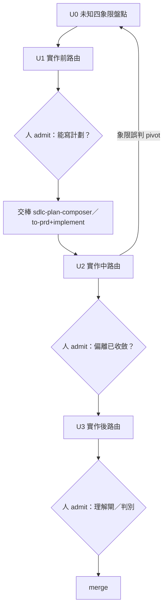

# Module: legacy unknown-discovery-composer SKILL.md before state graph rewrite

This module is a preservation artifact. It keeps the pre-rewrite `SKILL.md` text so domain knowledge, route idioms, warnings, and retarget wording are not lost when the active `SKILL.md` is slimmed into a state graph.

Use this file for audit and recovery only. The active execution contract is the current `../SKILL.md`; if a legacy sentence conflicts with the state graph, preserve the legacy meaning by moving it into `domain-lexicon.md`, `semantic-loss-ledger.md`, or `retarget-map.md` instead of executing this file as live instructions.

## Verbatim Legacy Content

````md
---
name: unknown-discovery-composer
description: |
  未知發掘編排器 —— 把「地圖 ≠ 真實疆域」的落差（unknowns）按四象限（KK/KU/UK/UU）×三時段
  （實作前/中/後）路由到既有 skill（mattpocock 全局 skills + skill-bettor 本地同批移植 sibling）。
  recipe-not-engine：只盤點未知 + 路由 + SURFACE，不執行被路由的 skill、不 auto-chain，
  每段路由結果由人 admit。實作前收斂到「能寫計劃」→ 交棒 sdlc-plan-composer（本地同批移植 sibling）；
  單階段/需求已清楚走 to-prd+implement（mattpocock 全局 skill 輕量出口）；
  實作後人理解閘（quiz 全對才 merge）；產物判準 → judge-loop-chooser（同批移植 sibling），代碼類
  直接 code-review。skill-bettor 是 Claude-Code-only 單 host，無 antigravity 的雙 host 矩陣；
  gemini-conversation-research／truth-verify-loop／repo-wiki-converge 無本地基座（已誠實降級）；
  repo-agent-native（source-anchored 不變量抽取）2026-07-11 已補上本地移植版，見 retarget-map。
  何時用：任務起點在霧裡——不知道該問什麼、品味類需求說不出標準、需求太模糊還不能寫計劃、
  或實作後 merge 前要出小測驗確認真懂了這次變更。
  （2026-07-17 更新：單階段出口不再指理論性 `superpowers:writing-plans`／範疇腦暴不再指
  `superpowers:brainstorming`——2026-07-11 已查證 superpowers 在 skill-bettor 同樣未啟用，今日比照
  antigravity 同日 retarget 結論，改指 mattpocock 真實技術等價物 `to-prd`+`implement`／`grilling`；
  見 modules/retarget-map.md。）
---

# Skill: unknown-discovery-composer — 未知發掘編排（地圖≠疆域 → 四象限×三時段路由）

> **Role**：任務起點在霧裡時，
> 先把「我不知道什麼」盤點成四象限（KK/KU/UK/UU），
> 按時段（實作前/中/後）路由到對應的既有 skill。
> 只**盤點 + 路由 + SURFACE**，
> 不執行被路由的 skill、不 auto-chain 整條鏈、
> 不替人決定「哪個未知值得解」——
> 每段路由結果人 admit 後才進下一段（recipe-not-engine）。
> **結構**：本檔 = U0-U3 路由決策表 + 不變量 + Gotchas；
> 逐機制 retarget 帳本（antigravity 有什麼被拿掉/換掉/誠實留白）
> → [modules/retarget-map.md](modules/retarget-map.md)。
> **SSOT**：路由目標的真實性以 `~/.claude/skills/`
> （mattpocock 全局符號連結）與本 repo `.claude/skills/`
> （Claude Code 原生 skill 目錄——**不是** antigravity 的 `.agents/skills/`
> Google Antigravity CLI 規範，
> 兩者封裝/frontmatter 不同，路由目標一律指本地 `.claude/skills/`）
> 現存目錄為準——路由前先確認目標真在 disk，
> 缺席就誠實標「不在」給替代，禁偽路由。
> **Lineage**：port 自 antigravity
> `.agents/skills/unknown-discovery-composer/`
> （該版 v0.1.1 系出 northstar，
> 那一環的帳本記在 antigravity 版自己的 `modules/retarget-map.md`，
> 本檔不重抄）。
> `sdlc-plan-composer`／`judge-loop-chooser`／
> `external-verify`／`repo-agent-native` 四個下游交棒點
> 在本 repo **同批移植**為本地 sibling（`.claude/skills/{sdlc-plan-composer,judge-loop-chooser,
> external-verify,repo-agent-native}/`）；`gemini-conversation-research`／`repo-wiki-converge`／
> `truth-verify-loop` 三個 antigravity 下游在 skill-bettor
> **無本地基座**，已誠實降級（見下方路由表與 modules/retarget-map.md）。
> 非原樣搬；逐機制映射 → modules/retarget-map.md。

## 🚩 STOP — 你在合理化（違反即停）
| 念頭 | 現實 |
|---|---|
| 「U0→U3 一路做完再跟人講」 | ❌ 每段出口都要人 admit；auto-chain 整條 = 違 recipe-not-engine |
| 「這個未知隨便挑一格湊數」 | ❌ 四象限每格要嘛 ≥1 條真實條目、要嘛顯式 N/A；湊數 = 盤點品質造假 |
| 「單階段小需求也丟給 sdlc-plan-composer 走六階段」 | ❌ 本 skill 只路由不造 skill；`sdlc-plan-composer` 是多階段 SDLC 協議，單階段/需求已清楚仍走輕量 `to-prd`+`implement`——別用重協議處理輕需求 |
| 「這是代碼產物，也丟 judge-loop-chooser 判」 | ❌ antigravity 源版 judge-loop-chooser 明言無 code/sandbox 判決表基座（skill-bettor 同批移植 sibling 承此現況）；代碼產物直接 `code-review` |
| 「quiz 隨便出幾題應付」 | ❌ quiz 測人真懂與否，不是形式；出不出得了好題本身就是「你懂了沒」的訊號 |

## When to Use
任務起點在霧裡，你要先搞清楚「我不知道什麼」再動手：
- 陌生 codebase 區塊 / 全新領域，**不知道該問什麼**（unknown-unknowns）。
- 「我一看到就知道要不要，但寫不出標準」的品味類需求（unknown-knowns）。
- 需求太模糊，**還不能寫計劃**。
- 實作完成後，要確認**人**真的理解了這次變更（quiz/pitch 的人理解半）。

## Not For
- ❌ **需求已成形、可直接寫計劃**：
  多階段任務且要 SDLC 級紀律 → `sdlc-plan-composer`
  （skill-bettor 本地同批移植 sibling，
  S-1..S5 序列委派，
  內容以其自己落地後的 SKILL.md/retarget-map 為準，本檔不預判）；
  單階段/需求已很清楚 → `to-prd`+`implement`。
- ❌ **產物驗證標準/tier 選擇** → `judge-loop-chooser`
  （同批移植 sibling；DR/Path-B/覆蓋矩陣類是
  antigravity 自己的產物範例，
  skill-bettor 對應哪些本地產物待其自己落地釐清）
  或 `code-review`（代碼類）。
- ❌ **執行本體** → 直接 `implement` / `tdd`
  （skill-bettor 無 skill-cycle 這類編排層，同 antigravity 現況）。
- ❌ **純 mattpocock skill 導航（不帶未知象限視角）**
  → `ask-matt`（mattpocock repo 自帶的 router）。
- ❌ **auto-chain**：
  把 U0→U3 硬串成一條無人閘的管線 = 違 recipe-not-engine；
  每段出口人 admit。
- ❌ **重複委派**：
  同一意圖的 grill 不重複問（防雙稅精神，簡化版——
  `sdlc-plan-composer` sibling 尚待落地，
  S1 可比對細節見其自己 SKILL.md）。

## 不變量（違反即停）
1. **recipe-not-engine**：只盤點 + 路由 + SURFACE，不執行被路由的 skill。
2. **四象限非二元**：每格獨立判準，不可用「反正都要做」跳過分類。
3. **LAND-DECISION 永遠人**：哪個未知值得解、何時進下一段，人 admit。
4. **pivot 迴路合法**：U2 發現象限誤判可回 U0 重分類，這是紀律內建的修正，不是失敗。
5. **目標存在性**：
   路由前確認目標 skill 真在 disk
   （`~/.claude/skills/` 符號連結或本 repo `.claude/skills/`），
   缺席就誠實標「不在」給替代。

## Instructions（單一線性協議：U0 盤點 → 按時段路由 → 出口交棒）



### U0 — 未知四象限盤點（動手前 5 分鐘，寫進對話不寫檔）

**第 0 步——起跑點披露**：盤點任務的未知**之前**，
先披露**人**的起跑點——
目前思考進度、對問題與 codebase 的熟悉程度、
期望引擎作為 thought-partner 的協作方式。
並持具體度平衡：
說得太具體 → 引擎盲從、該轉向時不轉；
太模糊 → 引擎套行業 best-practice 假設、未必合身。
未知盤點的品質上限由起跑點披露決定。

對當前任務問四格，每格 ≥1 條或顯式 N/A：

| 象限 | 判別問句 | 收斂手段（原則） |
|---|---|---|
| **KK** known knowns | 我能直接寫進 prompt 的 | 直接寫，不路由 |
| **KU** known unknowns | 我知道我還沒想透的 | 訪談/研究（問對問題就收斂） |
| **UK** unknown knowns | 我一看就認得、但寫不出來的（品味） | 原型/多方案（做出來給我看） |
| **UU** unknown unknowns | 我完全沒考慮過的 | 盲點審查（讓引擎替我掃疆域） |

### U1 — 實作前路由表（收斂到「能寫計劃」為止）

| 未知情境 | 路由 skill | 象限 |
|---|---|---|
| 陌生 code 區塊，要上一層抽象的地圖 | `zoom-out`（模組+callers 地圖）；起手可先用 **盲點通行證（Blindspot Pass，源：loop-harness-panorama 06 C06）** inline 提示語逼出坑點：`I'm working on adding a new [Target/e.g., auth provider] but I know nothing about the [Target modules/e.g., auth modules] in this codebase. Can you do a blindspot pass to help me figure out my relevant unknown unknowns and help me prompt you better?` | UU |
| 全新領域要**學** | `teach`（stateful 教學工作區：MISSION/lessons/learning-records） | UU |
| 需要外部一手資料背景研究 | `research`（一般背景研究，mattpocock 全局，disk 已驗證存在）；claim 涉及 post-cutoff 框架/版本/能力斷言需要官方 primary source 查證 → `external-verify`（**skill-bettor 本地同批移植 sibling**，`.claude/skills/external-verify/`）；~~研究一個 Gemini 對話~~ → **不可用**：antigravity `gemini-conversation-research` 綁死 `automate.js` DR 引擎與 AI Studio 對話管線，skill-bettor 無此基座——本 repo 的 DR 研究批次改走 `agy` 直發（`ARCHITECTURE.md` §9「06:30 research」步驟），不透過 composer skill 路由，這是真實能力差距非簡化 | UU/KU |
| 外部**保真語料**（逐字對話稿＋萃取稿）含 post-cutoff 具名實體/數字，真偽未明（2026-07-20 接線） | intake 紀律交棒 [dr-to-mvp](../dr-to-mvp/SKILL.md) Phase R「保真語料 intake 兩層分工」（逐字＝意圖考古層不入前提；萃取＝知識層須真值覆蓋）；實體真偽逐條 → `external-verify`。**雙向警戒**：「訓練記憶想不起來≠假」——疑假（把真的 post-cutoff 實體判 confabulation）與疑真同為漂移，判假前必查 primary source（翻案先例 2026-07-17） | KU/UK |
| 想法太大、路線不明（一個 session 裝不下的霧） | `wayfinder`（investigation-ticket 共享地圖，逐票收斂到路線清晰） | UU 規模化 |
| 範疇還沒界定（怕定太窄/太寬）、要腦暴介入點 | `grilling`（mattpocock 全局 skill，逼問腦暴範疇，2026-07-17 retarget 取代原 `superpowers:brainstorming`，見 modules/retarget-map.md） | UU→KU |
| 意圖模糊要逼問清楚 | `grilling` / `grill-me`（一次一問+推薦答案）；要沉澱決策記錄/glossary → `grill-with-docs`（skill-bettor 同 antigravity 現況：無編號 ADR/DDR 系統，產出為散文決策記錄；本地對應落點是 `families/<family>/changelog/` 或散文筆記，非編號系統）；workflow spec 專用 → `loop-me`；輕量單問單答可先用 **主動審查訪談（Interview Exploit，源：loop-harness-panorama 06 C06）** inline 提示語把決策權收回人類：`Interview me one question at a time about anything ambiguous — prioritize questions where my answer would change the architecture.` | KU |
| 無法言語化但有現成範例可指（缺術語/太複雜） | **inline 紀律（無對應 skill，本 skill 補位）**：指認**參考源碼**——資料夾 / vendor 模組 / 喜歡的網站底層模組，告知「注意什麼」，跨語言亦可 | KU |
| 品味類：一看才知道好不好 | `prototype`（throwaway 原型答一個設計問題）；介面形狀 → `design-an-interface`（並行子代理產 ≥2 截然不同方案）；快速逼出品味可先用 **設計對比器（Design Reactor，源：loop-harness-panorama 06 C06）** inline 提示語：`I want a [Target/e.g., dashboard] for this data but I have no visual taste and don't know what's possible. Make me an HTML page with 4 wildly different design directions so I can react to them.` | UK |
| 架構深化機會掃描 | `improve-codebase-architecture`（掃描 → HTML 報告 → 逐項 grill） | UU |
| 既有 repo 的真相（合約/隱含依賴） | **（2026-07-11 已補上）** 本地 `repo-agent-native`（source-anchored 不變量抽取：9 階段+Evidence Level+source_ref，輸出落 `docs/plans/<date>-<topic>/invariants/`，無 KG 入庫，見其 retarget-map）；正交項 `repo-wiki-converge`（Opus 級散文理解）在 skill-bettor **仍無本地基座**——真實能力差距，該半仍誠實降級為人工讀源碼/grep | KU |
| 要對文章/概念做**真相驗證**，或對某 config/引擎做 **token-efficiency 量測** | claim 級真相驗證可交棒本地 `external-verify`（見上，同一 sibling，KK：引擎已存在）；但 antigravity `truth-verify-loop`（t0 工具鏈+合約+播錯集方法、token-efficiency 量測迴圈本體）在 skill-bettor **無本地基座**——這條量測迴圈工程本身是真實能力差距，不是「重新發明」問題，暫無替代，SURFACE 給人（若真需要，得先走 `loop-harness-standard` 的 skill→小迴圈 recipe 建一條新迴圈，不假裝有現成量測引擎） | 前半 KK／後半缺口 |

**出口 gate**：四象限各格「已收斂或顯式接受殘留」→ 人 admit → 分流交棒：
**多階段任務、需要 SDLC 級紀律**
（意圖對齊/垂直切片/介面深模組/TDD/交接皆要編進計劃）
→ `sdlc-plan-composer`
（**skill-bettor 本地同批移植 sibling**，
`.claude/skills/sdlc-plan-composer/`，
S-1..S5 序列委派——內容以其自己落地後的
SKILL.md/retarget-map 為準，本檔不預判）；
**單階段/需求已很清楚** → 直接走 `to-prd`
（mattpocock，無需訪談、直接把對話 synthesis 成 PRD）+
`implement`
（消化 PRD/issue 直接執行，內建 tdd/code-review），
不需六階段協議（2026-07-17 retarget，見 modules/retarget-map.md）。
交棒時對計劃形狀帶兩條要求：
① **前置最易變決策**——資料模型/型別介面/UX flows 放計劃開頭供人微調，機械式重構沉底；② 計劃含
**遇未知可靈活應變**條款（引擎遇邊緣狀況的處置規則 = U2 迴路的鉤子），不是鎖死的步驟表。

### U2 — 實作中路由表（計劃趕不上疆域時）

| 情境 | 路由 |
|---|---|
| 邊緣狀況迫使偏離計劃 | **inline 紀律（無對應 skill，本 skill 補位）**：維護 `implementation-notes.md`，偏離記「Deviations」段（保守選項 + 記錄 + 繼續），收尾時回流 U3——**留給非斷言級的小偏離**；斷言級證偽見下一列 |
| 執行揭露計劃斷言不成立（斷言級證偽，非邊緣小偏離；2026-07-19 composer-integration 接線） | [loop-harness-standard execution-feedback 模組](../loop-harness-standard/modules/execution-feedback.md)（N-diverse-variant → 判官逐斷言比對軌跡）：走該迴圈勾稽表確認是飄移還是誤讀，飄移 → plan-delta 人閘 |
| 發現「不知道好的標準」/ 未知指向換方法 | **回 U0 重分類（pivot 迴路）**——象限誤判的中途修正：以為 UK（做幾版來選）實為 UU（不知道「好」長什麼樣）→ prototype 轉 teach |
| 預註冊步驟的**資訊價值歸零**（前置量測已定方向，端點/加碼步只會更貴不會改結論） | **顯式棄跑（人核）**：判定落帳標 PARTIAL/SKIPPED＋棄跑理由，**不改判定式遷就**——這條紀律 skill-bettor 已有本地基座，即 [loop-harness-standard](../loop-harness-standard/SKILL.md) 八基座卡 #7「判定式先於 run 落檔，不事後改」；antigravity `path-b-reduction`/`truth-verify-loop` 兩個 skill 本身在 skill-bettor **無本地 fork**，不引用它們的具體案例（BS1/3-majority/H4 是 antigravity 自己的軌跡），只承接同一條紀律的精神 |
| 偏離變成硬 bug | `diagnose` / `diagnosing-bugs`（reproduce→minimise→instrument） |
| context 滿了要跨 session 交棒 | `handoff` / `claude-handoff`（skill-bettor 同 antigravity 現況：**無** northstar `fidelity-handoff` 的形態決策 + fidelity-lint 覆蓋閘——此為 antigravity 早已做過的降級，本次移植原樣承接、非新降級；交棒前自行檢查有無漏 load-bearing negative） |

### U3 — 實作後路由表（合併前的人理解閘）

| 情境 | 路由 | 半邊歸屬 |
|---|---|---|
| 提案/解說（爭取 buy-in） | `to-prd`（對話→綜述發佈）；散文成型 → `writing-shape` / `edit-article` | 人理解半 |
| 小測驗（我真懂這次變更嗎） | inline quiz 紀律：要求引擎產含背景+直覺+變更說明的報告 + 底部 quiz，**全對才 merge**；`teach` 的 learning-record 形態可承接 | 人理解半 |
| 斷言級勾稽（哪些計劃斷言被執行推翻；2026-07-19 composer-integration 接線） | [loop-harness-standard execution-feedback 模組](../loop-harness-standard/modules/execution-feedback.md)的 judge-verdict 勾稽表——比 quiz 更硬，人 review「HELD/REFUTED/UNOBSERVED」逐條 | 人理解半 |
| 對話式回報遺留問題 | `qa`（輕澄清 → 背景 Explore → 檔 domain-language issue） | 人理解半 |
| 產物本身的判準/驗證 tier（DR 報告 / Path-B 精煉 / COMPLETENESS 覆蓋矩陣——這三類是 antigravity 自己的產物範例，skill-bettor 未必有對應） | **交棒 `judge-loop-chooser`**（**skill-bettor 本地同批移植 sibling**，`.claude/skills/judge-loop-chooser/`；它自己落地後對應哪些 skill-bettor 產物——如 family eval 報告/holdout 畢業判/`llm_judge` checks——以其自己的 SKILL.md/retarget-map 為準，本檔不重複預判） | 產物判別半 |
| 產物本身的判準/驗證 tier（**代碼**） | **直接 `code-review`**（judge-loop-chooser antigravity 源版明言「無 code-branch」，skill-bettor 同批移植 sibling 承此現況） | 產物判別半 |

> quiz 測「人」的理解就緒度，
> judge-loop-chooser/code-review 測「產物」的判別力——
> 同一個「別憑感覺 merge」閘的兩半，缺一都不完整。

## 與下游交棒點的邊界

- **`sdlc-plan-composer`**：
  U1 出口只做「未知是否收斂完了」的判斷；
  計劃怎麼寫、S-1..S5 怎麼切是它的事，
  本 skill 不重跑其否證素材/防雙稅/design-an-interface+決策記錄稀疏 gate 特化
  （這些細節屬其自己落地後的 SKILL.md，本檔不預判內容）。
  多階段任務才交棒；
  單階段仍走 `to-prd`+`implement`
  （本 skill 判斷交棒哪一個，不判斷計劃內容本身）。
- **`to-prd`+`implement`**：
  單階段/需求已清楚時的輕量出口，不需六階段協議，mattpocock 全局 skill
  不依賴任何 plugin（2026-07-17 retarget，
  取代原「`superpowers:writing-plans` 確認未啟用」的持有狀態，
  見 modules/retarget-map.md）。
- **`judge-loop-chooser` / `code-review`**：
  U3 只判「該用哪個」，不做判決本身。
- 完整逐機制映射
  （含哪些下游從 antigravity 本地 fork 換成 skill-bettor 同批移植 sibling、
  哪些真無基座誠實拿掉）
  → [modules/retarget-map.md](modules/retarget-map.md)。

---

*port 自 antigravity `.agents/skills/unknown-discovery-composer/`
（該版 v0.1.1 系出 northstar
`unknown-discovery-composer`，2026-07-04；
northstar→antigravity 那一環的帳本記在 antigravity 版自己的
`modules/retarget-map.md`，本檔不重抄）。
skill-bettor 版同樣無 skill-conformance-hub liveness/grounding
治理系統，故不帶那套 YAML 治理欄位——
本檔以 `~/.claude/skills/` 現存符號連結 + skill-bettor
`.claude/skills/` 現存/同批移植目錄作為路由目標真實性的鐵錨
（見 modules/retarget-map.md §4）。*

````
