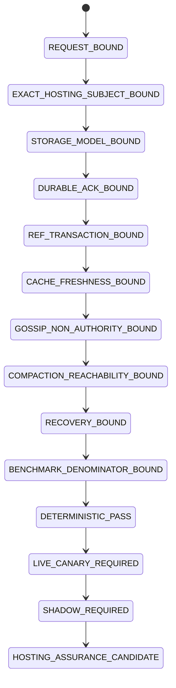
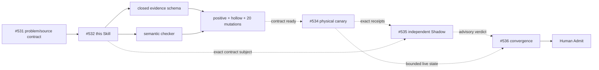

# `git-hosting-scale-assurance`

Portable Method-Plane verifier for Git-hosting evidence. Parent problem contract: #531. Implementation owner: #532. Physical canary: #534. Independent Shadow: #535. Final shared convergence: #536.

## Directory → owner → output

| Path | Owner | Output | Ceiling |
|---|---|---|---|
| `SKILL.md` | #532 | portable procedure, `CORE-LAW-001..005`, stop laws | method only |
| `modules/domain-profile.md` | #532 | backend/runtime/source-proposal binding and lane owners | binding only |
| `references/hosting-assurance.schema.json` | #532 | closed evidence-packet interface | contract only |
| `scripts/check_hosting_assurance.py` | #532 | stable semantic refusal result | deterministic only |
| `tests/` | #532 | positive/hollow/mutation denominator | fixture evidence only |
| consumer/runtime receipts | #534 | durability/consistency/recovery/benchmark observations | bounded live evidence |
| Shadow receipt | #535 | independent falsification/admission | advisory |

## State Machine



## Responsibility / execution DAG



The arrows above are semantic/process dependencies. They are not Git ancestry unless a branch actually consumes named unmerged bytes.

## Data flow

```text
exact hosting subject
+ declared storage/consistency model
+ durability/ref/cache/gossip/compaction/recovery evidence
+ operation history
+ benchmark denominator
+ cleanup/rollback identity
→ hosting-assurance.schema.json
→ check_hosting_assurance.py
→ PASS or stable GS-Cxx refusal
→ #534 live canary required
→ #535 independent readback
→ #536 convergence
```

## Deterministic denominator

The suite owns one valid packet, hollow controls, and one schema-valid mutation for each `GS-C01..GS-C20`. A mutation counts only when the checker refuses for its named reason; parser/schema failure cannot substitute for the semantic guard when a schema-valid malicious packet can be formed.

## Current evidence ceiling

Until a real #534 runtime packet exists, the highest possible terminal for this directory is:

```text
GIT_HOSTING_ASSURANCE_CONTRACT_READY_FOR_LIVE_CANARY
```

It cannot prove Cursor's implementation, object-store/provider guarantees, arbitrary scale, production readiness, merge, release or infrastructure adoption.