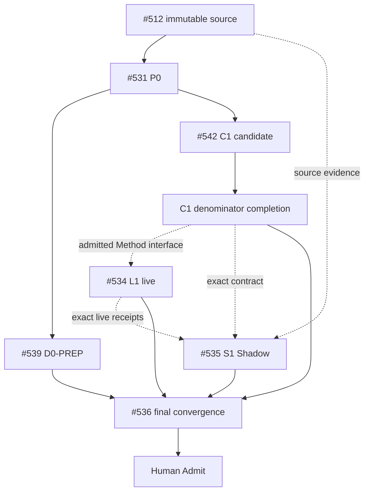

# Git at any scale — Molecular Stack index

This index records actual delivery topology for the Cursor **Git at any scale** audit. It is a traceability projection owned by #536. GitHub metadata, Git identities and exact receipts remain authority.

## State vocabulary

```text
ISSUE_ONLY
IMPLEMENTATION_CANDIDATE
PR_DRAFT
PR_OPEN
BLOCKED
READY_FOR_HUMAN_ADMIT
MERGED
EXTERNAL_OPEN
HISTORICAL
```

Never invent a branch, PR, workflow, receipt or merge. `PR_ABSENT` is valid when true.

## Current implemented Stack

| Atom | Issue | PR | Relation | Exact selected subject | Owns paths | Provides / consumes | Deterministic evidence | Live evidence | Terminal / next owner |
|---|---:|---:|---|---|---|---|---|---|---|
| `P0-SOURCE` | #531 | #539 carries preparation projection | source/problem parent | `main@988a4e790af6a8bee31fd14e00e52a6e944b9f17`; immutable article packet still absent | dedicated trace preparation | claim denominator + authority split | preparation bytes only | none | OPEN → #512/#532/#536 |
| `D0-PREP` | #536 | #539 `PR_DRAFT` | SIBLING preparation | `agent/git-at-any-scale-closure-prep`; read live before decision | dedicated trace/index/queue | zero-context route, problem ledger, queue | owning workflows not PASS | no physical claim | PARTIAL |
| `C1-CONTRACT` | #532 | #542 `PR_DRAFT` | SIBLING implementation candidate | `196a75ac04f6ad2c9a6e50b0645d71fea9bf43e3` | `skills/git-hosting-scale-assurance/**` | aggregate schema/checker + GS-C01..C20 mutations | candidate exists; Shared Skills Infra workflow `SKIPPED`; full #532 denominator incomplete | none | OPEN / complete receipt+fixture families |
| `C1-COMPLETE` | #532 | PR_ABSENT | planned terminal leaf or continuation of #542 after path-owner readback | not selected | same C1 path lease | separate receipt schemas, concurrent/hollow/fault/rebuild/benchmark fixtures, repository gates | NOT_IMPLEMENTED | none | OPEN → #534 |
| `L1-LIVE` | #534 | PR_ABSENT / consumer-owned | PROCESS_DEPENDENCY + EXTERNAL_EVIDENCE | runtime subject ABSENT | external consumer/runtime | durability, linearizability, stale-cache, gossip, rebuild, compaction, corruption, benchmark receipts | waits for admitted C1 interface | NOT_EXERCISED | OPEN → #535/#536 |
| `S1-SHADOW` | #535 | none | EXTERNAL_EVIDENCE / READ_ONLY | terminal exact review subject ABSENT | no Builder paths | GS-S01..S16 independent verdict | design/readback comments only | NOT_EXERCISED | OPEN → #536 |
| `D1-CONVERGE` | #536 | PR_ABSENT for final shared-path leaf | CONVERGENCE | selected admitted prerequisites not yet available | root/shared routes + canonical Git Town README after writer reconciliation | current-main zero-context navigation and terminal index | blocked on prerequisites/writers | no new live claim | BLOCKED/PARTIAL → Human Admit |

## Delivery / evidence DAG



### Git ancestry law

```text
SIBLING       = path/resource-disjoint work consuming a common admitted base
TRUE_CHILD    = child consumes named unmerged parent bytes/contracts
CONVERGENCE   = one writer consumes selected prerequisites for shared paths
PROCESS_DEPENDENCY = ordering/interface dependency without Git ancestry
EXTERNAL_EVIDENCE  = runtime/Shadow/provider evidence, not a Git parent by default
```

#539 and #542 are siblings: #542 consumes issue contracts and admitted `main`, not #539 unmerged bytes.

## #542 first-red / missing molecular leaves

The implemented candidate is useful but does not yet equal issue #532 closure. Missing molecular work includes:

```text
operation-history + linearizability contract/fixture
separate durability/ref/read/cache/gossip/compaction/recovery receipt contracts
hollow durable readback
stale-cache catch-up
cache destroy/rebuild
gossip drop/delay/reorder/duplicate
reachable compaction
corruption/partial-record/restart
benchmark denominator fixture
hosting closure record
repository-wide deterministic gates
exact-head hosted PASS
```

These may remain one #542 continuation only while one-writer/path isolation stays true; otherwise Tech Lead must split path-disjoint terminal leaves and record real PRs here.

## Shared writer collision

Observed current blockers:

```text
PR #412 -> skills/git-town-stacked-pr-worker/README.md
PR #419 -> skills/git-town-stacked-pr-worker/README.md + docs/INDEX.md
```

Therefore neither #539 nor #542 owns canonical `skills/git-town-stacked-pr-worker/README.md`. #536 owns final shared-path convergence only after these writers are consumed, superseded or terminally resolved.

## Admission end-state

```text
immutable source packet
+ complete/admitted C1 contract denominator
+ bounded real L1 canary or explicit Human scope exclusion
+ exact-subject independent S1 verdict
+ current-main D1 shared convergence
+ exact-head required gates
→ READY_FOR_HUMAN_ADMIT
```

Merge, release, provider/account activation, production adoption, cost acceptance and rollback remain Human/trusted-operator operations.