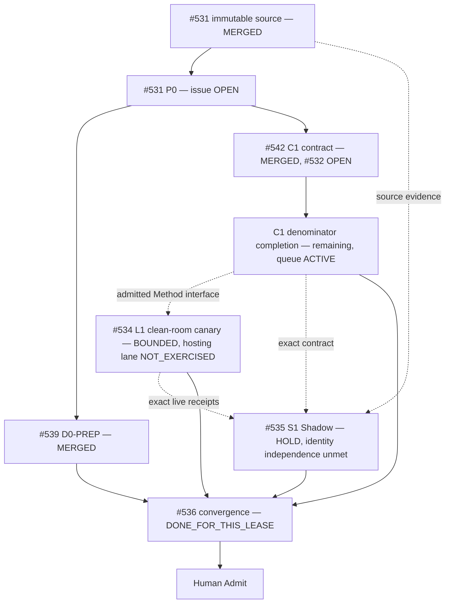

# Git at any scale — Molecular Stack index

This index records actual delivery topology for the Cursor **Git at any scale** audit. It is a traceability projection owned by #536. GitHub metadata, Git identities and exact receipts remain authority.

There is no `index.json` in this directory, so `scripts/assert_molecular_stack_index.py` has nothing to validate here and every row below carries `DOCUMENTATION_PROJECTION` authority only. Do not cite a green repository gate as evidence for any cell in this table.

## State vocabulary

```text
ISSUE_ONLY
IMPLEMENTATION_CANDIDATE
PR_DRAFT
PR_OPEN
BLOCKED
READY_FOR_HUMAN_ADMIT
MERGED
EXTERNAL_OPEN
HISTORICAL
```

Never invent a branch, PR, workflow, receipt or merge. `PR_ABSENT` is valid when true.

## Current implemented Stack — compiled 2026-08-21, states restamped 2026-08-22

```text
main   5341885f26b5e8e7baf5087a4d661e324f878242   (2026-08-22 readback)
tree   a18e12507f9e621efd5354f58384eded1f1e2a9a
main   174009203a3ff9bd6ebc4010bc6cab7232dd44a4   (2026-08-21 compile subject, HISTORICAL)
```

| Atom | Issue | PR | Relation | Exact selected subject | Owns paths | Provides / consumes | Deterministic evidence | Live evidence | Terminal / next owner |
|---|---:|---:|---|---|---|---|---|---|---|
| `P0-SOURCE` | #531 | landed via merge commit `cd91370` | source/problem parent (issue stays OPEN) | 864322-byte immutable article packet, sha256 `25f59fc6…f00447cab9`; 28-claim ledger | `data/handoff/source-evidence/**` | claim denominator (26 APPLICABLE/OPEN + 2 NOT_APPLICABLE) + authority split | `check_problem_closure.py` exits 0 on the ledger | none | `#531` stays OPEN as parent until program close gate |
| `D0-PREP` | #536 | #539 **MERGED** (`6c1e410`, `dea9423`) | SIBLING preparation, path-disjoint from C1 | traceability skeleton + Local Handoff queue landed on `main` | `docs/traceability/git-at-any-scale/**`, `skills/agentic-tech-lead-orchestration/runtime-handoff/git-at-any-scale-local-handoff-queue.json` | zero-context route, problem ledger, queue | landed and readable on current `main` | no physical claim | handoff queue recompiled onto the epoch subject `5341885f` in this convergence; read its own `current.active_item` |
| `C1-CONTRACT` | #532 | #542 **MERGED** (`216c996`) | SIBLING implementation, path-disjoint from D0 (issue #532 stays OPEN) | `skills/git-hosting-scale-assurance/**` on current `main` | aggregate schema/checker + `GS-C01..GS-C20` mutations | `tests/run-all.sh` -> `PASS positive=1 mutations=20/20` on this exact head; registered in `evals/skill-entry-routes.json` + `evals/skill-core-boundaries.json` on 2026-08-22 so both `--skill git-hosting-scale-assurance` checkers exit 0; in `.github/workflows/skill-suites.yml` matrix | none (no physical hosting receipt) | `#532` stays OPEN — 6 of 28 claims target this contract shape, but the full receipt/fixture denominator (durability/ref/cache/gossip/compaction/recovery/benchmark) is still missing and `data/handoff/git-at-any-scale/issue-532-portable-contract-receipt.json` is `ABSENT` |
| `C1-COMPLETE` | #532 | `PR_ABSENT` | terminal leaf or continuation after path-owner readback | not selected | same C1 path lease | separate receipt schemas, concurrent/hollow/fault/rebuild/benchmark fixtures, repository gates | `NOT_IMPLEMENTED` | none | `OPEN` — the queue's `GIT-SCALE-H1` ACTIVE lane |
| `L1-LIVE` | #534 | `PR_ABSENT` / consumer-owned | PROCESS_DEPENDENCY + EXTERNAL_EVIDENCE | `refcore`, a **CLEAN_ROOM single-node** disposable core, sha256 `4ea664cc…`, deliberately not committed (`PRIVATE_DISPOSABLE_SCRATCHPAD`); `provider_activation: NOT_PERFORMED`, cost `0.00 USD` | no repository paths; receipts only, under `data/handoff/git-at-any-scale/` | durability, ref-transaction, read-freshness, cache-rebuild, compaction, corruption-recovery and two benchmark receipts + raw evidence | `check_hosting_assurance.py` on the bundle; `SHA256SUMS` 21/21 | **bounded** run on 2026-08-22: durable-ack, linearizable CAS, stale-cache catch-up, cache destroy/rebuild, compaction reachability, corruption/partial-record recovery all `PASS_BOUNDED`. Gossip lane `NOT_EXERCISED_VACUOUS` (no gossip subsystem exists), matched-scale matrix and Shadow replay `NOT_EXERCISED` | `OPEN` — 1 authority process, 0 replicas, 1 cache, no socket layer, SIGKILL-only faults, unpinned host, 2 workload classes × 1 repetition. Closes **none** of the 19 `REQUIRES_EXTERNAL_RUNTIME` claims and says nothing about Cursor or any commercial product |
| `S1-SHADOW` | #535 | none | EXTERNAL_EVIDENCE / READ_ONLY | same epoch subject; reviewed the uncommitted #534 bundle and the #532 registration as working-tree bytes | no Builder paths | `GS-S01..S16` independent verdict | independently re-derived source digest/byte count, `shasum -c` 21/21, and a Shadow-authored linearizability oracle with two planted-defect negative controls that both went red | `data/handoff/git-at-any-scale/issue-535-shadow-receipt.json`, verdict `HOLD`, `HUMAN_ADMIT_REQUIRED` | `OPEN` — the receipt is exact-subject and independent of Builder conclusions, but the reviewer was dispatched by the same Tech Lead on the same host and scratchpad, so Shadow **identity** independence is unmet and the verdict is advisory |
| `D1-CONVERGE` | #536 | `PR_ABSENT` until publication | CONVERGENCE | root `README.md`, root `AGENTS.md`, `docs/INDEX.md`, `docs/traceability/TRACEABILITY_INDEX.md`, `docs/traceability/TECH_LEAD_SHADOW_CLOSURE.md`, `skills/git-town-stacked-pr-worker/README.md`, `molecular-indexes/{spatial-407,git-at-any-scale}/README.md`, the git-at-any-scale Local Handoff queue | shared route/index paths | zero-context navigation, root routing rule and stop laws, terminal index | `check_document_routes.py` GREEN, `check_skill_entry_routes.py` GREEN, `assert_local_handoff_queue.py` + `--selftest` GREEN — all on this exact working subject | no new live claim | `DONE_FOR_THIS_LEASE` / `HUMAN_ADMIT_REQUIRED` for merge. Exact-head hosted PASS is `ABSENT`; a local green is not a hosted green |

## Delivery / evidence DAG



### Git ancestry law

```text
SIBLING       = path/resource-disjoint work consuming a common admitted base
TRUE_CHILD    = child consumes named unmerged parent bytes/contracts
CONVERGENCE   = one writer consumes selected prerequisites for shared paths
PROCESS_DEPENDENCY = ordering/interface dependency without Git ancestry
EXTERNAL_EVIDENCE  = runtime/Shadow/provider evidence, not a Git parent by default
```

#539 and #542 were siblings before merge and stayed siblings after merge: merging both onto `main` in the same epoch does not retroactively create ancestry between them.

## Per-claim triage (28-claim ledger)

Full ledger: [`data/handoff/source-evidence/git-at-any-scale-closure-ledger.json`](../../../../data/handoff/source-evidence/git-at-any-scale-closure-ledger.json). Rows are not duplicated here; only the triage counts are:

| Bucket | Count | Owner |
|---|---:|---|
| Narrative, not independently checkable (`NOT_APPLICABLE`) | 2 | none |
| Addressed by existing Tech Lead/Git Town/Shadow mechanism | 1 | `#531` |
| Owned by the merged C1 contract shape | 6 | `#532` |
| `REQUIRES_EXTERNAL_RUNTIME` (incl. all performance numbers) | 19 | `#534` |

## Shared writer collision — RESOLVED

Observed 2026-08-21, now historical:

```text
PR #412 -> skills/git-town-stacked-pr-worker/README.md   (then OPEN/DRAFT)
PR #419 -> skills/git-town-stacked-pr-worker/README.md + docs/INDEX.md   (then OPEN/DRAFT)
```

At the 2026-08-22 readback both are CLOSED unmerged — #412 `SUPERSEDED_BY_#419`, #419 `CONSUMED`, landed via PR #573 commit `9fe3c6d` (`skills/agentic-tech-lead-orchestration/references/closure-audit/issue-568.json:17-18,24`). The collision is cleared.

Neither #539 nor #542 ever touched canonical `skills/git-town-stacked-pr-worker/README.md`. The shared-path lease then transferred to #536 (issue-body option 2, prior writers recorded `CLOSED_UNMERGED`), and the convergence executed in this epoch: root `README.md`, root `AGENTS.md`, `docs/INDEX.md`, `docs/traceability/TRACEABILITY_INDEX.md`, `docs/traceability/TECH_LEAD_SHADOW_CLOSURE.md`, the canonical Git Town README, both Molecular indexes and the git-at-any-scale Local Handoff queue now carry the 2026-08-22 state and route into this program. The convergence is owned and done; it is not admitted.

Known residual inside the routed set: `docs/traceability/git-at-any-scale/README.md` still stamps `L1`/`S1` as `NOT_EXERCISED` from the 2026-08-21 compile. That file is outside this convergence lease and belongs to #531's doc lane. Where prose and receipt disagree, the receipts under `data/handoff/git-at-any-scale/` win.

## Admission end-state

```text
immutable source packet                         DONE (#531, merged)
complete/admitted C1 contract denominator        NOT YET (#532 OPEN; 6/28 claims targeted, per-family
                                                 receipt schemas + fixtures missing, own receipt ABSENT)
bounded real L1 canary or explicit Human scope   PARTIAL — a CLEAN_ROOM single-node canary ran with a
                                                 full receipt bundle; the hosting-grade lane and the
                                                 matched-scale matrix remain NOT_EXERCISED
exact-subject independent S1 verdict             PARTIAL — verdict HOLD recorded on the exact subject;
                                                 Shadow identity independence unmet, advisory only
current-main D1 shared convergence               DONE for the #536 lease (routes, indexes, queue)
exact-head hosted workflow PASS                  ABSENT (only SKIPPED on record; never a PASS)
→ READY_FOR_HUMAN_ADMIT: not yet
```

Merge, release, provider/account activation, production adoption, cost acceptance and rollback remain Human/trusted-operator operations. A green local gate, a bounded clean-room receipt and an advisory Shadow verdict do not compose into any of them.
