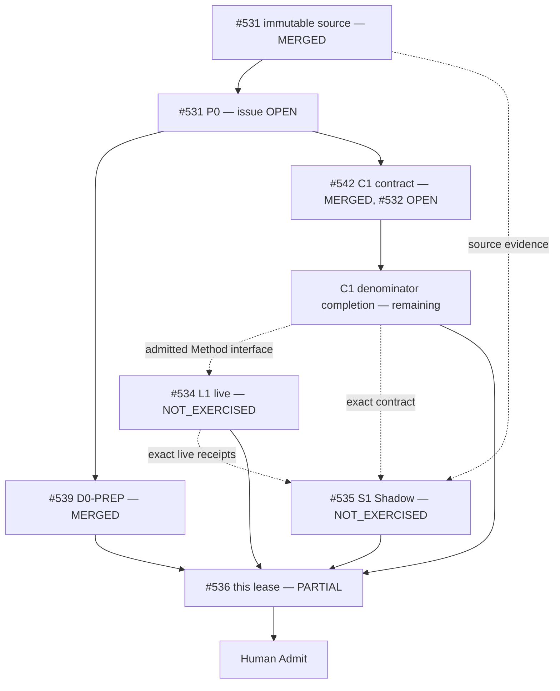

# Git at any scale — Molecular Stack index

This index records actual delivery topology for the Cursor **Git at any scale** audit. It is a traceability projection owned by #536. GitHub metadata, Git identities and exact receipts remain authority.

## State vocabulary

```text
ISSUE_ONLY
IMPLEMENTATION_CANDIDATE
PR_DRAFT
PR_OPEN
BLOCKED
READY_FOR_HUMAN_ADMIT
MERGED
EXTERNAL_OPEN
HISTORICAL
```

Never invent a branch, PR, workflow, receipt or merge. `PR_ABSENT` is valid when true.

## Current implemented Stack — 2026-08-21 readback

```text
main   174009203a3ff9bd6ebc4010bc6cab7232dd44a4
```

| Atom | Issue | PR | Relation | Exact selected subject | Owns paths | Provides / consumes | Deterministic evidence | Live evidence | Terminal / next owner |
|---|---:|---:|---|---|---|---|---|---|---|
| `P0-SOURCE` | #531 | landed via merge commit `cd91370` | source/problem parent (issue stays OPEN) | 864322-byte immutable article packet, sha256 `25f59fc6…f00447cab9`; 28-claim ledger | `data/handoff/source-evidence/**` | claim denominator (26 APPLICABLE/OPEN + 2 NOT_APPLICABLE) + authority split | `check_problem_closure.py` exits 0 on the ledger | none | `#531` stays OPEN as parent until program close gate |
| `D0-PREP` | #536 | #539 **MERGED** (`6c1e410`, `dea9423`) | SIBLING preparation, path-disjoint from C1 | traceability skeleton + Local Handoff queue landed on `main` | `docs/traceability/git-at-any-scale/**`, `skills/agentic-tech-lead-orchestration/runtime-handoff/git-at-any-scale-local-handoff-queue.json` | zero-context route, problem ledger, queue | landed and readable on current `main` | no physical claim | superseded by this READ — recompile of the handoff queue against the merged packet is still pending |
| `C1-CONTRACT` | #532 | #542 **MERGED** (`216c996`) | SIBLING implementation, path-disjoint from D0 (issue #532 stays OPEN) | `skills/git-hosting-scale-assurance/**` on current `main` | aggregate schema/checker + `GS-C01..GS-C20` mutations | `tests/run-all.sh` -> `PASS positive=1 mutations=20/20` on this exact head; in `.github/workflows/skill-suites.yml` matrix | none (no physical hosting receipt) | `#532` stays OPEN — 6 of 28 claims target this contract shape, but the full receipt/fixture denominator (durability/ref/cache/gossip/compaction/recovery/benchmark) is still missing |
| `C1-COMPLETE` | #532 | `PR_ABSENT` | planned terminal leaf or continuation after path-owner readback | not selected | same C1 path lease | separate receipt schemas, concurrent/hollow/fault/rebuild/benchmark fixtures, repository gates | `NOT_IMPLEMENTED` | none | `OPEN` → #534 |
| `L1-LIVE` | #534 | `PR_ABSENT` / consumer-owned | PROCESS_DEPENDENCY + EXTERNAL_EVIDENCE | runtime subject `ABSENT` | external consumer/runtime | durability, linearizability, stale-cache, gossip, rebuild, compaction, corruption, benchmark receipts | waits for admitted C1 interface | `NOT_EXERCISED` | `OPEN` — owns all 19 `REQUIRES_EXTERNAL_RUNTIME` claims incl. every performance number → #535/#536 |
| `S1-SHADOW` | #535 | none | EXTERNAL_EVIDENCE / READ_ONLY | terminal exact review subject `ABSENT` | no Builder paths | `GS-S01..S16` independent verdict | design/readback comments only | `NOT_EXERCISED`, blocked on #534's missing runtime subjects | `OPEN` → #536 |
| `D1-CONVERGE` | #536 | `PR_ABSENT` for final shared-path leaf | CONVERGENCE | this worker's lease (traceability + molecular index) only | `docs/traceability/git-at-any-scale/**`, this file, `skills/git-hosting-scale-assurance/{README,AGENTS}.md` if inaccurate | current-main navigation and terminal index for this lease | `check_document_routes.py` GREEN, `git-hosting-scale-assurance/tests/run-all.sh` GREEN, `check_problem_closure.py` exit 0 — all on this exact head | no new live claim | `PARTIAL` — root `README.md`/`AGENTS.md`/`docs/INDEX.md` and the canonical `skills/git-town-stacked-pr-worker/README.md` remain a separate, not-yet-done writer's convergence |

## Delivery / evidence DAG



### Git ancestry law

```text
SIBLING       = path/resource-disjoint work consuming a common admitted base
TRUE_CHILD    = child consumes named unmerged parent bytes/contracts
CONVERGENCE   = one writer consumes selected prerequisites for shared paths
PROCESS_DEPENDENCY = ordering/interface dependency without Git ancestry
EXTERNAL_EVIDENCE  = runtime/Shadow/provider evidence, not a Git parent by default
```

#539 and #542 were siblings before merge and stayed siblings after merge: merging both onto `main` in the same epoch does not retroactively create ancestry between them.

## Per-claim triage (28-claim ledger)

Full ledger: [`data/handoff/source-evidence/git-at-any-scale-closure-ledger.json`](../../../../data/handoff/source-evidence/git-at-any-scale-closure-ledger.json). Rows are not duplicated here; only the triage counts are:

| Bucket | Count | Owner |
|---|---:|---|
| Narrative, not independently checkable (`NOT_APPLICABLE`) | 2 | none |
| Addressed by existing Tech Lead/Git Town/Shadow mechanism | 1 | `#531` |
| Owned by the merged C1 contract shape | 6 | `#532` |
| `REQUIRES_EXTERNAL_RUNTIME` (incl. all performance numbers) | 19 | `#534` |

## Shared writer collision

Observed at this readback:

```text
PR #412 -> skills/git-town-stacked-pr-worker/README.md   (OPEN/DRAFT at that readback; CLOSED since 2026-08-21)
PR #419 -> skills/git-town-stacked-pr-worker/README.md + docs/INDEX.md   (OPEN/DRAFT at that readback; CLOSED since 2026-08-21)
```

2026-08-22 reconciliation: both PRs are CLOSED (not merged); their content landed via replayed carriers on `main`, so this writer contention no longer exists.

Neither #539 nor #542 ever touched canonical `skills/git-town-stacked-pr-worker/README.md`, and this lease does not either. Root `README.md`, `AGENTS.md`, `docs/INDEX.md` and the canonical Git Town README remain unconverged; #536's final shared-path convergence there is a separate, not-yet-done writer's work after #412/#419 are reconciled.

## Admission end-state

```text
immutable source packet                         DONE (#531, merged)
complete/admitted C1 contract denominator        NOT YET (#532 stays OPEN; 6/28 claims targeted, receipt families missing)
bounded real L1 canary or explicit Human scope   NOT YET (#534 NOT_EXERCISED)
exact-subject independent S1 verdict             NOT YET (#535 NOT_EXERCISED, blocked on #534)
current-main D1 shared convergence (this lease)  PARTIAL — traceability/molecular-index only, root convergence still open
→ READY_FOR_HUMAN_ADMIT: not yet
```

Merge, release, provider/account activation, production adoption, cost acceptance and rollback remain Human/trusted-operator operations.
