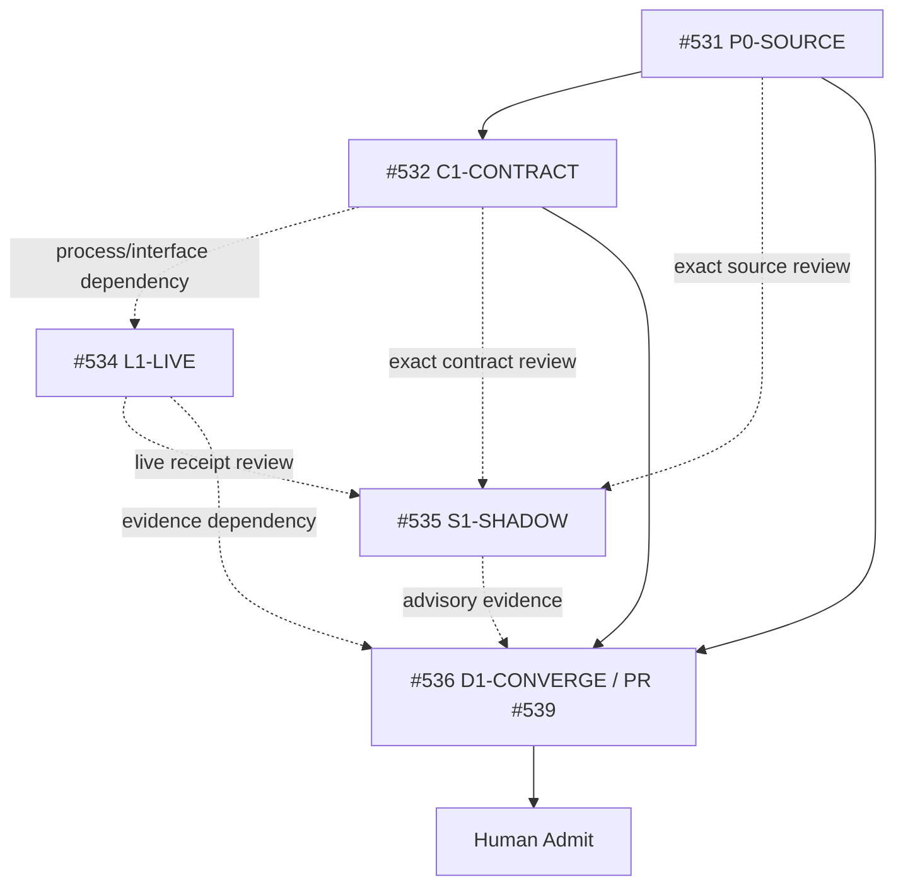

# Git at any scale — Molecular Stack index

This index records the actual delivery topology for the Cursor **Git at any scale** audit. It is a traceability projection owned by #536. GitHub/Git metadata remains authority for branch, PR and merge state.

## State vocabulary

```text
ISSUE_ONLY
BRANCH_CREATED
PR_DRAFT
PR_OPEN
BLOCKED
READY_FOR_HUMAN_ADMIT
MERGED
EXTERNAL_OPEN
HISTORICAL
```

`ISSUE_ONLY / PR_ABSENT` is valid and required. Never invent a branch, PR, workflow run, receipt, or merge merely to complete the diagram.

## Current Stack

| Atom | Issue | PR | Relation | Selected subject | Owns paths | Provides / consumes | Deterministic evidence | Live evidence | Terminal / next owner |
|---|---:|---:|---|---|---|---|---|---|---|
| `P0-SOURCE` | #531 | PR_ABSENT | parent source/problem contract | source locator + `main@988a4e790af6a8bee31fd14e00e52a6e944b9f17` | dedicated trace preparation | complete problem denominator; consumes article as `SOURCE_PROPOSAL` | trace/ledger bytes on #539 preparation only | immutable source bytes absent | OPEN → #532/#534/#535/#536 |
| `C1-CONTRACT` | #532 | PR_ABSENT | planned implementation atom; TRUE_CHILD only if exact unmerged #531 bytes are consumed | ISSUE_ONLY | future `skills/git-hosting-scale-assurance/**` | portable durability/consistency/cache/recovery contracts | NOT_IMPLEMENTED | none | OPEN → #534 |
| `L1-LIVE` | #534 | PR_ABSENT | PROCESS_DEPENDENCY + EXTERNAL_EVIDENCE | runtime subject ABSENT | external consumer/runtime only | durability, linearizability, stale-cache, rebuild, gossip, compaction, corruption, benchmark receipts | contract precondition pending | NOT_EXERCISED | OPEN → #535/#536 |
| `S1-SHADOW` | #535 | PR_ABSENT | EXTERNAL_EVIDENCE / READ_ONLY | exact review subject ABSENT | no Builder paths | independent falsification/admission receipt | design issue exists; exact-subject receipt absent | NOT_EXERCISED | OPEN → #536 |
| `D1-CONVERGE` | #536 | #539 / PR_DRAFT | CONVERGENCE preparation | `agent/git-at-any-scale-closure-prep`; exact mutable head must be read live from GitHub | dedicated trace + Molecular index + Local Handoff; canonical Git Town README deferred while #412/#419 active | zero-context navigation, current-state ledger, Stack index, Local Handoff | branch readback present; exact-head hosted checks pending | creates no new physical claim | PARTIAL → final shared-path convergence |

## Branch / issue / evidence DAG



### Git ancestry rule

The diagram above is not a Git parent graph. Use these laws:

```text
SIBLING       = path/resource-disjoint work on a common admitted base
TRUE_CHILD    = child consumes named unmerged parent bytes/contracts
CONVERGENCE   = one writer consumes selected prerequisites for shared routes/indexes
PROCESS_DEPENDENCY = ordering/evidence dependency without Git ancestry
EXTERNAL_EVIDENCE  = runtime/Shadow/provider evidence; not a Stack parent by default
```

At this audit epoch #532/#534/#535 have issues but no implementation PRs, so no serial Git Stack is claimed. PR #539 is the path-bounded D1 preparation candidate; it does not turn the other issue relations into Git ancestry.

## Current writer collision

Observed 2026-08-21:

```text
PR #412 -> skills/git-town-stacked-pr-worker/README.md
PR #419 -> skills/git-town-stacked-pr-worker/README.md + docs/INDEX.md
```

Therefore #539 does **not** modify the canonical Git Town README. #536 must later select one explicit convergence strategy: consume one writer as a true dependency, supersede with a Human-reviewed current-main convergence, or wait until the writer is terminal. Text mergeability alone is insufficient.

## Molecular end-state required by #531

```text
P0 source packet immutable + denominator complete
+ C1 portable assurance contracts admitted
+ L1 real hosting canary verified or explicit Human scope exclusion
+ S1 exact-subject independent Shadow verdict
+ D1 current-main README/AGENTS/Stack/Local-Handoff convergence
→ READY_FOR_HUMAN_ADMIT
```

Merge, release, provider/account activation, production adoption, cost acceptance, and rollback remain Human/trusted-operator actions.