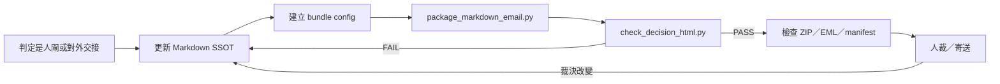

# Skill: html-for-decisions

## Role

把已存在於 Markdown SSOT 的裁決、證據與未知，投影成：

1. 單檔自包含 HTML，供瀏覽器直接開啟；
2. `.eml` 郵件草稿，本文直接顯示精簡摘要；
3. ZIP，包含完整 HTML、全部來源 Markdown 與 SHA-256 manifest。

本 skill 是決策媒介，不是判官。它不發明結論，也不把 HTML 變成第二份真相。

哪些節點算 LAND-DECISION、md SSOT 落在哪個目錄，由宿主自己的架構文件定義；本 skill 只管「怎麼產、怎麼驗、怎麼更新」。宿主專屬的節點清單、資料來源與致動器住在該 repo 的 `.skill-bindings/html-for-decisions/`。

## When to Use

- 人需要在 LAND-DECISION 節點看高密度證據與理解 quiz。
- 一組 Markdown 要跨 repo／跨團隊寄送，又要保留 source provenance。
- 人裁後要先更新 Markdown，再事件式重生 HTML／EML／ZIP。
- 要把 Release-reachable 與 Deployed 等 source／runtime 邊界顯式呈現。

## Not For

- 一般進度更新：直接用 Markdown，避免 HTML 稅。
- 即時雙向 cockpit、daemon、POST 決策寫回：body 只做靜態投影。宿主若有 live server 基座，那是它 binding 裡的擴充，不是本 skill 的預設能力。
- 宿主專案的 family metrics、product board、session trace：那些資料契約屬於該 repo，不屬共用面。
- 替使用者 approve 或把 quiz 全對當成自動批准：最終裁決永遠是人。

## 不可違反的不變量

1. **Markdown 是 SSOT**：先改 `.md`，再重生投影；禁止只改 HTML 結論。
2. **投影誠實標記**：HTML 必含「本頁為投影非 SSOT」與外部傳入的快照日期。
3. **自包含**：inline CSS／JS，無 CDN、遠端字型或遠端圖片；CJK 用系統字型堆疊（**別**把 CJK 字型 data-URI 內嵌，體積不可行）。
4. **quiz 全對才理解就緒，approve 仍由人**：agent 不自批、不把沉默當通過。
5. **語意真相標態**：預判／已 admit／已鎖分開標，預判不冒充定案；狀態變更只來自 md SSOT 的人裁記錄。
6. **決策面與觀測面語義隔離**：決策面＝從 md 萃取判定（有 quiz、有人閘語義）；觀測面＝腳本從 log 機械投影（零 LLM、無 quiz、無判定）。**永不混同一頁、永不共用 schema**——把觀測數據塞進決策面＝用機器帳偽裝判定，反之＝給觀測報表掛假人閘。
7. **狀態色過 CVD validator**：`node <dataviz-skill>/scripts/validate_palette.js "<hex,...>" --mode light`。注意**分段相鄰順序**影響判定（實測：紫緊鄰藍 FAIL，重排分段序即 PASS）。
8. **email 雙層交付**：郵件本文只放精簡摘要，避免常見郵件客戶端裁切大型 HTML；完整 HTML 與來源 Markdown 必放附件 ZIP。
9. **來源完整性**：ZIP 內每份來源與完整 HTML 都要進 SHA-256 manifest。
10. **位元組可重生**：來源沒變時重跑必須產出**完全相同的位元組**。快照日期由 config 傳入不讀系統時間；`Date`／`Message-ID`／MIME boundary 全部由 snapshot 與 basename 推導，不用 `now()` 也不用亂數。否則 manifest 分不出「投影跟上了 Markdown」與「renderer 只是吐了雜訊」。
11. **production 雙層**：沒有 deployment receipt 時只能寫 `Release-reachable`，`Deployed=UNKNOWN`。
12. **每份來源都要有資料流圖**：config 列出的每一份 Markdown 至少帶一張 ASCII 資料流圖；renderer 在寫出任何檔案前 fail-closed。圖畫在 Markdown SSOT，不畫在 HTML——HTML 只負責加上編號、圖錄與縮放。
13. **圖寬 ≤ 100 字元**：新畫的圖以 1120px 版面不橫捲為準。既有超寬圖不重排（重排 ASCII swimlane 極易改錯對齊），改用每張圖自帶的縮放鈕。
14. **代號必須可遍歷**：文件族用短代號互相引用時，HTML 必須把每個提及處連到定義處，並提供符號索引。**懸空連結一律視為缺陷**——讀者點了沒反應就不再信任其餘連結。定義點的判準：表格首欄、標題開頭、條列開頭，三者都只認「開頭那一個」代號（`### E-8 / INV-101` 定義的是 E-8，INV-101 只是提及）。
15. **跳轉要落在原始來源，不是另一個索引**：同一代號可能在多處出現在定義位置，但只有一處是來源。份量排序 **標題 > 條列 > 表格列**，且**份量高的勝出、與文件順序無關**——一份早出現的摘要表不得打敗後面真正定義它的那一節。範圍標題（`Commit 1〜10`）講的是一群，不定義其中任何一個。同一份文件內同階多處時只認第一處，否則會產生重複 id 而瀏覽器只認其中一個。
16. **多份文件必須分頁，且分頁不得打斷錨點**：九份串成一條長捲軸等於找不到。但分頁預設會讓錨點失效（目標在隱藏面板，瀏覽器捲到空處），所以每次跳轉必須**先展開所屬分頁與所屬文件，再捲動**。
17. **導覽狀態要可逆**：跳轉前記下（分頁、文件、捲動位置），提供上一步／下一步。已經在畫面內的目標**只標示不跳**，也不吃返回歷史——跳到自己身上會讓返回鍵「回到原地」。標示保留到讀者點別處才消失。
18. **附帶工具要隨包出貨**：文件叫人執行的東西必須用 `extras` 放進 ZIP。只給指令不給檔案，讀者能讀到主張卻無法重新推導——而「可重新推導」正是這套的立足點。
19. **決策文件要能導出 MVP**：完整方案必須附一節回答「明天要做哪一步」，逐項過四道閘門並列出被刷掉的候選與原因。方法見 [modules/mvp-extraction.md](modules/mvp-extraction.md)。只列入選的，讀者無法判斷有沒有漏掉更好的。

## 確定性程序



1. 確認頁面服務的是裁決／交接，不是普通進度。不是人閘節點 → 出 Markdown，停。
2. 找出所有 Markdown SSOT；用 config 顯式列出，禁止用 glob 偷帶不相關文件。**只投影不新增判定。**
3. 把裁決摘要、文件角色與 quiz 寫進 config；內容必能指回 Markdown。「必」槽缺料顯式 N/A，禁靜默省略。
4. 執行：

   ```bash
   python3 <本skill>/scripts/package_markdown_email.py <config.json>
   ```

5. 驗證完整 HTML：

   ```bash
   python3 <本skill>/scripts/check_decision_html.py <report.html>
   ```

6. 用 ZIP listing、MIME parser 與 manifest 檢查附件與來源數量；狀態色過 CVD validator（不變量 7）；`open <file>` 本地目檢一次（label 碰撞／溢出——validator 不管版面）。
7. 人裁後先回填 Markdown，再用同一 config／basename 覆蓋重生。

## Bundle config 最小契約

```json
{
  "title": "決策包標題",
  "snapshot": "2026-08-06",
  "basename": "decision-bundle",
  "output_dir": "deliverables",
  "subject": "郵件主旨",
  "decision": "已裁決或待裁決的一句話",
  "summary": ["只來自 SSOT 的摘要"],
  "documents": [
    {"path": "README.md", "label": "入口", "role": "索引"}
  ],
  "quiz": [
    {"question": "問題", "options": ["正確", "錯誤"], "answer": 0}
  ]
}
```

所有相對路徑都以 config 所在目錄解析。收件人欄位預設使用 `.invalid` placeholder，寄送前由人修改。

## 驗證閘

- `python3 scripts/check_decision_html.py --selftest`
- `bash tests/run-all.sh`
- 完整 HTML 的 checker 必須五項全 PASS。
- ZIP 必含 HTML、所有 config documents、`MANIFEST.sha256` 與 config snapshot。
- `.eml` 必須同時有 `text/plain`、`text/html`、HTML 附件與 ZIP 附件，且 `Date`／`Message-ID` 由 snapshot 推導。
- HTML 必含圖錄（`id="atlas"`）與符號索引（`id="symbol-index"`），且每份文件的圖數 > 0。
- 錨點 id 不得重複、內部連結不得懸空；代號跳轉必須落在原始定義而非摘要列。
- 來源不變時重跑兩次，四個產物必須 byte-identical；改一個字後 hash 必須全動。以上都在 `tests/package-markdown-email/verify.sh` 裡。
- **每條新斷言都要先看它會叫**：暫時把對應的實作退回舊行為，確認測試轉紅，再改回來。第一次就過的斷言可能根本沒測到目標——本 skill 就發生過一次：範圍標題的 fixture 寫成 `## 2. Commit 1〜2`，有數字前綴所以根本沒進到那條規則。

## Gotchas

- Gmail 等服務可能裁切大型 HTML 郵件本文；這不是 ZIP 或附件損壞。郵件本文保持摘要，完整內容放 HTML 附件。
- Markdown 內 Mermaid 圖在無外部 JS 的交付包中會顯示為可讀 code block，不假裝已渲染。
- 資料流圖用 ```text 或不標語言的 fence；**標了語言（swift／js／bash…）的一律當程式碼**，不會進圖錄。這條是刻意的：程式碼註解裡的 `→` 不該讓一段 Swift 被當成資料流圖。
- 圖的判準是「箭頭與框線密度」，不是 fence 標籤。欄位清單、schema、狀態列舉即使標 ```text 也不會被當圖——它們是資料結構，不是流。
- **隱藏元素的 `getBoundingClientRect()` 全是 0**。任何「在不在畫面內」的判斷，必須先確認元素真的有版面（`offsetParent` 或非零高度），否則隱藏分頁裡的目標會被判成「已經看得到」，跨文件跳轉就退化成原地閃一下。這個 bug 只有真的在瀏覽器裡跑才看得到，grep 抓不到。
- **懸浮元件不要寫死 `top`**。標題區有高度，捲到頂端時固定定位的元件會壓在標題上。以「sticky 分頁列的底緣」為基準，捲動與 resize 時重算成 CSS 變數。
- **重生順序會決定檢查結果**。先檢查再重生，等於對著過期的網頁打分——Markdown 改了而網頁沒跟上時會回報 100%。任何計分腳本都要**先重生再檢查**，並用「連續兩次重生」同時取得可重現性的答案。
- **一份基線只對一個 repo 有效**。同一支 checker 對不同 repo 會吐出不同規則集，用同一份扁平基線去對另一個 repo，沒列到的規則會被誤判成新違規——乾淨的 repo 看起來像退化了。基線要依 repo 分區，且分區不存在時要**明確報錯而不是靜默通過**。
- 外部 URL 顯示成文字，不建立會讓 self-contained checker 誤判的遠端資源 link。
- 相同 basename 會覆蓋既有投影；因投影可再生，來源仍以 Markdown 與 config 為準。

## Modules / Prompts / Scripts

- [modules/media-know-why.md](modules/media-know-why.md)：HTML 稅、email client 邊界與 md＝源的理由。
- [modules/mvp-extraction.md](modules/mvp-extraction.md)：把「完整方案」轉成「明天就能開始的清單」的四道閘門與排序；含被刷掉候選也要列出的理由。
- [prompts/decision-report.prompt.md](prompts/decision-report.prompt.md)：需要 LLM 編排決策摘要時的 schema；不得取代 Markdown SSOT。
- [scripts/check_decision_html.py](scripts/check_decision_html.py)：自包含／投影／快照／quiz／title checker。
- [scripts/package_markdown_email.py](scripts/package_markdown_email.py)：標準庫-only 的 HTML／ZIP／EML renderer。
- [scripts/check_redaction.py](scripts/check_redaction.py)：阻擋**上游 skill 來源 repo 識別字**進入交付物。它比對的是一組固定 token，不是任意絕對路徑；目標 repo 自身的路徑與檔名是刻意保留的證據，不在擋的範圍。renderer 會在寫出任何檔案前先呼叫它。
- worked instance 指針、宿主專屬致動器與移植帳本：見該 repo 的 `.skill-bindings/html-for-decisions/`。

## 已裁決的分岔（別再重新推導）

`scripts/package_markdown_email.py` 在 #1 記錄的另一份 history 裡有一個同名版本，兩者符號集完全相同
（0 獨有 / 0 獨有 / 39 共有），33 個共有符號裡 29 個逐位元相同。差異只在四個函式：三個是那邊疊加的
code graph 整合，第四個 `page_css` 是 **+11 −11 的純視覺改版**（色盤、`--nav`/`--purple`/`--grey`
三個新變數、max-width 1120 → 1380、`Noto Sans CJK TC` → `Noto Sans TC`、header 換漸層、tabs 由
換行改橫向捲動）。

code graph 那半分不出來——三個函式裡與 graph 無關的改動各有 17／22／2 行，機械上與視覺改版交錯。

**人裁結果：保留本版**（2026-08-15，ruling A）。因此那邊的 `scripts/code_graph.py`、
`modules/code-graph-schema.md` 與三個 graph fixture 不採用，不是待辦。要重開這個決定，需要的是
比較兩版**外觀**，不是再比一次程式碼——程式碼已經比完，答案是「兩個設計」。

